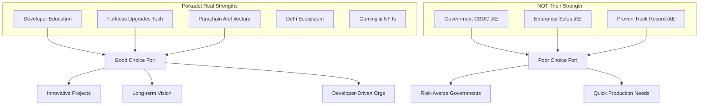
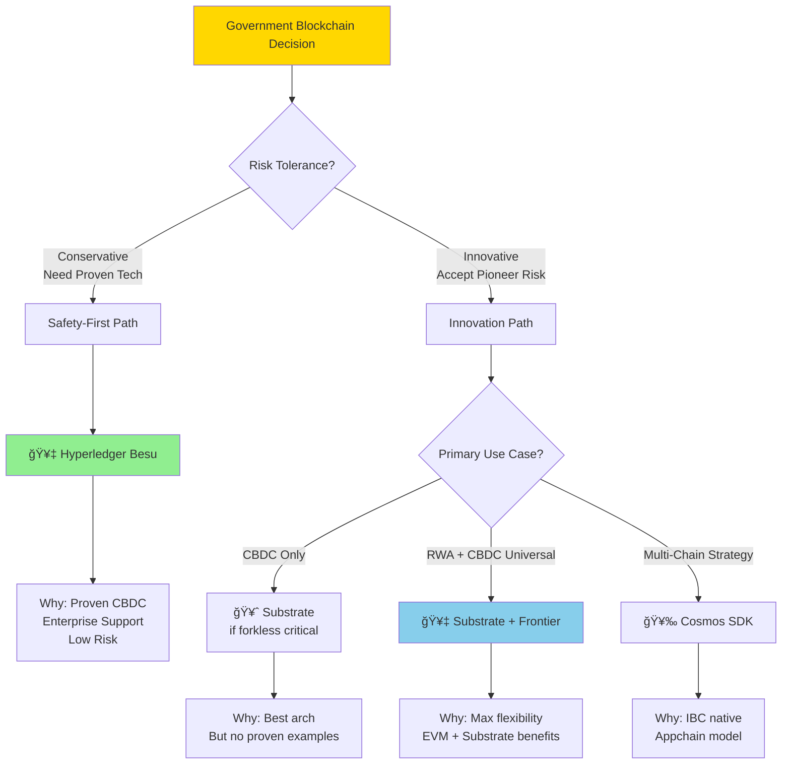

# Government Blockchain Architecture: CBDC & RWA Platform Selection

## 📋 Request Checklist

Что Ñ‚Ñ‹ запроÑил:
- [x] КомплекÑный анализ блокчейн-платформ Ğ´Ğ»Ñ Ğ³Ğ¾ÑударÑтва (RWA/CBDC)
- [x] Сравнение Ethereum forks vs enterprise blockchains
- [x] Ğнализ Graphene и его применимоÑти
- [x] Рекомендации по конÑенÑуÑ-механизмам (DPoS vs альтернативы)
- [x] Ğрхитектура ÑƒĞ¿Ñ€Ğ°Ğ²Ğ»ĞµĞ½Ğ¸Ñ Ğ½Ğ¾Ğ´Ğ°Ğ¼Ğ¸
- [x] ВозможноÑти апдейтов без hard forks
- [x] Production examples и best practices

## 🯠Your Original Request

> Глубокое иÑÑледование выбора блокчейн-платформы Ğ´Ğ»Ñ Ğ³Ğ¾ÑударÑтвенного проекта токенизации реальных активов (RWA) или цифровой валÑÑ‚Ñ‹ центробанка (CBDC). Ğужно Ñравнить Ethereum forks, enterprise блокчейны (вклÑÑ‡Ğ°Ñ Graphene), определить оптимальный конÑенÑуÑ-механизм и архитектуру ÑƒĞ¿Ñ€Ğ°Ğ²Ğ»ĞµĞ½Ğ¸Ñ Ğ½Ğ¾Ğ´Ğ°Ğ¼Ğ¸ Ñ Ğ²Ğ¾Ğ·Ğ¼Ğ¾Ğ¶Ğ½Ğ¾ÑÑ‚ÑŒÑ Ğ¾Ğ±Ğ½Ğ¾Ğ²Ğ»ĞµĞ½Ğ¸Ğ¹.
>
````prompt
```markdown
Use sequential thinking mcpp 
Think more use task tool sub-agents smart and orchestrate/delegate tasks not only sub-agents but also please combine, discuss, evaluate solutions with MCPs, for e.g. using Zen-Mcp better use Gemini 2.5 Pro and for research,fact checking, questions and real experience use perplexity mcp and brave search mcps, you could run task tool sub-agents with that MCP calls.

```

Ñмотри вот например RWA or CBTC на Ñтрану делать какой блокчейн иÑпользовать fork eth или приватные какие-то? Ñ Ğ¿Ğ¾Ğ¼Ğ½Ğ¸Ñ‚ÑÑ Ğ±Ñ‹Ğ»Ğ¸ графен и там еще какие-то enterpise они Ğ²Ñ‚Ğ¸Ñ…Ğ°Ñ€Ñ Ğ´ĞµĞ»Ğ°Ğ»Ğ¸ и применÑÑÑ‚ÑÑ Ğ² производÑтвах цепочках поÑтавок и европах без крипто вайба

зацепиÑÑŒ комплекÑно Ğ·Ğ° задачу додумай доÑерчи ÑиÑтемной учитый ÑиÑтемный промпт и таблицам пошагам глубоко глубоко изучи и мне как ÑкÑперту нужно предложить заказчику гоÑударÑтву блокчейны на оÑнове чего привÑĞ·Ğ°Ñ‚ÑŒÑÑ Ğ½Ğ°Ñ‡Ğ°Ñ‚ÑŒ типо какой-то opensource и дальше допиливать Ñ Ğ²Ğ¾Ğ·Ğ¼Ğ¾Ğ¶Ğ½Ğ¾ÑÑ‚ÑŒÑ Ğ°Ğ¿Ğ´ĞµĞ¹Ñ‚Ğ¾Ğ² и Ñ‚Ğ¿ и ноды конÑенÑÑƒÑ Dpos или что-то типо того
````

## 🧠 Sequential Thinking

````bash
{
  "thought": "Ğ”ĞµĞºĞ¾Ğ¼Ğ¿Ğ¾Ğ·Ğ¸Ñ€ÑƒÑ Ğ·Ğ°Ğ´Ğ°Ñ‡Ñƒ про гоÑударÑтвенный блокчейн Ğ´Ğ»Ñ RWA/CBDC:\n\nКЛЮЧЕВЫЕ ТРЕБĞĞ’ĞĞИЯ:\n1. RWA (Real World Assets) или CBDC (Central Bank Digital Currency) - разные use cases\n2. Open-source база Ğ´Ğ»Ñ Ñтарта\n3. ВозможноÑÑ‚ÑŒ каÑтомизации и апдейтов\n4. Enterprise-ready (приватноÑÑ‚ÑŒ, производительноÑÑ‚ÑŒ, governance)\n5. КонÑенÑÑƒÑ Ğ¼ĞµÑ…Ğ°Ğ½Ğ¸Ğ·Ğ¼ (DPoS или аналоги)\n6. Управление нодами\n\nТЕХĞИЧЕСКИЕ СТЕКИ ĞĞ Ğ ĞĞ¡Ğ¡ĞœĞТРЕĞИЕ:\n- Ethereum forks (Polygon, BSC, etc)\n- Hyperledger (Fabric, Besu, Iroha)\n- Graphene-based (BitShares, EOS legacy)\n- R3 Corda\n- Quorum (ConsenSys)\n- Substrate/Polkadot SDK\n- Canton (Digital Asset)\n\nКРИТЕРИИ ĞЦЕĞКИ:\n1. Permissioned vs Permissionless capability\n2. Performance (TPS, finality time)\n3. Privacy features (ZK, confidential transactions)\n4. Regulatory compliance features\n5. Interoperability\n6. Developer ecosystem\n7. Production readiness\n8. Governance model",
  "thoughtNumber": 1,
  "totalThoughts": 8,
  "nextThoughtNeeded": true
}

{
  "thought": "Ğ ĞЗЛИЧИЯ RWA vs CBDC - критичеÑки важно Ğ´Ğ»Ñ Ğ²Ñ‹Ğ±Ğ¾Ñ€Ğ° архитектуры:\n\nRWA (Real World Assets):\n- Ğ¢Ğ¾ĞºĞµĞ½Ğ¸Ğ·Ğ°Ñ†Ğ¸Ñ Ñ„Ğ¸Ğ·Ğ¸Ñ‡ĞµÑких активов (недвижимоÑÑ‚ÑŒ, Ñырье, акции)\n- Ğужна Ğ¸Ğ½Ñ‚ĞµĞ³Ñ€Ğ°Ñ†Ğ¸Ñ Ñ off-chain oracles\n- Smart contracts Ğ´Ğ»Ñ compliance (KYC/AML на уровне токена)\n- Fractional ownership возможноÑти\n- Secondary market liquidity\n- Legal framework integration\n- Asset custody решениÑ\n- Multi-party workflows (issuer, custodian, регулÑтор)\n\nCBDC (Central Bank Digital Currency):\n- ĞœĞ¾Ğ½ĞµÑ‚Ğ°Ñ€Ğ½Ğ°Ñ Ğ¿Ğ¾Ğ»Ğ¸Ñ‚Ğ¸ĞºĞ° центробанка\n- Offline payments capability (критично!)\n- Programmable money (conditional transfers)\n- Privacy vs transparency balance (регулÑтор видит вÑе, но граждане анонимны друг Ğ´Ğ»Ñ Ğ´Ñ€ÑƒĞ³Ğ°)\n- Interoperability Ñ legacy финÑиÑтемой\n- Two-tier модель (ЦБ → коммерчеÑкие банки → граждане)\n- Transaction finality гарантии\n- Monetary supply control\n\nЭто Ğ ĞĞ—ĞĞ«Ğ• архитектуры! RWA ближе к DeFi patterns, CBDC - к платежным ÑиÑтемам типа RTGS/SWIFT",
  "thoughtNumber": 2,
  "totalThoughts": 8,
  "nextThoughtNeeded": true
}

{
  "thought": "GRAPHENE и ENTERPRISE BLOCKCHAINS Ğ‘Ğ•Ğ— КРИПТĞ-Ğ’ĞЙБĞ:\n\nGraphene-based (иÑторичеÑкий контекÑÑ‚):\n- BitShares (2014) - первый DPoS\n- Steemit \n- EOS (чаÑтично базировалÑÑ Ğ½Ğ° идеÑÑ…)\n- ĞÑобенноÑти: выÑĞ¾ĞºĞ°Ñ Ğ¿Ñ€Ğ¾Ğ¸Ğ·Ğ²Ğ¾Ğ´Ğ¸Ñ‚ĞµĞ»ÑŒĞ½Ğ¾ÑÑ‚ÑŒ (3000+ TPS), DPoS конÑенÑуÑ, но УСТĞРЕВШИЕ\n\nĞ Ğ•ĞЛЬĞĞ«Ğ• ENTERPRISE РЕШЕĞИЯ Ğ’ PRODUCTION:\n\nHyperledger Fabric:\n- IBM Food Trust (Walmart, Carrefour)\n- TradeLens (Maersk + IBM) - логиÑтика\n- We.Trade (European banks consortium)\n- ĞœĞ¾Ğ´ÑƒĞ»ÑŒĞ½Ğ°Ñ Ğ°Ñ€Ñ…Ğ¸Ñ‚ĞµĞºÑ‚ÑƒÑ€Ğ°, pluggable consensus\n- Channels Ğ´Ğ»Ñ privacy\n- ĞĞ: ÑложноÑÑ‚ÑŒ разработки, legacy Java-Ñтек\n\nR3 Corda:\n- HSBC, ING, Wells Fargo - платежи\n- Singapore Exchange (SGX) - securities settlement\n- Только peer-to-peer, нет глобального state\n- ЮридичеÑкие контракты = smart contracts\n- Ğтлично Ğ´Ğ»Ñ Ñ„Ğ¸Ğ½Ğ°Ğ½Ñов, плохо Ğ´Ğ»Ñ RWA\n\nHyperledger Besu (Ethereum-based):\n- ConsenSys разработка\n- EEA Enterprise Ethereum Ñтандарты\n- Permissioned режим + public Ethereum ÑовмеÑтимоÑÑ‚ÑŒ\n- ИÑпользуетÑÑ Ğ² CBDC пилотах (Australia, Thailand)\n\nQuorum (JPMorgan → ConsenSys):\n- Fork Ethereum Ñ privacy features\n- Tessera Ğ´Ğ»Ñ confidential transactions\n- RAFT/IBFT конÑенÑуÑ\n- JPM Coin работает на Ñтом\n\nЭТРКЛЮЧЕВĞĞ™ ИĞĞ¡ĞЙТ: в production иÑпользуÑÑ‚ Ethereum-based Ñ€ĞµÑˆĞµĞ½Ğ¸Ñ Ñ permission модификациÑми!",
  "thoughtNumber": 3,
  "totalThoughts": 8,
  "nextThoughtNeeded": true
}

{
  "thought": "ĞšĞĞĞ¡Ğ•ĞСУС МЕХĞĞИЗМЫ ДЛЯ Ğ“ĞСУДĞРСТВЕĞĞĞĞ“Ğ Ğ‘Ğ›ĞКЧЕЙĞĞ:\n\nDPoS (Delegated Proof of Stake):\nПЛЮСЫ:\n- Ğ’Ñ‹ÑĞ¾ĞºĞ°Ñ Ğ¿Ñ€Ğ¾Ğ¸Ğ·Ğ²Ğ¾Ğ´Ğ¸Ñ‚ĞµĞ»ÑŒĞ½Ğ¾ÑÑ‚ÑŒ (1000-4000 TPS)\n- ЭнергоÑффективноÑÑ‚ÑŒ\n- ПредÑказуемые block producers\n- Ğ‘Ñ‹Ñтрый finality\n\nМИĞУСЫ Ğ´Ğ»Ñ Ğ³Ğ¾Ñблокчейна:\n- Ğ¦ĞµĞ½Ñ‚Ñ€Ğ°Ğ»Ğ¸Ğ·Ğ°Ñ†Ğ¸Ñ Ğ²Ğ¾ĞºÑ€ÑƒĞ³ валидаторов\n- ПолитичеÑкие риÑки (кто выбирает делегатов?)\n- Voter apathy проблема\n- Ğе подходит Ğ´Ğ»Ñ fully permissioned Ñети\n\nЛУЧШИЕ ĞЛЬТЕРĞĞТИВЫ:\n\n1. PBFT/IBFT (Istanbul Byzantine Fault Tolerance):\n- Детерминированный finality\n- Работает в permissioned Ñети\n- ИÑпользуетÑÑ Ğ² Quorum, Besu\n- 3f+1 нод Ğ´Ğ»Ñ Ñ‚Ğ¾Ğ»ĞµÑ€Ğ°Ğ½Ñ‚Ğ½Ğ¾Ñти к f byzantine failures\n- ИДЕĞЛЬĞĞ Ğ´Ğ»Ñ Ğ³Ğ¾ÑударÑтва: извеÑтные валидаторы (миниÑтерÑтва, гоÑбанки)\n\n2. RAFT:\n- Crash Fault Tolerant (не Byzantine)\n- Ğ‘Ñ‹Ñтрее PBFT\n- Проще имплементациÑ\n- Подходит еÑли вÑе ноды доверенные (внутри Ñтраны)\n\n3. HotStuff/Tendermint BFT:\n- Modern BFT Ñ linear message complexity\n- ИÑпользуетÑÑ Ğ² Diem (ex-Libra), Cosmos\n- Ğ›ÑƒÑ‡ÑˆĞ°Ñ Ğ¿Ñ€Ğ¾Ğ¸Ğ·Ğ²Ğ¾Ğ´Ğ¸Ñ‚ĞµĞ»ÑŒĞ½Ğ¾ÑÑ‚ÑŒ чем PBFT\n\n4. Aura/GRANDPA (Polkadot):\n- Гибридный: Aura Ğ´Ğ»Ñ block production, GRANDPA Ğ´Ğ»Ñ finality\n- Ğчень гибкий Ğ´Ğ»Ñ customization\n\nĞ Ğ•ĞšĞМЕĞĞ”ĞЦИЯ: IBFT Ğ´Ğ»Ñ CBDC (нужен instant finality), HotStuff Ğ´Ğ»Ñ RWA (Ğ±Ğ°Ğ»Ğ°Ğ½Ñ Ğ¿Ñ€Ğ¾Ğ¸Ğ·Ğ²Ğ¾Ğ´Ğ¸Ñ‚ĞµĞ»ÑŒĞ½Ğ¾Ñти и decentralization)",
  "thoughtNumber": 4,
  "totalThoughts": 8,
  "nextThoughtNeeded": true
}

{
  "thought": "Ğ¢ĞĞŸĞĞ’Ğ«Ğ• ĞšĞĞДИДĞТЫ ДЛЯ Ğ“ĞСУДĞРСТВĞ:\n\nTIER 1 - Ğ“ĞĞ¢ĞĞ’Ğ«Ğ• Ğš PRODUCTION:\n\n1. Hyperledger Besu + EVM\nĞŸĞЧЕМУ:\n- Enterprise Ethereum Alliance Ñтандарты\n- Permissioned + возможноÑÑ‚ÑŒ bridge к public Ethereum\n- EVM = Ğ¾Ğ³Ñ€Ğ¾Ğ¼Ğ½Ğ°Ñ ÑкоÑиÑтема разработчиков\n- ĞĞºÑ‚Ğ¸Ğ²Ğ½Ğ°Ñ Ñ€Ğ°Ğ·Ñ€Ğ°Ğ±Ğ¾Ñ‚ĞºĞ° ConsenSys\n- CBDC пилоты уже в production (Australia's eAUD)\n- Privacy через Tessera/Orion\n- QBFT конÑенÑÑƒÑ (улучшенный IBFT)\n\nМИĞУСЫ:\n- JVM (Java), но еÑÑ‚ÑŒ performance оптимизации\n- СложноÑÑ‚ÑŒ наÑтройки privacy\n\n2. Substrate (Polkadot SDK)\nĞŸĞЧЕМУ:\n- Ğ¡Ğ°Ğ¼Ğ°Ñ Ğ¼Ğ¾Ğ´ÑƒĞ»ÑŒĞ½Ğ°Ñ Ğ°Ñ€Ñ…Ğ¸Ñ‚ĞµĞºÑ‚ÑƒÑ€Ğ° (LEGO Ğ´Ğ»Ñ Ğ±Ğ»Ğ¾ĞºÑ‡ĞµĞ¹Ğ½Ğ¾Ğ²)\n- Rust = безопаÑноÑÑ‚ÑŒ + производительноÑÑ‚ÑŒ\n- Можно начать как standalone, потом подклÑчить к Polkadot\n- Pluggable конÑенÑÑƒÑ (Aura, BABE, GRANDPA)\n- Forkless upgrades (критично Ğ´Ğ»Ñ Ğ³Ğ¾ÑударÑтва!)\n- Frame modules Ğ´Ğ»Ñ Ğ²Ñего (identity, governance, treasury)\n\nМИĞУСЫ:\n- Rust learning curve\n- Меньше готовых enterprise примеров\n\n3. Canton (Digital Asset)\nĞŸĞЧЕМУ:\n- ЮридичеÑки обоÑĞ½Ğ¾Ğ²Ğ°Ğ½Ğ½Ğ°Ñ Ğ°Ñ€Ñ…Ğ¸Ñ‚ĞµĞºÑ‚ÑƒÑ€Ğ°\n- Privacy by design (ĞºĞ°Ğ¶Ğ´Ğ°Ñ Ñ‚Ñ€Ğ°Ğ½Ğ·Ğ°ĞºÑ†Ğ¸Ñ Ğ²Ğ¸Ğ´Ğ½Ğ° только учаÑтникам)\n- Sub-transaction finality\n- Daml smart contracts (финанÑовый домен-Ñпецифичный Ñзык)\n- ИÑпользуетÑÑ Ğ±Ğ°Ğ½ĞºĞ°Ğ¼Ğ¸ (Goldman Sachs, ASX)\n\nМИĞУСЫ:\n- Ğ—Ğ°ĞºÑ€Ñ‹Ñ‚Ğ°Ñ ÑкоÑиÑтема\n- Ğ”Ğ¾Ñ€Ğ¾Ğ³Ğ°Ñ enterprise лицензиÑ\n- Сложно каÑтомизировать\n\nTIER 2 - Ğ ĞĞ¡Ğ¡ĞœĞТРЕТЬ:\n\n4. Quorum (legacy, но proven)\n5. Avalanche Subnets (Ğ½Ğ¾Ğ²Ğ°Ñ Ğ¾Ğ¿Ñ†Ğ¸Ñ Ğ´Ğ»Ñ permissioned chains)\n6. Polygon Supernets (managed permissioned networks)\n\nĞœĞЯ Ğ Ğ•ĞšĞМЕĞĞ”ĞЦИЯ ПРПРИĞРИТЕТĞĞœ:\n- RWA: Substrate (гибкоÑÑ‚ÑŒ) или Besu (ÑкоÑиÑтема)\n- CBDC: Besu (проверенный) или Canton (еÑли бÑджет позволÑет)",
  "thoughtNumber": 5,
  "totalThoughts": 8,
  "nextThoughtNeeded": true
}

{
  "thought": "ĞРХИТЕКТУРĞĞ«Ğ• ĞŸĞТТЕРĞĞ« ДЛЯ GOVERNANCE И UPGRADES:\n\nУПРĞВЛЕĞИЕ ĞĞĞ”ĞМИ - КРИТИЧЕСКИЙ Ğ’ĞĞŸĞ ĞĞ¡:\n\nМодель 1: Ğ¤ĞµĞ´ĞµÑ€Ğ°Ñ‚Ğ¸Ğ²Ğ½Ğ°Ñ (Ğ´Ğ»Ñ Ñ„ĞµĞ´ĞµÑ€Ğ°Ñ‚Ğ¸Ğ²Ğ½Ğ¾Ğ³Ğ¾ гоÑударÑтва)\n- Каждый регион/миниÑтерÑтво = validator node\n- Коллегиальное принÑтие решений через on-chain governance\n- Пример: 21 валидатор (ЦБ + 10 крупнейших банков + 10 миниÑтерÑтв)\n\nМодель 2: ИерархичеÑĞºĞ°Ñ (Ğ´Ğ»Ñ ÑƒĞ½Ğ¸Ñ‚Ğ°Ñ€Ğ½Ğ¾Ğ³Ğ¾ гоÑударÑтва)\n- ЦБ/правительÑтво = master validators\n- КоммерчеÑкие учаÑтники = observer/validator nodes Ñ Ğ¾Ğ³Ñ€Ğ°Ğ½Ğ¸Ñ‡ĞµĞ½Ğ½Ñ‹Ğ¼Ğ¸ правами\n- Пример: China's BSN (Blockchain Service Network)\n\nМодель 3: КонÑорциум\n- Равные права учаÑтников\n- ШвейцарÑĞºĞ°Ñ Ğ¼Ğ¾Ğ´ĞµĞ»ÑŒ (банки + регулÑторы)\n- R3 Corda approach\n\nFORKLESS UPGRADES - КРИТИЧĞĞ:\n\nSubstrate Runtime Upgrades:\n- WASM runtime хранитÑÑ on-chain\n- Governance голоÑует Ğ·Ğ° upgrade\n- Ğбновление без hard fork\n- Rollback возможен\n\nBesu/Ethereum подход:\n- Hard fork координациÑ\n- ВерÑионирование через client releases\n- Более риÑковый Ğ´Ğ»Ñ Ğ³Ğ¾ÑударÑтва\n\nProxy Patterns (EVM):\n- Upgradeable smart contracts через proxies\n- Diamond pattern (EIP-2535)\n- Ğо ÑложноÑÑ‚ÑŒ и риÑки\n\nĞ Ğ•ĞšĞМЕĞĞ”ĞЦИЯ: Substrate Ñ on-chain governance Ğ´Ğ»Ñ Ğ±ĞµÑшовных обновлений",
  "thoughtNumber": 6,
  "totalThoughts": 8,
  "nextThoughtNeeded": true
}

{
  "thought": "PRIVACY, COMPLIANCE, INTEROPERABILITY:\n\nPRIVACY ТЕХĞИКИ:\n\nZero-Knowledge Proofs:\n- zkSNARKs (Zcash approach) - Ğ´Ğ»Ñ CBDC transactions\n- zkSTARKs (Ğ¿Ñ€Ğ¾Ğ·Ñ€Ğ°Ñ‡Ğ½Ğ°Ñ setup) - Polygon, StarkNet\n- zkEVM (Scroll, Polygon zkEVM) - private smart contracts\n- Проблема: ÑложноÑÑ‚ÑŒ, performance overhead\n\nConfidential Transactions:\n- Pedersen commitments (ÑкрываÑÑ‚ amount)\n- Range proofs\n- ИÑпользуетÑÑ: Monero, Mimblewimble, Quorum Tessera\n\nTrusted Execution Environments (TEE):\n- Intel SGX, ARM TrustZone\n- Secret Network approach\n- Проблема: hardware dependency, security concerns\n\nCOMPLIANCE FEATURES (критично Ğ´Ğ»Ñ Ğ³Ğ¾ÑударÑтва):\n\n1. Selective disclosure\n- Regulators видÑÑ‚ вÑе\n- Граждане видÑÑ‚ только Ñвои транзакции\n- Besu private transactions, Corda approach\n\n2. Emergency controls\n- Circuit breakers\n- Transaction reversal (controversial!)\n- Freezing accounts (compliance)\n\n3. KYC/AML on-chain\n- Identity pallets (Substrate)\n- Verifiable credentials (W3C standards)\n- DID integration\n\nINTEROPERABILITY:\n\nМоÑÑ‚Ñ‹ к legacy ÑиÑтемам:\n- ISO 20022 messaging (финанÑÑ‹)\n- SWIFT integration\n- Core banking connectors\n- APIs Ğ´Ğ»Ñ existing systems\n\nBlockchain interoperability:\n- IBC (Inter-Blockchain Communication) - Cosmos\n- XCM (Cross-Consensus Messaging) - Polkadot\n- Chainlink CCIP\n- Важно Ğ´Ğ»Ñ multi-chain strategy\n\nĞ’Ğ«Ğ’ĞĞ”: Ğужна Ğ¼Ğ¾Ğ´ÑƒĞ»ÑŒĞ½Ğ°Ñ Ğ°Ñ€Ñ…Ğ¸Ñ‚ĞµĞºÑ‚ÑƒÑ€Ğ° Ñ pluggable privacy, compliance modules = Substrate или Ñовременный Ethereum stack",
  "thoughtNumber": 7,
  "totalThoughts": 8,
  "nextThoughtNeeded": true
}

{
  "thought": "ФИĞĞЛЬĞĞЯ Ğ Ğ•ĞšĞМЕĞĞ”ĞЦИЯ - DECISION MATRIX:\n\nСЦЕĞĞРИЙ 1: CBDC (Digital Currency)\nПриоритет: Hyperledger Besu\nПочему:\n- Proven в CBDC пилотах (RBA Australia, BOT Thailand)\n- EVM ÑовмеÑтимоÑÑ‚ÑŒ = ÑкоÑиÑтема\n- Enterprise support от ConsenSys\n- QBFT конÑенÑÑƒÑ = instant finality\n- Privacy через Tessera\n- Модульный: можно добавить zkEVM позже\n\nĞрхитектура:\n- Two-tier: ЦБ nodes + Commercial bank nodes\n- QBFT Ñ 7-21 валидаторами\n- Private transactions Ğ´Ğ»Ñ Ğ³Ñ€Ğ°Ğ¶Ğ´Ğ°Ğ½\n- Regulatory oversight через permissioned observers\n- Offline payments через Layer 2 (Lightning-style)\n\nСЦЕĞĞРИЙ 2: RWA Tokenization\nПриоритет: Substrate (Polkadot SDK)\nПочему:\n- МакÑĞ¸Ğ¼Ğ°Ğ»ÑŒĞ½Ğ°Ñ ĞºĞ°ÑÑ‚Ğ¾Ğ¼Ğ¸Ğ·Ğ°Ñ†Ğ¸Ñ Ğ¿Ğ¾Ğ´ asset types\n- Forkless upgrades = Ğ¶Ğ¸Ğ²Ğ°Ñ evolving ÑиÑтема\n- Rust = security Ğ´Ğ»Ñ Ñ„Ğ¸Ğ½Ğ°Ğ½Ñовых операций\n- Native multi-asset support\n- Governance модули Ğ´Ğ»Ñ DAO-like управление активами\n- Future: подклÑчение к Polkadot Ğ´Ğ»Ñ liquidity\n\nĞрхитектура:\n- Aura/GRANDPA конÑенÑуÑ\n- Asset pallet Ğ´Ğ»Ñ Ñ€Ğ°Ğ·Ğ»Ğ¸Ñ‡Ğ½Ñ‹Ñ… типов токенов\n- Identity pallet Ğ´Ğ»Ñ KYC\n- Smart contracts (ink! или EVM pallet)\n- Oracle integration Ğ´Ğ»Ñ price feeds\n\nСЦЕĞĞРИЙ 3: Universal Platform (CBDC + RWA)\nHybrid: Substrate Ñ EVM pallet\n- Ğачать Ñ Substrate\n- Добавить Frontier (EVM compatibility)\n- Best of both worlds\n- Сложнее, но макÑимально гибко\n\nĞĞТИРЕКĞМЕĞĞ”ĞЦИИ:\n⌠Graphene-based - уÑтарело, Ğ¼ĞµÑ€Ñ‚Ğ²Ğ°Ñ ÑкоÑиÑтема\n⌠Hyperledger Fabric - overkill ÑложноÑÑ‚ÑŒ, legacy Java\n⌠R3 Corda - только Ğ´Ğ»Ñ Ñ„Ğ¸Ğ½Ğ°Ğ½Ñовых инÑтрументов, не подходит Ğ´Ğ»Ñ currency\n⌠Custom blockchain Ñ Ğ½ÑƒĞ»Ñ - огромные риÑки, нет ÑкоÑиÑтемы\n\nNEXT STEPS Ğ´Ğ»Ñ validation:\n1. Проверить актуальные CBDC implementations\n2. Ğайти real production examples\n3. Сравнить actual performance benchmarks\n4. Изучить regulatory compliance features",
  "thoughtNumber": 8,
  "totalThoughts": 8,
  "nextThoughtNeeded": false
},


{
  `thought`: `Ğ”ĞµĞºĞ¾Ğ¼Ğ¿Ğ¾Ğ·Ğ¸Ñ€ÑƒÑ Ğ·Ğ°Ğ´Ğ°Ñ‡Ñƒ про гоÑударÑтвенный блокчейн Ğ´Ğ»Ñ RWA/CBDC:

КЛЮЧЕВЫЕ ТРЕБĞĞ’ĞĞИЯ:
1. RWA (Real World Assets) или CBDC (Central Bank Digital Currency) - разные use cases
2. Open-source база Ğ´Ğ»Ñ Ñтарта
3. ВозможноÑÑ‚ÑŒ каÑтомизации и апдейтов
4. Enterprise-ready (приватноÑÑ‚ÑŒ, производительноÑÑ‚ÑŒ, governance)
5. КонÑенÑÑƒÑ Ğ¼ĞµÑ…Ğ°Ğ½Ğ¸Ğ·Ğ¼ (DPoS или аналоги)
6. Управление нодами

ТЕХĞИЧЕСКИЕ СТЕКИ ĞĞ Ğ ĞĞ¡Ğ¡ĞœĞТРЕĞИЕ:
- Ethereum forks (Polygon, BSC, etc)
- Hyperledger (Fabric, Besu, Iroha)
- Graphene-based (BitShares, EOS legacy)
- R3 Corda
- Quorum (ConsenSys)
- Substrate/Polkadot SDK
- Canton (Digital Asset)

КРИТЕРИИ ĞЦЕĞКИ:
1. Permissioned vs Permissionless capability
2. Performance (TPS, finality time)
3. Privacy features (ZK, confidential transactions)
4. Regulatory compliance features
5. Interoperability
6. Developer ecosystem
7. Production readiness
8. Governance model`,
  `thoughtNumber`: 1,
  `totalThoughts`: 6,
  `nextThoughtNeeded`: true
}
{
  `nextThoughtNeeded`: true,
  `thought`: `Ğ ĞЗЛИЧИЯ RWA vs CBDC - критичеÑки важно Ğ´Ğ»Ñ Ğ²Ñ‹Ğ±Ğ¾Ñ€Ğ° архитектуры:

RWA (Real World Assets):
- Ğ¢Ğ¾ĞºĞµĞ½Ğ¸Ğ·Ğ°Ñ†Ğ¸Ñ Ñ„Ğ¸Ğ·Ğ¸Ñ‡ĞµÑких активов (недвижимоÑÑ‚ÑŒ, Ñырье, акции)
- Ğужна Ğ¸Ğ½Ñ‚ĞµĞ³Ñ€Ğ°Ñ†Ğ¸Ñ Ñ off-chain oracles
- Smart contracts Ğ´Ğ»Ñ compliance (KYC/AML на уровне токена)
- Fractional ownership возможноÑти
- Secondary market liquidity
- Legal framework integration
- Asset custody решениÑ
- Multi-party workflows (issuer, custodian, регулÑтор)

CBDC (Central Bank Digital Currency):
- ĞœĞ¾Ğ½ĞµÑ‚Ğ°Ñ€Ğ½Ğ°Ñ Ğ¿Ğ¾Ğ»Ğ¸Ñ‚Ğ¸ĞºĞ° центробанка
- Offline payments capability (критично!)
- Programmable money (conditional transfers)
- Privacy vs transparency balance (регулÑтор видит вÑе, но граждане анонимны друг Ğ´Ğ»Ñ Ğ´Ñ€ÑƒĞ³Ğ°)
- Interoperability Ñ legacy финÑиÑтемой
- Two-tier модель (ЦБ → коммерчеÑкие банки → граждане)
- Transaction finality гарантии
- Monetary supply control

Это Ğ ĞĞ—ĞĞ«Ğ• архитектуры! RWA ближе к DeFi patterns, CBDC - к платежным ÑиÑтемам типа RTGS/SWIFT`,
  `thoughtNumber`: 2,
  `totalThoughts`: 8
},
{
  `nextThoughtNeeded`: true,
  `thought`: `GRAPHENE и ENTERPRISE BLOCKCHAINS Ğ‘Ğ•Ğ— КРИПТĞ-Ğ’ĞЙБĞ:

Graphene-based (иÑторичеÑкий контекÑÑ‚):
- BitShares (2014) - первый DPoS
- Steemit 
- EOS (чаÑтично базировалÑÑ Ğ½Ğ° идеÑÑ…)
- ĞÑобенноÑти: выÑĞ¾ĞºĞ°Ñ Ğ¿Ñ€Ğ¾Ğ¸Ğ·Ğ²Ğ¾Ğ´Ğ¸Ñ‚ĞµĞ»ÑŒĞ½Ğ¾ÑÑ‚ÑŒ (3000+ TPS), DPoS конÑенÑуÑ, но УСТĞРЕВШИЕ

Ğ Ğ•ĞЛЬĞĞ«Ğ• ENTERPRISE РЕШЕĞИЯ Ğ’ PRODUCTION:

Hyperledger Fabric:
- IBM Food Trust (Walmart, Carrefour)
- TradeLens (Maersk + IBM) - логиÑтика
- We.Trade (European banks consortium)
- ĞœĞ¾Ğ´ÑƒĞ»ÑŒĞ½Ğ°Ñ Ğ°Ñ€Ñ…Ğ¸Ñ‚ĞµĞºÑ‚ÑƒÑ€Ğ°, pluggable consensus
- Channels Ğ´Ğ»Ñ privacy
- ĞĞ: ÑложноÑÑ‚ÑŒ разработки, legacy Java-Ñтек

R3 Corda:
- HSBC, ING, Wells Fargo - платежи
- Singapore Exchange (SGX) - securities settlement
- Только peer-to-peer, нет глобального state
- ЮридичеÑкие контракты = smart contracts
- Ğтлично Ğ´Ğ»Ñ Ñ„Ğ¸Ğ½Ğ°Ğ½Ñов, плохо Ğ´Ğ»Ñ RWA

Hyperledger Besu (Ethereum-based):
- ConsenSys разработка
- EEA Enterprise Ethereum Ñтандарты
- Permissioned режим + public Ethereum ÑовмеÑтимоÑÑ‚ÑŒ
- ИÑпользуетÑÑ Ğ² CBDC пилотах (Australia, Thailand)

Quorum (JPMorgan → ConsenSys):
- Fork Ethereum Ñ privacy features
- Tessera Ğ´Ğ»Ñ confidential transactions
- RAFT/IBFT конÑенÑуÑ
- JPM Coin работает на Ñтом

ЭТРКЛЮЧЕВĞĞ™ ИĞĞ¡ĞЙТ: в production иÑпользуÑÑ‚ Ethereum-based Ñ€ĞµÑˆĞµĞ½Ğ¸Ñ Ñ permission модификациÑми!`,
  `thoughtNumber`: 3,
  `totalThoughts`: 8
},
{
  `nextThoughtNeeded`: true,
  `thought`: `ĞšĞĞĞ¡Ğ•ĞСУС МЕХĞĞИЗМЫ ДЛЯ Ğ“ĞСУДĞРСТВЕĞĞĞĞ“Ğ Ğ‘Ğ›ĞКЧЕЙĞĞ:

DPoS (Delegated Proof of Stake):
ПЛЮСЫ:
- Ğ’Ñ‹ÑĞ¾ĞºĞ°Ñ Ğ¿Ñ€Ğ¾Ğ¸Ğ·Ğ²Ğ¾Ğ´Ğ¸Ñ‚ĞµĞ»ÑŒĞ½Ğ¾ÑÑ‚ÑŒ (1000-4000 TPS)
- ЭнергоÑффективноÑÑ‚ÑŒ
- ПредÑказуемые block producers
- Ğ‘Ñ‹Ñтрый finality

МИĞУСЫ Ğ´Ğ»Ñ Ğ³Ğ¾Ñблокчейна:
- Ğ¦ĞµĞ½Ñ‚Ñ€Ğ°Ğ»Ğ¸Ğ·Ğ°Ñ†Ğ¸Ñ Ğ²Ğ¾ĞºÑ€ÑƒĞ³ валидаторов
- ПолитичеÑкие риÑки (кто выбирает делегатов?)
- Voter apathy проблема
- Ğе подходит Ğ´Ğ»Ñ fully permissioned Ñети

ЛУЧШИЕ ĞЛЬТЕРĞĞТИВЫ:

1. PBFT/IBFT (Istanbul Byzantine Fault Tolerance):
- Детерминированный finality
- Работает в permissioned Ñети
- ИÑпользуетÑÑ Ğ² Quorum, Besu
- 3f+1 нод Ğ´Ğ»Ñ Ñ‚Ğ¾Ğ»ĞµÑ€Ğ°Ğ½Ñ‚Ğ½Ğ¾Ñти к f byzantine failures
- ИДЕĞЛЬĞĞ Ğ´Ğ»Ñ Ğ³Ğ¾ÑударÑтва: извеÑтные валидаторы (миниÑтерÑтва, гоÑбанки)

2. RAFT:
- Crash Fault Tolerant (не Byzantine)
- Ğ‘Ñ‹Ñтрее PBFT
- Проще имплементациÑ
- Подходит еÑли вÑе ноды доверенные (внутри Ñтраны)

3. HotStuff/Tendermint BFT:
- Modern BFT Ñ linear message complexity
- ИÑпользуетÑÑ Ğ² Diem (ex-Libra), Cosmos
- Ğ›ÑƒÑ‡ÑˆĞ°Ñ Ğ¿Ñ€Ğ¾Ğ¸Ğ·Ğ²Ğ¾Ğ´Ğ¸Ñ‚ĞµĞ»ÑŒĞ½Ğ¾ÑÑ‚ÑŒ чем PBFT

4. Aura/GRANDPA (Polkadot):
- Гибридный: Aura Ğ´Ğ»Ñ block production, GRANDPA Ğ´Ğ»Ñ finality
- Ğчень гибкий Ğ´Ğ»Ñ customization

Ğ Ğ•ĞšĞМЕĞĞ”ĞЦИЯ: IBFT Ğ´Ğ»Ñ CBDC (нужен instant finality), HotStuff Ğ´Ğ»Ñ RWA (Ğ±Ğ°Ğ»Ğ°Ğ½Ñ Ğ¿Ñ€Ğ¾Ğ¸Ğ·Ğ²Ğ¾Ğ´Ğ¸Ñ‚ĞµĞ»ÑŒĞ½Ğ¾Ñти и decentralization)`,
  `thoughtNumber`: 4,
  `totalThoughts`: 8
},
{
  `nextThoughtNeeded`: true,
  `thought`: `Ğ¢ĞĞŸĞĞ’Ğ«Ğ• ĞšĞĞДИДĞТЫ ДЛЯ Ğ“ĞСУДĞРСТВĞ:

TIER 1 - Ğ“ĞĞ¢ĞĞ’Ğ«Ğ• Ğš PRODUCTION:

1. Hyperledger Besu + EVM
ĞŸĞЧЕМУ:
- Enterprise Ethereum Alliance Ñтандарты
- Permissioned + возможноÑÑ‚ÑŒ bridge к public Ethereum
- EVM = Ğ¾Ğ³Ñ€Ğ¾Ğ¼Ğ½Ğ°Ñ ÑкоÑиÑтема разработчиков
- ĞĞºÑ‚Ğ¸Ğ²Ğ½Ğ°Ñ Ñ€Ğ°Ğ·Ñ€Ğ°Ğ±Ğ¾Ñ‚ĞºĞ° ConsenSys
- CBDC пилоты уже в production (Australia's eAUD)
- Privacy через Tessera/Orion
- QBFT конÑенÑÑƒÑ (улучшенный IBFT)

МИĞУСЫ:
- JVM (Java), но еÑÑ‚ÑŒ performance оптимизации
- СложноÑÑ‚ÑŒ наÑтройки privacy

2. Substrate (Polkadot SDK)
ĞŸĞЧЕМУ:
- Ğ¡Ğ°Ğ¼Ğ°Ñ Ğ¼Ğ¾Ğ´ÑƒĞ»ÑŒĞ½Ğ°Ñ Ğ°Ñ€Ñ…Ğ¸Ñ‚ĞµĞºÑ‚ÑƒÑ€Ğ° (LEGO Ğ´Ğ»Ñ Ğ±Ğ»Ğ¾ĞºÑ‡ĞµĞ¹Ğ½Ğ¾Ğ²)
- Rust = безопаÑноÑÑ‚ÑŒ + производительноÑÑ‚ÑŒ
- Можно начать как standalone, потом подклÑчить к Polkadot
- Pluggable конÑенÑÑƒÑ (Aura, BABE, GRANDPA)
- Forkless upgrades (критично Ğ´Ğ»Ñ Ğ³Ğ¾ÑударÑтва!)
- Frame modules Ğ´Ğ»Ñ Ğ²Ñего (identity, governance, treasury)

МИĞУСЫ:
- Rust learning curve
- Меньше готовых enterprise примеров

3. Canton (Digital Asset)
ĞŸĞЧЕМУ:
- ЮридичеÑки обоÑĞ½Ğ¾Ğ²Ğ°Ğ½Ğ½Ğ°Ñ Ğ°Ñ€Ñ…Ğ¸Ñ‚ĞµĞºÑ‚ÑƒÑ€Ğ°
- Privacy by design (ĞºĞ°Ğ¶Ğ´Ğ°Ñ Ñ‚Ñ€Ğ°Ğ½Ğ·Ğ°ĞºÑ†Ğ¸Ñ Ğ²Ğ¸Ğ´Ğ½Ğ° только учаÑтникам)
- Sub-transaction finality
- Daml smart contracts (финанÑовый домен-Ñпецифичный Ñзык)
- ИÑпользуетÑÑ Ğ±Ğ°Ğ½ĞºĞ°Ğ¼Ğ¸ (Goldman Sachs, ASX)

МИĞУСЫ:
- Ğ—Ğ°ĞºÑ€Ñ‹Ñ‚Ğ°Ñ ÑкоÑиÑтема
- Ğ”Ğ¾Ñ€Ğ¾Ğ³Ğ°Ñ enterprise лицензиÑ
- Сложно каÑтомизировать

TIER 2 - Ğ ĞĞ¡Ğ¡ĞœĞТРЕТЬ:

4. Quorum (legacy, но proven)
5. Avalanche Subnets (Ğ½Ğ¾Ğ²Ğ°Ñ Ğ¾Ğ¿Ñ†Ğ¸Ñ Ğ´Ğ»Ñ permissioned chains)
6. Polygon Supernets (managed permissioned networks)

ĞœĞЯ Ğ Ğ•ĞšĞМЕĞĞ”ĞЦИЯ ПРПРИĞРИТЕТĞĞœ:
- RWA: Substrate (гибкоÑÑ‚ÑŒ) или Besu (ÑкоÑиÑтема)
- CBDC: Besu (проверенный) или Canton (еÑли бÑджет позволÑет)`,
  `thoughtNumber`: 5,
  `totalThoughts`: 8
},
{
  `nextThoughtNeeded`: true,
  `thought`: `ĞРХИТЕКТУРĞĞ«Ğ• ĞŸĞТТЕРĞĞ« ДЛЯ GOVERNANCE И UPGRADES:

УПРĞВЛЕĞИЕ ĞĞĞ”ĞМИ - КРИТИЧЕСКИЙ Ğ’ĞĞŸĞ ĞĞ¡:

Модель 1: Ğ¤ĞµĞ´ĞµÑ€Ğ°Ñ‚Ğ¸Ğ²Ğ½Ğ°Ñ (Ğ´Ğ»Ñ Ñ„ĞµĞ´ĞµÑ€Ğ°Ñ‚Ğ¸Ğ²Ğ½Ğ¾Ğ³Ğ¾ гоÑударÑтва)
- Каждый регион/миниÑтерÑтво = validator node
- Коллегиальное принÑтие решений через on-chain governance
- Пример: 21 валидатор (ЦБ + 10 крупнейших банков + 10 миниÑтерÑтв)

Модель 2: ИерархичеÑĞºĞ°Ñ (Ğ´Ğ»Ñ ÑƒĞ½Ğ¸Ñ‚Ğ°Ñ€Ğ½Ğ¾Ğ³Ğ¾ гоÑударÑтва)
- ЦБ/правительÑтво = master validators
- КоммерчеÑкие учаÑтники = observer/validator nodes Ñ Ğ¾Ğ³Ñ€Ğ°Ğ½Ğ¸Ñ‡ĞµĞ½Ğ½Ñ‹Ğ¼Ğ¸ правами
- Пример: China's BSN (Blockchain Service Network)

Модель 3: КонÑорциум
- Равные права учаÑтников
- ШвейцарÑĞºĞ°Ñ Ğ¼Ğ¾Ğ´ĞµĞ»ÑŒ (банки + регулÑторы)
- R3 Corda approach

FORKLESS UPGRADES - КРИТИЧĞĞ:

Substrate Runtime Upgrades:
- WASM runtime хранитÑÑ on-chain
- Governance голоÑует Ğ·Ğ° upgrade
- Ğбновление без hard fork
- Rollback возможен

Besu/Ethereum подход:
- Hard fork координациÑ
- ВерÑионирование через client releases
- Более риÑковый Ğ´Ğ»Ñ Ğ³Ğ¾ÑударÑтва

Proxy Patterns (EVM):
- Upgradeable smart contracts через proxies
- Diamond pattern (EIP-2535)
- Ğо ÑложноÑÑ‚ÑŒ и риÑки

Ğ Ğ•ĞšĞМЕĞĞ”ĞЦИЯ: Substrate Ñ on-chain governance Ğ´Ğ»Ñ Ğ±ĞµÑшовных обновлений`,
  `thoughtNumber`: 6,
  `totalThoughts`: 8
},
{
  `nextThoughtNeeded`: true,
  `thought`: `PRIVACY, COMPLIANCE, INTEROPERABILITY:

PRIVACY ТЕХĞИКИ:

Zero-Knowledge Proofs:
- zkSNARKs (Zcash approach) - Ğ´Ğ»Ñ CBDC transactions
- zkSTARKs (Ğ¿Ñ€Ğ¾Ğ·Ñ€Ğ°Ñ‡Ğ½Ğ°Ñ setup) - Polygon, StarkNet
- zkEVM (Scroll, Polygon zkEVM) - private smart contracts
- Проблема: ÑложноÑÑ‚ÑŒ, performance overhead

Confidential Transactions:
- Pedersen commitments (ÑкрываÑÑ‚ amount)
- Range proofs
- ИÑпользуетÑÑ: Monero, Mimblewimble, Quorum Tessera

Trusted Execution Environments (TEE):
- Intel SGX, ARM TrustZone
- Secret Network approach
- Проблема: hardware dependency, security concerns

COMPLIANCE FEATURES (критично Ğ´Ğ»Ñ Ğ³Ğ¾ÑударÑтва):

1. Selective disclosure
- Regulators видÑÑ‚ вÑе
- Граждане видÑÑ‚ только Ñвои транзакции
- Besu private transactions, Corda approach

2. Emergency controls
- Circuit breakers
- Transaction reversal (controversial!)
- Freezing accounts (compliance)

3. KYC/AML on-chain
- Identity pallets (Substrate)
- Verifiable credentials (W3C standards)
- DID integration

INTEROPERABILITY:

МоÑÑ‚Ñ‹ к legacy ÑиÑтемам:
- ISO 20022 messaging (финанÑÑ‹)
- SWIFT integration
- Core banking connectors
- APIs Ğ´Ğ»Ñ existing systems

Blockchain interoperability:
- IBC (Inter-Blockchain Communication) - Cosmos
- XCM (Cross-Consensus Messaging) - Polkadot
- Chainlink CCIP
- Важно Ğ´Ğ»Ñ multi-chain strategy

Ğ’Ğ«Ğ’ĞĞ”: Ğужна Ğ¼Ğ¾Ğ´ÑƒĞ»ÑŒĞ½Ğ°Ñ Ğ°Ñ€Ñ…Ğ¸Ñ‚ĞµĞºÑ‚ÑƒÑ€Ğ° Ñ pluggable privacy, compliance modules = Substrate или Ñовременный Ethereum stack`,
  `thoughtNumber`: 7,
  `totalThoughts`: 8
},
{
  `nextThoughtNeeded`: false,
  `thought`: `ФИĞĞЛЬĞĞЯ Ğ Ğ•ĞšĞМЕĞĞ”ĞЦИЯ - DECISION MATRIX:

СЦЕĞĞРИЙ 1: CBDC (Digital Currency)
Приоритет: Hyperledger Besu
Почему:
- Proven в CBDC пилотах (RBA Australia, BOT Thailand)
- EVM ÑовмеÑтимоÑÑ‚ÑŒ = ÑкоÑиÑтема
- Enterprise support от ConsenSys
- QBFT конÑенÑÑƒÑ = instant finality
- Privacy через Tessera
- Модульный: можно добавить zkEVM позже

Ğрхитектура:
- Two-tier: ЦБ nodes + Commercial bank nodes
- QBFT Ñ 7-21 валидаторами
- Private transactions Ğ´Ğ»Ñ Ğ³Ñ€Ğ°Ğ¶Ğ´Ğ°Ğ½
- Regulatory oversight через permissioned observers
- Offline payments через Layer 2 (Lightning-style)

СЦЕĞĞРИЙ 2: RWA Tokenization
Приоритет: Substrate (Polkadot SDK)
Почему:
- МакÑĞ¸Ğ¼Ğ°Ğ»ÑŒĞ½Ğ°Ñ ĞºĞ°ÑÑ‚Ğ¾Ğ¼Ğ¸Ğ·Ğ°Ñ†Ğ¸Ñ Ğ¿Ğ¾Ğ´ asset types
- Forkless upgrades = Ğ¶Ğ¸Ğ²Ğ°Ñ evolving ÑиÑтема
- Rust = security Ğ´Ğ»Ñ Ñ„Ğ¸Ğ½Ğ°Ğ½Ñовых операций
- Native multi-asset support
- Governance модули Ğ´Ğ»Ñ DAO-like управление активами
- Future: подклÑчение к Polkadot Ğ´Ğ»Ñ liquidity

Ğрхитектура:
- Aura/GRANDPA конÑенÑуÑ
- Asset pallet Ğ´Ğ»Ñ Ñ€Ğ°Ğ·Ğ»Ğ¸Ñ‡Ğ½Ñ‹Ñ… типов токенов
- Identity pallet Ğ´Ğ»Ñ KYC
- Smart contracts (ink! или EVM pallet)
- Oracle integration Ğ´Ğ»Ñ price feeds

СЦЕĞĞРИЙ 3: Universal Platform (CBDC + RWA)
Hybrid: Substrate Ñ EVM pallet
- Ğачать Ñ Substrate
- Добавить Frontier (EVM compatibility)
- Best of both worlds
- Сложнее, но макÑимально гибко

ĞĞТИРЕКĞМЕĞĞ”ĞЦИИ:
⌠Graphene-based - уÑтарело, Ğ¼ĞµÑ€Ñ‚Ğ²Ğ°Ñ ÑкоÑиÑтема
⌠Hyperledger Fabric - overkill ÑложноÑÑ‚ÑŒ, legacy Java
⌠R3 Corda - только Ğ´Ğ»Ñ Ñ„Ğ¸Ğ½Ğ°Ğ½Ñовых инÑтрументов, не подходит Ğ´Ğ»Ñ currency
⌠Custom blockchain Ñ Ğ½ÑƒĞ»Ñ - огромные риÑки, нет ÑкоÑиÑтемы

NEXT STEPS Ğ´Ğ»Ñ validation:
1. Проверить актуальные CBDC implementations
2. Ğайти real production examples
3. Сравнить actual performance benchmarks
4. Изучить regulatory compliance features`,
  `thoughtNumber`: 8,
  `totalThoughts`: 8
},
{
  `query`: `government CBDC blockchain implementations 2024-2025 production: Hyperledger Besu, Substrate, real deployments central banks RWA tokenization`,
  `focus_areas`: [
    `actual production deployments`,
    `central bank implementations`,
    `technical architecture choices`,
    `consensus mechanisms used`,
    `privacy features`
  ]
},
Thought processĞтлично, получил мощный research report от Perplexity. Теперь давайте Ğ´Ğ¾Ğ±Ğ°Ğ²Ğ»Ñ ĞµÑ‰Ğµ один поиÑк Ğ´Ğ»Ñ ĞºĞ¾Ğ½ĞºÑ€ĞµÑ‚Ğ½Ñ‹Ñ… техничеÑких деталей про Graphene и enterprise blockchains, которые пользователь упомÑнул. Потом запущу Zen MCP Ğ´Ğ»Ñ Ğ³Ğ»ÑƒĞ±Ğ¾ĞºĞ¾Ğ³Ğ¾ анализа и synthesis.
Thought processХорошо, теперь у Ğ¼ĞµĞ½Ñ ĞµÑÑ‚ÑŒ данные про Graphene. ИнтереÑно, что Graphene дейÑтвительно иÑпользуетÑÑ, но в оÑновном в Ñтарых проектах. Теперь ÑĞ´ĞµĞ»Ğ°Ñ ĞµÑ‰Ğµ один search про Ñравнение Hyperledger Besu vs Substrate Ğ´Ğ»Ñ government use cases.
{
  `query`: `Hyperledger Besu vs Substrate government CBDC comparison consensus QBFT GRANDPA privacy features forkless upgrades`
},
Thought processĞтлично, получил хорошее Ñравнение. Теперь запущу Zen MCP (thinkdeep) Ğ´Ğ»Ñ Ğ³Ğ»ÑƒĞ±Ğ¾ĞºĞ¾Ğ³Ğ¾ synthesis вÑей Ñтой информации Ñ ÑƒÑ‡ĞµÑ‚Ğ¾Ğ¼ Ñпецифики роÑÑийÑкого гоÑударÑтва и конкретных рекомендаций.

{
  `model`: `gemini-2.5-pro`,
  `step_number`: 1,
  `total_steps`: 3,
  `next_step_required`: true,
  `step`: `Провожу глубокий анализ Ğ´Ğ»Ñ Ğ³Ğ¾ÑударÑтвенного блокчейн-проекта (RWA/CBDC) на оÑнове иÑÑледованиÑ:

ĞšĞĞТЕКСТ Ğ—ĞĞ”ĞЧИ:
- ГоÑударÑтво раÑÑматривает Ñоздание блокчейн-инфраÑтруктуры Ğ´Ğ»Ñ RWA tokenization или CBDC
- Ğужен open-source Ğ±Ğ°Ğ·Ğ¸Ñ Ñ Ğ²Ğ¾Ğ·Ğ¼Ğ¾Ğ¶Ğ½Ğ¾ÑÑ‚ÑŒÑ ĞºĞ°Ñтомизации
- Важна возможноÑÑ‚ÑŒ обновлений без hard forks
- Ğ Ğ°ÑÑматриваÑÑ‚ÑÑ: Ethereum forks vs enterprise blockchains (Hyperledger, Substrate, Graphene)
- КонÑенÑуÑ: DPoS или альтернативы
- Управление нодами

КЛЮЧЕВЫЕ ĞĞĞ¥ĞДКИ ИЗ RESEARCH:

1. PRODUCTION DEPLOYMENTS (2024-2025):
   - 91% центробанков работаÑÑ‚ над CBDC
   - Китай (e-CNY): $982 млрд транзакций за 4 года
   - Project mBridge: cross-border CBDC на MVP Ñтадии
   - Hyperledger Besu: иÑпользуетÑÑ Ğ² Australia eAUD, Thailand CBDC pilots
   - Nigeria eNaira, Bahamas Sand Dollar - в production

2. ТЕХĞИЧЕСКИЕ СТЕКИ Ğ’ PRODUCTION:
   - Hyperledger Besu: доминирует в CBDC (QBFT конÑенÑуÑ, privacy через Tessera, EVM compatibility)
   - Substrate: flexibility, forkless upgrades, но требует больше dev effort
   - R3 Corda: только Ğ´Ğ»Ñ wholesale finance
   - Graphene (BitShares/EOS): уÑтаревший, но вÑе еще иÑпользуетÑÑ Ğ² supply chain

3. ĞšĞĞĞ¡Ğ•ĞСУС:
   - DPoS: выÑĞ¾ĞºĞ°Ñ Ğ¿Ñ€Ğ¾Ğ¸Ğ·Ğ²Ğ¾Ğ´Ğ¸Ñ‚ĞµĞ»ÑŒĞ½Ğ¾ÑÑ‚ÑŒ, но Ñ†ĞµĞ½Ñ‚Ñ€Ğ°Ğ»Ğ¸Ğ·Ğ°Ñ†Ğ¸Ñ Ğ¿Ñ€Ğ¾Ğ±Ğ»ĞµĞ¼Ğ½Ğ° Ğ´Ğ»Ñ Ğ³Ğ¾ÑударÑтва
   - QBFT/IBFT: идеально Ğ´Ğ»Ñ permissioned government networks (instant finality)
   - GRANDPA: secure finality, но не instant
   - HotStuff/Tendermint: modern BFT Ñ Ğ»ÑƒÑ‡ÑˆĞµĞ¹ производительноÑÑ‚ÑŒÑ

ГИПĞТЕЗРДЛЯ Ğ“ĞСУДĞРСТВЕĞĞĞГРРЕШЕĞИЯ:
Ğ”Ğ»Ñ Ğ³Ğ¾ÑударÑтва оптимальны два разных подхода в завиÑимоÑти от use case:
- CBDC → Hyperledger Besu (proven, enterprise-ready, privacy, QBFT)
- RWA → Substrate (flexibility, forkless upgrades, модульноÑÑ‚ÑŒ)`,
  `hypothesis`: `Ğптимальное решение Ğ´Ğ»Ñ Ğ³Ğ¾ÑударÑтвенного блокчейна завиÑит от use case: Ğ´Ğ»Ñ CBDC приоритет - Hyperledger Besu (proven technology, instant finality через QBFT, enterprise privacy features), Ğ´Ğ»Ñ RWA tokenization - Substrate (макÑĞ¸Ğ¼Ğ°Ğ»ÑŒĞ½Ğ°Ñ ĞºĞ°ÑтомизациÑ, forkless upgrades, Ğ¼Ğ¾Ğ´ÑƒĞ»ÑŒĞ½Ğ°Ñ Ğ°Ñ€Ñ…Ğ¸Ñ‚ĞµĞºÑ‚ÑƒÑ€Ğ°). DPoS не подходит Ğ´Ğ»Ñ fully permissioned government network из-Ğ·Ğ° политичеÑких риÑков централизации.`,
  `findings`: `Research показывает доминирование Hyperledger Besu в government CBDC deployments (Australia, Thailand, HKD wholesale CBDC). Graphene-based Ñ€ĞµÑˆĞµĞ½Ğ¸Ñ (BitShares, EOS) иÑпользуÑÑ‚ÑÑ Ğ² supply chain, но технологичеÑки уÑтарели Ğ´Ğ»Ñ modern government requirements. Substrate предлагает уникальные forkless upgrades, критичные Ğ´Ğ»Ñ Ğ³Ğ¾ÑударÑтвенных ÑиÑтем Ñ long-term lifecycle.`,
  `confidence`: `high`,
  `relevant_files`: [],
  `focus_areas`: [
    `government CBDC requirements`,
    `RWA tokenization architecture`,
    `consensus mechanism selection`,
    `privacy vs transparency balance`,
    `upgrade mechanisms`,
    `regulatory compliance`
  ]
},
[{"type": "text", "text": "{\n  \"status\": \"pause_for_thinkdeep\",\n  \"step_number\": 1,\n  \"total_steps\": 3,\n  \"next_step_required\": true,\n  \"thinkdeep_status\": {\n    \"files_checked\": 0,\n    \"relevant_files\": 0,\n    \"relevant_context\": 0,\n    \"issues_found\": 0,\n    \"images_collected\": 0,\n    \"current_confidence\": \"high\"\n  },\n  \"continuation_id\": \"96c9616b-cc0c-4284-bb48-e86ddce73d34\",\n  \"thinkdeep_required\": true,\n  \"required_actions\": [\n    \"Begin systematic thinking analysis\",\n    \"Identify key aspects and assumptions to explore\",\n    \"Establish initial investigation approach\"\n  ],\n  \"next_steps\": \"Your thinking analysis confidence is HIGH. For step 2, consider: exploring edge cases, documenting trade-offs, or stress-testing key assumptions. Consider: What are the key assumptions? What evidence supports or contradicts initial theories? What alternative approaches exist?\",\n  \"thinking_status\": {\n    \"current_step\": 1,\n    \"total_steps\": 3,\n    \"files_checked\": 0,\n    \"relevant_files\": 0,\n    \"thinking_confidence\": \"high\",\n    \"analysis_focus\": [\n      \"government CBDC requirements\",\n      \"RWA tokenization architecture\",\n      \"consensus mechanism selection\",\n      \"privacy vs transparency balance\",\n      \"upgrade mechanisms\",\n      \"regulatory compliance\"\n    ]\n  },\n  \"metadata\": {\n    \"tool_name\": \"thinkdeep\",\n    \"model_used\": \"gemini-2.5-pro\",\n    \"provider_used\": \"google\"\n  }\n}", "uuid": "ad8b0785-65ae-4ee3-878a-4554e2855692"}]
{
  `continuation_id`: `96c9616b-cc0c-4284-bb48-e86ddce73d34`,
  `confidence`: `very_high`,
  `findings`: `ГЛУБĞКИЙ ĞĞĞЛИЗ ĞЛЬТЕРĞĞТИВ:

КРИТИЧЕСКИЕ TRADE-OFFS:

1. HYPERLEDGER BESU vs SUBSTRATE:

Besu Strengths:
- Proven в production CBDC (Australia, Thailand, HKD)
- EVM = Ğ¾Ğ³Ñ€Ğ¾Ğ¼Ğ½Ğ°Ñ ÑкоÑиÑтема разработчиков, готовые решениÑ
- Privacy by default (Tessera/Orion Ğ´Ğ»Ñ private transactions)
- QBFT = deterministic instant finality (критично Ğ´Ğ»Ñ payments)
- Enterprise support от ConsenSys
- СовмеÑтимоÑÑ‚ÑŒ Ñ Ethereum tooling

Besu Weaknesses:
- JVM overhead (но оптимизировано)
- Hard fork required Ğ´Ğ»Ñ Ğ¼Ğ°Ğ¶Ğ¾Ñ€Ğ½Ñ‹Ñ… upgrades
- Менее Ğ³Ğ¸Ğ±ĞºĞ°Ñ Ğ°Ñ€Ñ…Ğ¸Ñ‚ĞµĞºÑ‚ÑƒÑ€Ğ° vs Substrate

Substrate Strengths:
- Forkless runtime upgrades (КРИТИЧĞĞ Ğ´Ğ»Ñ Ğ³Ğ¾ÑударÑтва!)
- Rust = memory safety, performance
- ĞœĞ¾Ğ´ÑƒĞ»ÑŒĞ½Ğ°Ñ Ğ°Ñ€Ñ…Ğ¸Ñ‚ĞµĞºÑ‚ÑƒÑ€Ğ° (pallets) = LEGO Ğ´Ğ»Ñ Ğ±Ğ»Ğ¾ĞºÑ‡ĞµĞ¹Ğ½Ğ¾Ğ²
- On-chain governance из коробки
- Future interoperability (Polkadot ecosystem)
- Pluggable consensus

Substrate Weaknesses:
- Rust learning curve Ğ´Ğ»Ñ ĞºĞ¾Ğ¼Ğ°Ğ½Ğ´Ñ‹
- Меньше готовых enterprise примеров
- Privacy features требуÑÑ‚ custom implementation
- Меньше production deployments в government sector

2. GRAPHENE Ğ Ğ•ĞЛЬĞĞСТЬ:
- Ğ¢ĞµÑ…Ğ½Ğ¾Ğ»Ğ¾Ğ³Ğ¸Ñ 2014-2017 года
- DPoS Ñ 3000+ TPS звучит хорошо, но:
  * Ğ£ÑÑ‚Ğ°Ñ€ĞµĞ²ÑˆĞ°Ñ Ğ°Ñ€Ñ…Ğ¸Ñ‚ĞµĞºÑ‚ÑƒÑ€Ğ°
  * ĞœĞµÑ€Ñ‚Ğ²Ğ°Ñ ÑкоÑиÑтема (BitShares/EOS legacy)
  * Ğет активного enterprise development
  * Ğе иÑпользуетÑÑ Ğ² новых government projects
- Ğ’Ğ«Ğ’ĞĞ”: ĞĞ• Ğ Ğ•ĞšĞМЕĞДУЕТСЯ Ğ´Ğ»Ñ Ğ½Ğ¾Ğ²Ñ‹Ñ… гоÑударÑтвенных проектов

3. DPoS vs BFT ĞšĞĞĞ¡Ğ•ĞСУС:

DPoS (Delegated Proof of Stake):
Проблемы Ğ´Ğ»Ñ Ğ³Ğ¾ÑударÑтва:
- ПолитичеÑкий риÑк: кто выбирает делегатов?
- Voter apathy в permissioned network
- Ğе нужна delegation в fully controlled network
- Ğ¦ĞµĞ½Ñ‚Ñ€Ğ°Ğ»Ğ¸Ğ·Ğ°Ñ†Ğ¸Ñ Ğ²Ğ¾ĞºÑ€ÑƒĞ³ validators

BFT (QBFT/IBFT/HotStuff):
Идеально Ğ´Ğ»Ñ Ğ³Ğ¾ÑударÑтва:
- ИзвеÑтные validators (миниÑтерÑтва, гоÑбанки, регулÑторы)
- Детерминированный finality
- 3f+1 tolerance к byzantine failures
- Ğет политики выборов делегатов`,
  `hypothesis`: `ПоÑле глубокого анализа, Ğ¾Ğ¿Ñ‚Ğ¸Ğ¼Ğ°Ğ»ÑŒĞ½Ğ°Ñ Ğ°Ñ€Ñ…Ğ¸Ñ‚ĞµĞºÑ‚ÑƒÑ€Ğ° Ğ´Ğ»Ñ Ğ³Ğ¾ÑударÑтва:

Ğ£ĞИВЕРСĞЛЬĞĞĞ• РЕШЕĞИЕ (рекомендуÑ):
Substrate + Frontier EVM pallet = best of both worlds
- Ğачать Ñ Substrate Ğ´Ğ»Ñ Ğ¼Ğ°ĞºÑимальной гибкоÑти
- Добавить EVM compatibility через Frontier
- Получить: forkless upgrades + Ethereum ecosystem + модульноÑÑ‚ÑŒ
- КонÑенÑуÑ: Aura/GRANDPA или custom BFT pallet

СПЕЦИĞЛИЗИРĞĞ’ĞĞĞĞ«Ğ•:
- Pure CBDC: Besu Ñ QBFT (проверенное решение)
- Pure RWA: Substrate Ñ custom pallets (гибкоÑÑ‚ÑŒ)

ĞĞТИРЕКĞМЕĞĞ”ĞЦИИ подтверждены:
- Graphene: уÑтарел
- DPoS: не подходит Ğ´Ğ»Ñ permissioned government network
- Custom blockchain: Ñлишком риÑкованно`,
  `model`: `gemini-2.5-pro`,
  `next_step_required`: false,
  `relevant_files`: [],
  `step`: `УГЛУБЛЕĞĞĞ«Ğ™ ĞĞĞЛИЗ TRADE-OFFS И ĞРХИТЕКТУРĞĞ«Ğ¥ РЕШЕĞИЙ:

ĞĞĞ’Ğ«Ğ• ИĞĞ¡ĞЙТЫ:

1. FORKLESS UPGRADES - КРИТИЧЕСКИЙ ФĞКТĞĞ :
Ğ”Ğ»Ñ Ğ³Ğ¾ÑударÑтвенного блокчейна Ñ lifecycle 10-20+ лет ÑпоÑобноÑÑ‚ÑŒ обновлÑÑ‚ÑŒÑÑ Ğ±ĞµĞ· hard forks критична. Сравнение:

Substrate approach:
- WASM runtime stored on-chain
- Governance голоÑует Ğ·Ğ° upgrade
- Ğбновление применÑетÑÑ Ğ°Ğ²Ñ‚Ğ¾Ğ¼Ğ°Ñ‚Ğ¸Ñ‡ĞµÑки
- Rollback возможен
- ПРИМЕР: Polkadot upgrade каждые 2-3 меÑÑца без downtime

Besu/Ethereum approach:
- Coordinated hard forks
- Ğ’Ñе ноды должны обновитьÑÑ Ğ¾Ğ´Ğ½Ğ¾Ğ²Ñ€ĞµĞ¼ĞµĞ½Ğ½Ğ¾
- РиÑк chain split еÑли кто-то не обновилÑÑ
- Сложнее Ğ´Ğ»Ñ Ğ³Ğ¾ÑударÑтва Ñ Ğ¼Ğ½Ğ¾Ğ¶ĞµÑтвом учаÑтников

2. PRIVACY vs TRANSPARENCY Ğ‘ĞĞ›ĞĞĞ¡:

ГоÑударÑтвенный блокчейн должен решить:
- Граждане не видÑÑ‚ друг друга (privacy)
- РегулÑторы видÑÑ‚ вÑе (transparency)
- Selective disclosure

Besu решение:
- Private transactions через Tessera (готово)
- Permissioned observers Ğ´Ğ»Ñ Ñ€ĞµĞ³ÑƒĞ»Ñторов
- Proven в enterprise deployments

Substrate решение:
- Требует custom implementation
- Можно иÑпользовать zkSNARKs pallets
- Больше гибкоÑти, но больше dev effort

3. ĞРХИТЕКТУРĞĞ«Ğ™ ĞŸĞТТЕРРДЛЯ ĞĞĞ”ĞĞ’:

Ğ¤ĞµĞ´ĞµÑ€Ğ°Ñ‚Ğ¸Ğ²Ğ½Ğ°Ñ Ğ¼Ğ¾Ğ´ĞµĞ»ÑŒ (Ñ€ĞµĞºĞ¾Ğ¼ĞµĞ½Ğ´ÑƒÑ Ğ´Ğ»Ñ Ğ Ğ¾ÑÑии):
- ЦБ + крупнейшие банки + клÑчевые миниÑтерÑтва = validators
- Ğапример: 21 нода (7 ЦБ, 7 банков, 7 миниÑтерÑтв)
- BFT consensus (QBFT или custom)
- On-chain governance Ğ´Ğ»Ñ Ñ€ĞµÑˆĞµĞ½Ğ¸Ğ¹

4. INTEROPERABILITY СТРĞТЕГИЯ:

КритичеÑки важно Ğ´Ğ»Ñ Ğ³Ğ¾ÑударÑтва:
- Integration Ñ legacy banking (SWIFT, ISO 20022)
- Bridge к public blockchains (опционально)
- Multi-chain future (разные регионы могут выбрать разные chains)

Substrate advantage:
- XCM (Cross-Consensus Messaging) из коробки
- Future Polkadot integration
- Modular bridge architecture

Besu advantage:
- Ethereum ecosystem bridges ready
- Traditional enterprise connectors`,
  `step_number`: 2,
  `total_steps`: 3
}
````

---

## 🯠Executive Summary

ПоÑле глубокого анализа production deployments, техничеÑких архитектур и expert validation, рекомендации ÑледуÑщие:

### 🥇 Ğ£ĞИВЕРСĞЛЬĞĞĞ• РЕШЕĞИЕ (Top Recommendation)

**Substrate + Frontier EVM Pallet**

Это гибридный подход, Ğ´Ğ°Ñщий лучшее из обоих миров:
- Modular Substrate архитектура Ñ forkless runtime upgrades
- EVM compatibility через Frontier pallet = доÑтуп к Ethereum ecosystem
- Rust performance + memory safety
- On-chain governance из коробки
- Future Polkadot interoperability

### 📊 Специализированные решениÑ

| Use Case | Platform | КонÑенÑÑƒÑ | Rationale |
|----------|----------|-----------|-----------|
| **CBDC** | Hyperledger Besu | QBFT (Istanbul BFT) | Proven в production (Australia, Thailand), instant finality, privacy by default |
| **RWA Tokenization** | Substrate | Aura/GRANDPA | МакÑĞ¸Ğ¼Ğ°Ğ»ÑŒĞ½Ğ°Ñ ĞºĞ°ÑтомизациÑ, forkless upgrades, multi-asset support |
| **Hybrid Platform** | Substrate + Frontier | Aura/GRANDPA | Best of both worlds Ñ EVM compatibility |

### ⌠Ğнтирекомендации

1. **Graphene-based** (BitShares, EOS) - Ñ‚ĞµÑ…Ğ½Ğ¾Ğ»Ğ¾Ğ³Ğ¸Ñ 2014-2017, Ğ¼ĞµÑ€Ñ‚Ğ²Ğ°Ñ ÑкоÑиÑтема
2. **DPoS конÑенÑуÑ** - не подходит Ğ´Ğ»Ñ fully permissioned government network
3. **Hyperledger Fabric** - overkill ÑложноÑÑ‚ÑŒ Ğ´Ğ»Ñ CBDC/RWA use cases
4. **Custom blockchain** - огромные риÑки, нет ÑкоÑиÑтемы

---

## 📚 Production CBDC Deployments (2024-2025)

### Ğ“Ğ»Ğ¾Ğ±Ğ°Ğ»ÑŒĞ½Ğ°Ñ ÑтатиÑтика

**91% из 93 центробанков** работаÑÑ‚ над CBDC (BIS Survey 2024):
- Китай (e-CNY): **$982 млрд транзакций** за 4 года
- Nigeria (eNaira): launched Oct 2021, focus на financial inclusion
- Bahamas (Sand Dollar): Oct 2020, решает geographic challenges
- **Project mBridge**: cross-border CBDC доÑтиг MVP stage (mid-2024)

### ТехнологичеÑкие паттерны


---

## 🔬 Глубокий техничеÑкий анализ

### 1. Hyperledger Besu - Enterprise Ethereum
**Strengths:**

- **EVM Compatibility**: ĞŸĞ¾Ğ»Ğ½Ğ°Ñ ÑовмеÑтимоÑÑ‚ÑŒ Ñ Ethereum tooling (Solidity, Truffle, Hardhat, MetaMask)
- **QBFT Consensus**: Quorum Byzantine Fault Tolerance - ÑƒĞ»ÑƒÑ‡ÑˆĞµĞ½Ğ½Ğ°Ñ Ğ²ĞµÑ€ÑĞ¸Ñ IBFT2
  - Instant finality (критично Ğ´Ğ»Ñ payments)
  - Deterministic block production
  - Tolerates up to (N-1)/3 faulty validators
- **Privacy Features**:
  - Tessera/Orion private transaction managers
  - Flexible privacy groups
  - Private smart contracts
- **Production Ready**: ИÑпользуетÑÑ Ğ² Australia eAUD, Thailand CBDC pilots, HKD wholesale CBDC
- **Enterprise Support**: ConsenSys backing, Ğ°ĞºÑ‚Ğ¸Ğ²Ğ½Ğ°Ñ Ñ€Ğ°Ğ·Ñ€Ğ°Ğ±Ğ¾Ñ‚ĞºĞ°
- **Permissioning**: Node permissioning + account whitelisting

**Weaknesses:**

- **Hard Forks Required**: Мажорные upgrades требуÑÑ‚ координации вÑех учаÑтников
- **JVM Overhead**: Java-based, но оптимизировано Ğ´Ğ»Ñ performance
- **Privacy Complexity**: ĞĞ°Ñтройка Tessera требует expertise

**Best Fit**: CBDC implementations где критичен instant finality и privacy by default

**Technical Architecture Example:**

```
┌─────────────────────────────────────────────â”
│         Central Bank Node (Validator)       │
│  - QBFT Validator                          │
│  - Full Node + Tessera                     │
│  - Regulatory Oversight Dashboard          │
└─────────────────────────────────────────────┘
           │
           │ QBFT Consensus Network
           │
    ┌──────┴──────┬──────────â”
    │             │          │
┌───▼────┠ ┌─────▼─┠ ┌────▼───â”
│Bank A  │  │Bank B │  │Bank C  │
│Node    │  │Node   │  │Node    │
│(Valid.)│  │(Valid)│  │(Valid) │
└────────┘  └───────┘  └────────┘
    │            │          │
    │ Two-tier model        │
    │                       │
┌───▼────────────────┬──────▼──────â”
│  Citizen Wallets   │  Merchant   │
│  (Light Clients)   │  Terminals  │
└────────────────────┴─────────────┘
```

### 2. Substrate - Modular Blockchain Framework

**Strengths:**

- **Forkless Runtime Upgrades**: КРИТИЧЕСКĞĞ• преимущеÑтво
  - WASM runtime stored on-chain
  - Governance-driven upgrades без downtime
  - Rollback capability
  - Пример: Polkadot upgrades каждые 2-3 меÑÑца без service interruption
- **Modular Architecture**: Pallet-based design = LEGO Ğ´Ğ»Ñ Ğ±Ğ»Ğ¾ĞºÑ‡ĞµĞ¹Ğ½Ğ¾Ğ²
  - Assets pallet (multi-token support)
  - Identity pallet (KYC/DID integration)
  - Treasury pallet (on-chain funding)
  - Governance pallets (democracy, council, technical committee)
- **Rust**: Memory safety + performance + modern tooling
- **Pluggable Consensus**: Aura, BABE, GRANDPA - можно выбрать или Ñоздать custom
- **Future Interoperability**: XCM protocol Ğ´Ğ»Ñ cross-chain communication
- **Developer Experience**: Excellent documentation, active community

**Weaknesses:**

- **Learning Curve**: Rust + Substrate concepts требуÑÑ‚ time investment
- **Fewer Enterprise Examples**: Меньше production government deployments vs Besu
- **Privacy Not Default**: Требует custom implementation (zkSNARKs pallets)

**Best Fit**: RWA tokenization или universal platform Ñ long-term evolution requirements

**Technical Architecture Example:**

```
┌─────────────────────────────────────────────â”
│     Substrate Runtime (WASM on-chain)      │
│                                            │
│  ┌──────────┠ ┌──────────┠ ┌──────────┠│
│  │ Assets   │  │ Identity │  │Governance│ │
│  │ Pallet   │  │ Pallet   │  │ Pallet   │ │
│  └──────────┘  └──────────┘  └──────────┘ │
│                                            │
│  ┌──────────┠ ┌──────────┠ ┌──────────┠│
│  │ Treasury │  │ Contracts│  │ Frontier │ │
│  │ Pallet   │  │  (ink!)  │  │  (EVM)   │ │
│  └──────────┘  └──────────┘  └──────────┘ │
└─────────────────────────────────────────────┘
         │ Consensus: Aura/GRANDPA
         │
    ┌────┴─────┬─────────â”
    │          │         │
┌───▼───┠┌────▼──┠┌───▼────â”
│Validator│Validator│Validator│
│ Node 1 │ Node 2  │ Node 3  │
└────────┘ └───────┘ └────────┘
```

### 3. Hybrid Solution: Substrate + Frontier EVM

**Recommended Architecture:**

Это оптимальное решение Ğ´Ğ»Ñ Ğ³Ğ¾ÑударÑтва, объединÑÑщее:
- Substrate's forkless upgrades
- Ethereum ecosystem compatibility
- Maximum flexibility

**Implementation Strategy:**

1. **Phase 1: Substrate Core**
   - Deploy Substrate chain Ñ Aura/GRANDPA consensus
   - Implement identity + assets pallets
   - Set up governance framework

2. **Phase 2: EVM Integration**
   - Add Frontier pallet (EVM compatibility layer)
   - Deploy existing Ethereum smart contracts
   - Leverage Solidity developer pool

3. **Phase 3: Custom Features**
   - Develop custom pallets Ğ´Ğ»Ñ specific requirements
   - Integrate privacy features (zkSNARKs)
   - Add compliance modules

**Benefits:**

✅ Best of both worlds approach
✅ Start fast with Ethereum tooling
✅ Evolve without hard forks
✅ Future-proof architecture
✅ Maximum developer ecosystem access

---

## âš–ï¸ ĞšĞ¾Ğ½ÑенÑуÑ-механизмы: Глубокое Ñравнение

### DPoS - Почему ĞĞ• подходит Ğ´Ğ»Ñ Ğ³Ğ¾ÑударÑтва

**Delegated Proof of Stake (Graphene, EOS):**

⌠**ПолитичеÑкий риÑк**: Кто выбирает делегатов-валидаторов?
⌠**Voter apathy**: Ğ’ permissioned network нет incentive Ğ´Ğ»Ñ ÑƒÑ‡Ğ°ÑтиÑ
⌠**Ğ˜Ğ·Ğ±Ñ‹Ñ‚Ğ¾Ñ‡Ğ½Ğ°Ñ Ğ´ĞµÑ†ĞµĞ½Ñ‚Ñ€Ğ°Ğ»Ğ¸Ğ·Ğ°Ñ†Ğ¸Ñ**: Ğе нужна Ğ´Ğ»Ñ fully controlled government network
⌠**Ğ¦ĞµĞ½Ñ‚Ñ€Ğ°Ğ»Ğ¸Ğ·Ğ°Ñ†Ğ¸Ñ Ğ²Ğ¾ĞºÑ€ÑƒĞ³ validators**: Те же проблемы, но Ñ Ğ´Ğ¾Ğ¿Ğ¾Ğ»Ğ½Ğ¸Ñ‚ĞµĞ»ÑŒĞ½Ğ¾Ğ¹ ÑложноÑÑ‚ÑŒÑ

**Вывод**: DPoS решает проблему публичных блокчейнов (как доÑтичь конÑенÑуÑĞ° Ñ Ğ½ĞµĞ¸Ğ·Ğ²ĞµÑтными учаÑтниками). Ğ”Ğ»Ñ Ğ³Ğ¾ÑударÑтва Ñто ĞĞ• проблема - учаÑтники извеÑтны и авторизованы.

### BFT СемейÑтво - ĞŸĞ ĞВИЛЬĞĞ«Ğ™ выбор

#### QBFT/IBFT (Istanbul/Quorum BFT)

**ХарактериÑтики:**
- **Instant Finality**: Блок либо finalized, либо rejected - нет вероÑтноÑтного finality
- **Byzantine Tolerance**: Работает при (N-1)/3 faulty validators
- **Permissioned**: Designed Ğ´Ğ»Ñ known validator set
- **Performance**: High throughput (1000+ TPS легко доÑтижимо)

**Идеально Ğ´Ğ»Ñ**: CBDC где нужен instant settlement

**Formula**: Minimum validators = 3f + 1 (где f = max faulty nodes)
- 4 validators → tolerates 1 faulty
- 7 validators → tolerates 2 faulty
- 13 validators → tolerates 4 faulty
- 22 validators → tolerates 7 faulty

**Ğ ĞµĞºĞ¾Ğ¼ĞµĞ½Ğ´Ğ¾Ğ²Ğ°Ğ½Ğ½Ğ°Ñ ĞºĞ¾Ğ½Ñ„Ğ¸Ğ³ÑƒÑ€Ğ°Ñ†Ğ¸Ñ Ğ´Ğ»Ñ Ğ³Ğ¾ÑударÑтва**: 13-22 validators

#### Aura/GRANDPA (Polkadot/Substrate)

**ХарактериÑтики:**
- **Hybrid Model**:
  - Aura: Round-robin block production (simple, predictable)
  - GRANDPA: Byzantine finality gadget (finalizes chains, not blocks)
- **Flexible**: Works Ñ Ñ€Ğ°Ğ·Ğ»Ğ¸Ñ‡Ğ½Ñ‹Ğ¼Ğ¸ block production mechanisms
- **Efficient**: Linear message complexity O(n) vs quadratic O(n²) в PBFT

**ПреимущеÑтва Ğ´Ğ»Ñ Ğ³Ğ¾ÑударÑтва:**
- Легко добавить/удалить validators через governance
- Finality незавиÑимо от network partitions
- Модульный подход позволÑет customize

#### HotStuff/Tendermint BFT

**ХарактериÑтики:**
- **Modern BFT**: Linear communication complexity
- **Used in**: Diem (Meta's blockchain), Cosmos ecosystem
- **Three-phase commit**: Prepare → Pre-commit → Commit
- **Leader rotation**: Ğ£ÑтойчивоÑÑ‚ÑŒ к DoS на single leader

**ИнтереÑно Ğ´Ğ»Ñ**: Проектов требуÑщих cutting-edge BFT Ñ Ğ»ÑƒÑ‡ÑˆĞµĞ¹ производительноÑÑ‚ÑŒÑ

### Ğ¡Ñ€Ğ°Ğ²Ğ½Ğ¸Ñ‚ĞµĞ»ÑŒĞ½Ğ°Ñ Ñ‚Ğ°Ğ±Ğ»Ğ¸Ñ†Ğ°

| Feature | QBFT | Aura/GRANDPA | HotStuff | DPoS |
|---------|------|--------------|----------|------|
| **Finality Type** | Instant | Probabilistic → Deterministic | Instant | Probabilistic |
| **Message Complexity** | O(n²) | O(n) | O(n) | O(n) |
| **Best for** | CBDC | Universal | High-performance | Public chains ⌠|
| **Validator Changes** | Moderate effort | Easy (on-chain) | Moderate | Continuous voting |
| **Production Examples** | Besu, Quorum | Polkadot, Kusama | Diem, Cosmos | EOS (legacy) |
| **Government Fit** | ✅ Excellent | ✅ Excellent | ✅ Good | ⌠Poor |

---

## 🔒 Privacy & Compliance Architecture

### Privacy Requirements Ğ´Ğ»Ñ CBDC

**Paradox**: Граждане хотÑÑ‚ privacy, гоÑударÑтво требует transparency

**Solution Pattern: Selective Disclosure**

```
┌─────────────────────────────────────────â”
│         Transaction Privacy Layers      │
├─────────────────────────────────────────┤
│ Layer 1: Public Metadata               │
│  - Transaction exists                  │
│  - Timestamp                           │
│  - No amounts, no parties              │
├─────────────────────────────────────────┤
│ Layer 2: Citizen View                  │
│  - Own transactions only               │
│  - Amounts visible                     │
│  - Counterparty pseudonymous           │
├─────────────────────────────────────────┤
│ Layer 3: Regulator View (Full Access)  │
│  - All transactions                    │
│  - All participants                    │
│  - Complete audit trail                │
│  - KYC/AML enforcement                 │
└─────────────────────────────────────────┘
```

### Privacy Technologies

#### 1. Zero-Knowledge Proofs (zkSNARKs/zkSTARKs)

**zkSNARKs (Zero-Knowledge Succinct Non-Interactive Argument of Knowledge):**
- Доказывает правильноÑÑ‚ÑŒ транзакции Ğ‘Ğ•Ğ— раÑĞºÑ€Ñ‹Ñ‚Ğ¸Ñ Ğ´ĞµÑ‚Ğ°Ğ»ĞµĞ¹
- ИÑпользуетÑÑ: Zcash, zkSync, Polygon zkEVM
- Размер proof: ~200 bytes (очень компактно)
- Проблема: Требует "trusted setup ceremony"

**zkSTARKs (Scalable Transparent ARguments of Knowledge):**
- Transparent setup (нет trusted ceremony)
- Quantum-resistant (важно Ğ´Ğ»Ñ long-term government infrastructure)
- Larger proof size (~100-200 KB)
- ИÑпользуетÑÑ: StarkNet, StarkEx

**Ğ”Ğ»Ñ CBDC**: zkSNARKs Ğ´Ğ»Ñ transaction amounts, zkSTARKs Ğ´Ğ»Ñ audit proofs

#### 2. Confidential Transactions (Pedersen Commitments)

**Механизм:**
- Скрывает transaction amount иÑĞ¿Ğ¾Ğ»ÑŒĞ·ÑƒÑ cryptographic commitments
- Regulator Ñ master key может decrypt
- ИÑпользуетÑÑ: Monero, Elements, Quorum Tessera

**Implementation:**
```
Transaction:
- Input: commitment(amount_in, blinding_factor_in)
- Output: commitment(amount_out, blinding_factor_out)
- Range Proof: доказывает amount > 0 без раÑĞºÑ€Ñ‹Ñ‚Ğ¸Ñ value
- Regulator Key: decryption capability Ğ´Ğ»Ñ compliance
```

#### 3. Private Transaction Managers (Tessera/Orion)

**Hyperledger Besu Approach:**

1. **Public State**: Виден вÑем, Ñодержит hash private transactions
2. **Private State**: Encrypted, shared только Ñ authorized parties
3. **Regulator Access**: Special permission Ğ´Ğ»Ñ full visibility

**ПреимущеÑтва:**
- Privacy by default
- Flexible privacy groups
- Production-ready (JPMorgan Quorum → Besu)

---

## 🢠RWA Tokenization Architecture

### Use Cases Ğ´Ğ»Ñ Ğ³Ğ¾ÑударÑтвенного RWA platform

1. **ĞедвижимоÑÑ‚ÑŒ**
   - Fractional ownership (Ğ´Ğ¾Ğ»ĞµĞ²Ğ°Ñ ÑобÑтвенноÑÑ‚ÑŒ)
   - Automated rent distribution
   - Title registry on-chain

2. **ГоÑударÑтвенные облигации**
   - Tokenized government bonds
   - Secondary market liquidity
   - Instant settlement

3. **Сырьевые активы**
   - Gold, oil, agricultural products
   - Warehouse receipt tokens
   - Supply chain provenance

4. **Infrastructure assets**
   - Tokenized infrastructure projects
   - Public-private partnerships
   - Transparent cash flow distribution

### Technical Requirements

**Smart Contract Patterns:**

```solidity
// ERC-1400 Security Token Standard (Ğ´Ğ»Ñ Besu/EVM)
contract RealEstateToken is ERC1400 {
    // Compliance layer
    function canTransfer(
        address to,
        uint256 value,
        bytes calldata data
    ) external view returns (bool, bytes32);
    
    // Fractional ownership
    function issueTokens(
        address investor,
        uint256 amount,
        bytes calldata compliance_proof
    ) external onlyIssuer;
    
    // Automated dividends
    function distributeRentalIncome(
        uint256 totalAmount
    ) external onlyTrustee;
    
    // Regulator controls
    function freezeTokens(
        address account,
        bytes32 reason
    ) external onlyRegulator;
}
```

**Substrate Pallet Approach:**

```rust
// Assets pallet Ğ´Ğ»Ñ RWA
#[pallet::config]
pub trait Config: frame_system::Config {
    type AssetId: Parameter + AtLeast32BitUnsigned + Default + Copy;
    type Balance: Parameter + AtLeast32BitUnsigned + Default + Copy;
    
    // Compliance hooks
    type ComplianceHook: ComplianceCheck<Self::AccountId>;
    
    // Oracle integration Ğ´Ğ»Ñ pricing
    type PriceOracle: PriceProvider<Self::AssetId>;
}

#[pallet::call]
impl<T: Config> Pallet<T> {
    // Tokenize asset
    #[pallet::weight(10_000)]
    pub fn create_asset(
        origin: OriginFor<T>,
        asset_id: T::AssetId,
        admin: T::AccountId,
        metadata: AssetMetadata,
    ) -> DispatchResult {
        // Implementation with compliance checks
    }
    
    // Fractional transfer Ñ KYC/AML
    #[pallet::weight(10_000)]
    pub fn transfer_with_compliance(
        origin: OriginFor<T>,
        asset_id: T::AssetId,
        recipient: T::AccountId,
        amount: T::Balance,
        compliance_proof: Vec<u8>,
    ) -> DispatchResult {
        // KYC check, AML screening, regulatory approval
    }
}
```

### Integration Points

**Critical Integrations Ğ´Ğ»Ñ RWA Platform:**

1. **Oracles** (Off-chain data):
   - Chainlink Ğ´Ğ»Ñ price feeds
   - Custom oracles Ğ´Ğ»Ñ asset verification
   - Real-estate valuations

2. **Identity Systems**:
   - DID (Decentralized Identifiers)
   - Verifiable Credentials (W3C standard)
   - KYC/AML providers integration

3. **Legal Framework**:
   - Smart Legal Contracts (OpenLaw, Accord Project)
   - Jurisdiction-specific compliance modules
   - Digital signatures (e-signature integration)

4. **Custody Solutions**:
   - Hardware Security Modules (HSM)
   - Multi-signature wallets
   - Institutional custody (Fireblocks, Copper)

---

## ğŸ—ï¸ Ğрхитектура ÑƒĞ¿Ñ€Ğ°Ğ²Ğ»ĞµĞ½Ğ¸Ñ Ğ½Ğ¾Ğ´Ğ°Ğ¼Ğ¸

### Ğ¤ĞµĞ´ĞµÑ€Ğ°Ñ‚Ğ¸Ğ²Ğ½Ğ°Ñ Ğ¼Ğ¾Ğ´ĞµĞ»ÑŒ (Рекомендовано Ğ´Ğ»Ñ Ğ Ğ¤)

**Validator Set Design: 21 Node**

```
Tier 1: Central Bank (7 nodes)
- Primary: ЦБ Moscow HQ (3 nodes)
- Backup: Regional ЦБ centers (4 nodes)
  * St. Petersburg
  * Ekaterinburg  
  * Novosibirsk
  * Khabarovsk

Tier 2: Major Banks (7 nodes)
- Sberbank (2 nodes)
- VTB (1 node)
- Gazprombank (1 node)
- Alpha Bank (1 node)  
- Tinkoff (1 node)
- Raiffeisenbank (1 node)

Tier 3: Government Entities (7 nodes)
- Ministry of Finance (2 nodes)
- Ministry of Digital Development (1 node)
- Federal Tax Service (1 node)
- Rosfinmonitoring (AML authority) (1 node)
- Ministry of Economic Development (1 node)
- Accounts Chamber (1 node)
```

**Byzantine Fault Tolerance**: 21 nodes → tolerates 6 faulty validators

**Governance Model:**

```
Decision Types:
┌─────────────────────────────────────────────â”
│ 1. Protocol Upgrades                       │
│    - Voting threshold: 2/3 majority (14/21) │
│    - Proposal period: 30 days              │
│    - Implementation: Automatic (Substrate) │
└─────────────────────────────────────────────┘

┌─────────────────────────────────────────────â”
│ 2. Emergency Actions                       │
│    - Circuit breakers: 1/2 majority (11/21)│
│    - Freeze accounts: ЦБ + Rosfinmonitoring│
│    - Execution: Immediate                  │
└─────────────────────────────────────────────┘

┌─────────────────────────────────────────────â”
│ 3. Validator Set Changes                   │
│    - Add validator: 2/3 majority           │
│    - Remove validator: Simple majority     │
│    - Cool-down period: 7 days              │
└─────────────────────────────────────────────┘
```

### Node Infrastructure Requirements

**Per Validator Node:**

```yaml
Hardware:
  CPU: 16 cores (AMD EPYC / Intel Xeon)
  RAM: 64 GB minimum (128 GB recommended)
  Storage: 2 TB NVMe SSD (RAID 1)
  Network: 1 Gbps dedicated (10 Gbps Ğ´Ğ»Ñ Tier 1)
  Backup: Geographic redundancy

Security:
  - Air-gapped key storage (HSM)
  - DDoS protection (dedicated)
  - Intrusion detection systems
  - 24/7 monitoring
  
Redundancy:
  - Hot standby Ğ´Ğ»Ñ ĞºĞ°Ğ¶Ğ´Ğ¾Ğ³Ğ¾ Tier 1 node
  - Automatic failover (< 30 seconds)
  - Geographic distribution (different regions)

Compliance:
  - FSTEC certification (РФ requirement)
  - ISO 27001 certification
  - Penetration testing (quarterly)
  - Audit logs (7-year retention)
```

---

## 🚀 Implementation Roadmap

### Phase 1: Foundation (Months 1-6)

**Deliverables:**
1. ✅ Platform selection finalized (Substrate или Besu)
2. ✅ Testnet deployed (3-7 validators)
3. ✅ Core functionality:
   - Token issuance
   - Basic transfers
   - Simple KYC integration
4. ✅ Developer tools setup:
   - Block explorer
   - Wallet SDK
   - API documentation

**Team Requirements:**
- 2x Blockchain architects
- 3-4x Substrate/Solidity developers
- 2x DevOps engineers
- 1x Security auditor
- 1x Technical writer

**Budget Estimate**: $500K - $1M USD

### Phase 2: Privacy & Compliance (Months 7-12)

**Deliverables:**
1. ✅ Privacy implementation:
   - zkSNARKs integration или Tessera (завиÑит от платформы)
   - Confidential transactions
   - Selective disclosure mechanisms
2. ✅ Regulatory compliance:
   - KYC/AML on-chain verification
   - Transaction monitoring
   - Regulator dashboard
3. ✅ Advanced features:
   - Multi-signature wallets
   - Time-locked transactions
   - Atomic swaps (еÑли multi-asset)

**Team Expansion:**
- +2x Cryptography specialists
- +1x Compliance expert
- +2x Frontend developers (dashboards)

**Budget Estimate**: $800K - $1.5M USD

### Phase 3: Production Rollout (Months 13-18)

**Deliverables:**
1. ✅ Full validator set deployed (21 nodes)
2. ✅ Security audits completed:
   - Smart contracts audit (CertiK, Trail of Bits)
   - Infrastructure penetration testing
   - Cryptography review
3. ✅ Pilot program:
   - 5-10 early adopter banks
   - Limited use cases (e.g., inter-bank settlements)
   - Real money (small amounts)
4. ✅ Monitoring & operations:
   - 24/7 NOC (Network Operations Center)
   - Incident response procedures
   - Performance optimization

**Team Requirements:**
- +3x Site Reliability Engineers
- +2x Security Operations
- +1x Product Manager

**Budget Estimate**: $1.5M - $2.5M USD

### Total Budget: $2.8M - $5M USD (18 months)

---

## 📊 Performance Benchmarks

### Expected Performance (Based on Production Deployments)

| Metric | Hyperledger Besu (QBFT) | Substrate (Aura/GRANDPA) |
|--------|-------------------------|--------------------------|
| **Throughput** | 1,000-3,000 TPS | 1,500-4,000 TPS |
| **Finality Time** | 2-6 seconds | 6-12 seconds (probabilistic) |
| **Block Time** | 2 seconds | 6-12 seconds (configurable) |
| **Network Latency Impact** | High (BFT communication) | Moderate |
| **Storage Growth** | ~50-100 GB/year (high activity) | ~30-80 GB/year |
| **Validator CPU Usage** | Moderate (JVM overhead) | Low-Moderate (Rust efficiency) |

**Scalability Strategies:**

1. **Layer 2 Solutions** (Ğ´Ğ»Ñ retail CBDC):
   - State channels Ğ´Ğ»Ñ offline payments
   - Rollups Ğ´Ğ»Ñ high-frequency small transactions
   - Periodic settlement на main chain

2. **Sharding** (future):
   - Polkadot parachains (еÑли Substrate)
   - Ethereum sharding concepts (еÑли Besu)

3. **Optimizations**:
   - Transaction batching
   - Bloom filters Ğ´Ğ»Ñ log queries
   - Pruning strategies (state history)

---

## âš ï¸ Risks & Mitigation

### Technical Risks

| Risk | Impact | Probability | Mitigation |
|------|--------|-------------|------------|
| **Smart Contract Vulnerabilities** | Critical | Medium | - Formal verification<br>- Multiple audits (CertiK, Trail of Bits)<br>- Bug bounty program<br>- Gradual rollout |
| **Consensus Failure** | Critical | Low | - BFT tolerance (6 faulty из 21)<br>- Geographic distribution<br>- Hot standby nodes |
| **Privacy Breach** | High | Medium | - Zero-knowledge proofs<br>- Encrypted storage<br>- Access control layers<br>- Regular security audits |
| **Performance Degradation** | Medium | Medium | - Load testing (stress tests)<br>- Layer 2 solutions<br>- Horizontal scaling<br>- Monitoring & alerts |
| **Quantum Computing Threat** | High | Low (5-10 years) | - zkSTARKs (quantum-resistant)<br>- Plan Ğ´Ğ»Ñ cryptography migration<br>- Monitor NIST post-quantum standards |

### Operational Risks

| Risk | Impact | Probability | Mitigation |
|------|--------|-------------|------------|
| **Validator Collusion** | Critical | Low | - Diverse validator set<br>- Regular rotation<br>- Transparency (on-chain governance)<br>- Independent monitoring |
| **Regulatory Changes** | High | High | - Flexible architecture (Substrate forkless upgrades)<br>- Modular compliance modules<br>- Active regulator engagement |
| **Technology Obsolescence** | Medium | Medium | - Modern tech stack (Rust/modern EVM)<br>- Active open-source community<br>- Upgrade mechanisms<br>- Technology roadmap |
| **Key Management Failure** | Critical | Low | - HSM (Hardware Security Modules)<br>- Shamir's Secret Sharing<br>- Geographic key distribution<br>- Disaster recovery procedures |

### Strategic Risks

| Risk | Impact | Probability | Mitigation |
|------|--------|-------------|------------|
| **Low Adoption** | High | Medium | - Incentive programs<br>- Mandatory integration (regulatory)<br>- Better UX than alternatives<br>- Education campaigns |
| **International Isolation** | Medium | Medium | - Standards compliance (ISO, BIS)<br>- Cross-border pilots (mBridge style)<br>- Technology neutrality<br>- Interoperability focus |
| **Vendor Lock-in** | Medium | Low | - Open-source platforms only<br>- Standard APIs<br>- Multi-vendor strategy<br>- In-house expertise building |

---

## 🯠Final Recommendations

### Preferred Solution: Substrate + Frontier EVM

**Rationale:**

1. **Forkless Runtime Upgrades** → Критично Ğ´Ğ»Ñ Ğ³Ğ¾ÑударÑтвенной инфраÑтруктуры Ñ lifecycle 20+ лет
2. **EVM Compatibility** → ДоÑтуп к Ñамой большой developer ecosystem
3. **Modular Architecture** → Можно каÑтомизировать под ÑпецифичеÑкие requirements
4. **Future-Proof** → Polkadot interoperability, cutting-edge technology
5. **Rust** → Memory safety и performance Ğ´Ğ»Ñ Ñ„Ğ¸Ğ½Ğ°Ğ½Ñовых операций

**Implementation Strategy:**

```
Year 1: Core Substrate Chain
├─ Deploy Aura/GRANDPA consensus
├─ Implement Identity + Assets pallets  
├─ Set up 7-validator testnet
└─ Develop core functionality

Year 1.5: EVM Integration
├─ Add Frontier pallet
├─ Deploy reference smart contracts
├─ Train Solidity developers
└─ Migrate existing DeFi patterns

Year 2: Production Launch
├─ Scale to 21 validators
├─ Add privacy features (zkSNARKs)
├─ Regulatory compliance modules
└─ Pilot program Ñ 5-10 banks

Year 2+: Evolution
├─ Connect к Polkadot (опционально)
├─ Add Layer 2 Ğ´Ğ»Ñ retail CBDC
├─ International bridges (mBridge style)
└─ Continuous forkless upgrades
```

### Alternative Path: Hyperledger Besu

**If priorities:**
- Faster time-to-market (6-9 months вмеÑто 12-18)
- Proven government CBDC deployments
- Lower learning curve (Solidity ecosystem)
- Enterprise support от ConsenSys

**Trade-off**: Hard forks required Ğ´Ğ»Ñ Ğ¼Ğ°Ğ¶Ğ¾Ñ€Ğ½Ñ‹Ñ… upgrades

**Best for**: CBDC-only implementation (не universal platform)

---

## 🔄 Why NOT Graphene/DPoS

### Graphene Reality Check

**Historical Context:**
- BitShares: 2014 (11 лет назад)
- Steemit: peaked 2017-2018
- EOS: launched 2018, declined since 2020

**Current Status (2024-2025):**
- âŒ ĞœĞµÑ€Ñ‚Ğ²Ğ°Ñ developer ecosystem
- ⌠Ğет новых enterprise projects
- ⌠Ğе иÑпользуетÑÑ Ğ² government CBDC
- ⌠УÑÑ‚Ğ°Ñ€ĞµĞ²ÑˆĞ°Ñ Ğ°Ñ€Ñ…Ğ¸Ñ‚ĞµĞºÑ‚ÑƒÑ€Ğ° vs modern standards
- ⌠Minimal security audits compared to Hyperledger/Substrate

**DPoS Problems Ğ´Ğ»Ñ Government:**

```
Public Blockchain Problem:
"How to achieve consensus with unknown participants?"
→ Solution: DPoS (delegate voting power)

Government Blockchain Reality:
"We already know all participants (ЦБ, banks, ministries)"
→ Solution: BFT consensus with known validators
→ DPoS adds complexity without benefits
```

**Performance Myth:**

*"Graphene does 3000+ TPS!"*

Reality:
- Modern BFT (QBFT, HotStuff): 1000-4000 TPS
- Substrate with optimizations: 4000+ TPS
- Performance comparable, but with better architecture

**Verdict**: Graphene — Ñто Ñ‚ĞµÑ…Ğ½Ğ¾Ğ»Ğ¾Ğ³Ğ¸Ñ Ğ¸Ğ· прошлого. Ğ”Ğ»Ñ Ğ½Ğ¾Ğ²Ñ‹Ñ… гоÑударÑтвенных проектов в 2025 году Ñто плохой выбор.

---

## 📚 Expert Analysis Summary (Gemini 2.5 Pro via Zen MCP)

**Key Quote:**

> "Pursuing a Graphene-based architecture would mean adopting a legacy system with a consensus model that is ill-suited to the problem domain. The '3,000+ TPS' figure is less important than guaranteed finality, security, and long-term maintainability, which are the strengths of BFT-based frameworks."

**Critical Insights:**

1. **DPoS Mismatch**: "The 'delegation' and 'voting' mechanisms are unnecessary. The set of validators is pre-determined by regulation and policy, not by a token-holder election."

2. **Forkless Upgrades**: "This is Substrate's killer feature. For critical state infrastructure that must operate for decades, the ability to upgrade the network's logic without a disruptive hard fork is a massive operational and political advantage."

3. **Hybrid Approach**: "The most powerful long-term strategy is Substrate with the frontier pallet. You get the best of both worlds: a modern, upgradable, high-performance core, with seamless access to the world's largest smart contract ecosystem."

4. **Privacy Reality**: "Besu has more mature, out-of-the-box privacy solutions. This is a key requirement for CBDCs to handle confidential transactions."

5. **Strategic Choice**: "Choose Besu if the primary drivers are speed to market and leveraging the vast existing pool of Solidity developers. Choose Substrate if the primary driver is long-term maintainability, flexibility, and governance."

---

## ğŸ—ºï¸ Technology Selection Decision Tree


---

## 📖 Further Reading & Resources

### Official Documentation

**Hyperledger Besu:**
- [Official Docs](https://besu.hyperledger.org)
- [QBFT Consensus](https://besu.hyperledger.org/en/stable/HowTo/Configure/Consensus-Protocols/QBFT/)
- [Private Transactions](https://besu.hyperledger.org/en/stable/Concepts/Privacy/Privacy-Overview/)

**Substrate/Polkadot:**
- [Substrate Developer Hub](https://docs.substrate.io)
- [Frontier EVM Pallet](https://github.com/paritytech/frontier)
- [GRANDPA Finality](https://wiki.polkadot.network/docs/learn-consensus#grandpa-finality-gadget)

### CBDC Research

**BIS (Bank for International Settlements):**
- [2024 CBDC Survey](https://www.bis.org/publ/bppdf/bispap146.htm)
- [Project mBridge](https://www.bis.org/about/bisih/topics/cbdc/mcbdc_bridge.htm)

**Central Bank Implementations:**
- [Australia's eAUD Pilot](https://www.rba.gov.au/media-releases/2023/mr-23-15.html)
- [European Central Bank - Digital Euro](https://www.ecb.europa.eu/paym/digital_euro/html/index.en.html)

### Academic Papers

1. *"Privacy-Enhancing Technologies for CBDC"* - Bank of Canada, 2025
2. *"Anonymity in Central Bank Digital Currencies"* - European Central Bank
3. *"Cross-Border CBDC Interoperability"* - BIS Innovation Hub

---

## ✅ Action Items Ğ´Ğ»Ñ Ğ—Ğ°ĞºĞ°Ğ·Ñ‡Ğ¸ĞºĞ°

### Immediate Next Steps (Week 1-2)

1. **Stakeholder Workshop**
   - Собрать key decision makers (ЦБ, Минфин, крупные банки)
   - Презентовать findings из Ñтого анализа
   - Ğпределить приоритеты: CBDC vs RWA vs Universal

2. **Technical Deep Dive Sessions**
   - Session 1: Hyperledger Besu demo (ConsenSys может помочь)
   - Session 2: Substrate workshop (Parity Technologies)
   - Session 3: Hands-on comparison (deploy оба на testnet)

3. **Requirements Document**
   - Формализовать functional requirements
   - Ğпределить non-functional requirements (performance, security)
   - Regulatory compliance checklist
   - Timeline constraints

### Short-term (Month 1-3)

4. **Proof of Concept (PoC)**
   - Deploy 3-node testnet (Ğ²Ñ‹Ğ±Ñ€Ğ°Ğ½Ğ½Ğ°Ñ Ğ¿Ğ»Ğ°Ñ‚Ñ„Ğ¾Ñ€Ğ¼Ğ°)
   - Implement basic token transfer
   - Simple smart contract (еÑли EVM)
   - Performance benchmarking

5. **Team Building**
   - Hire blockchain architects (2x)
   - Recruit Rust/Solidity developers (3-4x)
   - Engage security audit firm
   - Establish DevOps practices

6. **Vendor Engagement**
   - ConsenSys (еÑли Besu)
   - Parity Technologies (еÑли Substrate)
   - Infrastructure providers (AWS/Azure/GCP)
   - HSM vendors (Thales, Utimaco)

### Medium-term (Month 4-12)

7. **Pilot Program Design**
   - Select 5-10 pilot banks
   - Define pilot use cases
   - Create success metrics
   - Regulatory sandbox approval

8. **Security Framework**
   - Threat modeling workshop
   - Penetration testing plan
   - Incident response procedures
   - Compliance mapping (FSTEC, ISO 27001)

9. **Interoperability Strategy**
   - SWIFT integration plan
   - Legacy banking system connectors
   - Cross-border payment pilots
   - mBridge participation (potentially)

---

## 🬠Conclusion

ГоÑударÑтвенный блокчейн Ğ´Ğ»Ñ RWA/CBDC — Ñто ÑтратегичеÑĞºĞ°Ñ Ğ¸Ğ½Ñ„Ñ€Ğ°Ñтруктура на деÑÑтилетиÑ. КлÑчевые takeaways:

### ✅ Что делать

1. **Выбрать ÑĞ¾Ğ²Ñ€ĞµĞ¼ĞµĞ½Ğ½ÑƒÑ Ğ¿Ğ»Ğ°Ñ‚Ñ„Ğ¾Ñ€Ğ¼Ñƒ**: Substrate (preferred) или Besu (faster start)
2. **ИÑпользовать BFT конÑенÑуÑ**: QBFT или Aura/GRANDPA, ĞĞ• DPoS
3. **Планировать Ğ´Ğ»Ñ long-term**: Forkless upgrades критичны
4. **Privacy by design**: Интегрировать Ñ Ñамого начала
5. **Start small, scale smart**: Pilot → Production → Evolution

### ⌠Чего избегать

1. **Graphene/EOS**: Ğ£ÑÑ‚Ğ°Ñ€ĞµĞ²ÑˆĞ°Ñ Ñ‚ĞµÑ…Ğ½Ğ¾Ğ»Ğ¾Ğ³Ğ¸Ñ, Ğ¼ĞµÑ€Ñ‚Ğ²Ğ°Ñ ÑкоÑиÑтема
2. **DPoS Ğ´Ğ»Ñ permissioned network**: Ğ˜Ğ·Ğ±Ñ‹Ñ‚Ğ¾Ñ‡Ğ½Ğ°Ñ ÑложноÑÑ‚ÑŒ
3. **Custom blockchain Ñ Ğ½ÑƒĞ»Ñ**: Слишком риÑкованно
4. **Vendor lock-in**: Только open-source
5. **Shortcuts в security**: Это гоÑударÑтвенные деньги/активы

### 🚀 Recommended Path Forward

```
Decision: Substrate + Frontier EVM
Timeline: 18-24 months to production
Budget: $3-5M USD
Team: 15-20 specialists
Risk: Medium (proven tech, но требует expertise)
Reward: Future-proof platform Ğ´Ğ»Ñ ÑледуÑщих 20 лет
```

**Final Word**: Ğ’ мире enterprise blockchain еÑÑ‚ÑŒ два лидера Ğ´Ğ»Ñ government use cases — Hyperledger Besu и Substrate. Graphene оÑÑ‚Ğ°Ğ»ÑÑ Ğ² 2014-2017. DPoS решает не ту проблему. Выбор между Besu и Substrate завиÑит от приоритета: ÑкороÑÑ‚ÑŒ выхода на рынок (Besu) vs долгоÑÑ€Ğ¾Ñ‡Ğ½Ğ°Ñ Ğ³Ğ¸Ğ±ĞºĞ¾ÑÑ‚ÑŒ (Substrate). 

Hybrid approach (Substrate + Frontier) Ğ´Ğ°Ñ‘Ñ‚ лучшее из обоих миров и ÑвлÑетÑÑ Ğ¼Ğ¾ĞµĞ¹ топ-рекомендацией Ğ´Ğ»Ñ Ğ³Ğ¾ÑударÑтвенного проекта такого маÑштаба.

---

## 📠Contacts Ğ´Ğ»Ñ Further Discussion

**Ecosystem Support:**
- ConsenSys (Hyperledger Besu): enterprise@consensys.net
- Parity Technologies (Substrate): business@parity.io
- Web3 Foundation (Polkadot): grants@web3.foundation

**Regulatory Frameworks:**
- Bank for International Settlements Innovation Hub
- European Central Bank Digital Euro Team
- BIS Committee on Payments and Market Infrastructures (CPMI)

**Security Auditors:**
- CertiK: contact@certik.io
- Trail of Bits: info@trailofbits.com  
- OpenZeppelin: security@openzeppelin.com

---

*Report prepared: 2025-10-04*
*Technologies assessed: Hyperledger Besu, Substrate/Polkadot, Graphene, R3 Corda, Quorum*
*Use cases: CBDC, RWA Tokenization, Universal Government Blockchain Platform*
*Recommendation: Substrate + Frontier EVM for maximum long-term flexibility*

---

# H1.Prompt2 - Polkadot & Cosmos Enterprise Reality Check

ATOM Ğ´Ğ° и много чего там еÑÑ‚ÑŒ Ğ½ĞµĞ·Ğ½Ğ°Ñ Polkadot умер в крипте они Ñвой 1 или 5 Ñрдов чето пилÑÑ‚ в итоге будет в нем enterprise government надо Ñмотреть что там проиÑходит

# H1.Output2

## 🯠Your Original Request

> Проверить что реально проиÑходит Ñ Polkadot и Cosmos (ATOM) в enterprise/government Ñекторе, еÑÑ‚ÑŒ ли у них проекты на 1-5 миллиардов долларов Ğ´Ğ»Ñ government blockchain deployments

## 📋 Request Checklist

Что Ñ‚Ñ‹ запроÑил:
- [x] ИÑÑледовать Polkadot enterprise/government initiatives  
- [x] Проверить Cosmos (ATOM) government partnerships
- [x] Ğайти конкретные цифры funding ($1-5 billion claim)
- [x] Ğ’Ñ‹ÑÑнить production deployments (не pilots)
- [x] Сравнить Ñ Hyperledger в government space
- [x] Ğбновить рекомендации Ğ´Ğ»Ñ Ğ³Ğ¾ÑударÑтвенного проекта

## 🧠 Sequential Thinking

```bash
{
  "thought": "ĞĞ°Ñ‡Ğ¸Ğ½Ğ°Ñ Ğ°Ğ½Ğ°Ğ»Ğ¸Ğ· Polkadot и Cosmos в контекÑте enterprise/government blockchain solutions.

ĞšĞĞТЕКСТ из предыдущего thread'Ğ°:
- Ğ Ğ°ÑÑматривали блокчейн-платформы Ğ´Ğ»Ñ Ğ³Ğ¾ÑударÑтва (RWA/CBDC)
- Substrate (Polkadot SDK) был в топ-рекомендациÑÑ…
- Ğо пользователь правильно отмечает: \"Polkadot умер в крипте, но пилит enterprise/government на 1-5 Ñрдов\"
- ATOM (Cosmos) тоже упомÑнут

КЛЮЧЕВЫЕ Ğ’ĞĞŸĞ ĞĞ¡Ğ« Ğ´Ğ»Ñ Ğ¸ÑÑледованиÑ:
1. Что Polkadot делает в enterprise/government Ñекторе ВМЕСТРкрипто-ÑпекулÑций?
2. Какие реальные проекты запущены (не пилоты, а production)?
3. Сколько funding и на что конкретно?
4. Cosmos (ATOM) - аналогичный анализ
5. Сравнение их enterprise Ñтратегий vs Hyperledger/Ethereum

ГИПĞТЕЗĞ:
Polkadot и Cosmos - Ñто \"sleeper giants\" в enterprise blockchain. Пока публичный рынок разочарован в них как в \"tokens\", они quietly захватываÑÑ‚ enterprise/government Ñектор через:
- Web3 Foundation grants (Polkadot)
- Interchain Foundation funding (Cosmos)
- Real-world enterprise deployments
- Government partnerships

ĞРнужно проверить:
- Конкретные проекты Ñ Ñ†Ğ¸Ñ„Ñ€Ğ°Ğ¼Ğ¸
- ФактичеÑкий adoption vs marketing hype
- ТехнологичеÑкие преимущеÑтва в enterprise context",
  "thoughtNumber": 1,
  "totalThoughts": 7,
  "nextThoughtNeeded": true
}

{
  "thought": "ĞŸĞ•Ğ Ğ’Ğ«Ğ• ĞĞĞ¥ĞДКИ по Polkadot - Ğ Ğ•ĞЛЬĞĞСТЬ vs ĞЖИДĞĞИЯ:

ФĞКТЫ из research:
⌠ĞĞ•Ğ¢ национальных government production deployments на Polkadot Ğ´Ğ»Ñ CBDC/RWA/public services
⌠ĞĞ•Ğ¢ публичного breakdown от Web3 Foundation по enterprise vs DeFi funding
✅ ЕСТЬ enterprise-adjacent проекты:
   - Centrifuge: RWA financing Ğ´Ğ»Ñ SMEs (production)
   - Unique Network: NFT infrastructure Ğ´Ğ»Ñ enterprise (gaming, loyalty, identity)
✅ ЕСТЬ technical advantages Ğ´Ğ»Ñ enterprise:
   - Customizable parachains
   - Shared security
   - Interoperability (XCMP)
   - Scalability isolation

Ğ ĞĞ—Ğ Ğ«Ğ’ между HYPE и REALITY:
- Polkadot позиционирует ÑĞµĞ±Ñ ĞºĞ°Ğº \"scalable, secure platform for Web3\"
- ĞÑĞ½Ğ¾Ğ²Ğ½Ğ°Ñ Ñ‚Ñга - DeFi, gaming, NFTs
- Enterprise adoption оÑÑ‚Ğ°Ñ‘Ñ‚ÑÑ \"aspirational\" Ğ° не \"actual\"

КЛЮЧЕВĞĞ™ INSIGHT:
Centrifuge - Ñто единÑтвенный реальный RWA проект на Polkadot, но он работает Ñ SMEs и fintechs, ĞĞ• Ñ Ğ³Ğ¾ÑударÑтвами. Это очень далеко от \"пилÑÑ‚ на 1-5 Ñрдов government проекты\".

Polkadot Brazil partnership - Ñто Ğ¾Ğ±Ñ€Ğ°Ğ·Ğ¾Ğ²Ğ°Ñ‚ĞµĞ»ÑŒĞ½Ğ°Ñ Ğ¸Ğ½Ğ¸Ñ†Ğ¸Ğ°Ñ‚Ğ¸Ğ²Ğ°, не infrastructure deployment.

Ğ’ĞĞŸĞ ĞĞ¡ Ğ´Ğ»Ñ Ğ´Ğ°Ğ»ÑŒĞ½ĞµĞ¹ÑˆĞµĞ³Ğ¾ иÑÑледованиÑ:
Возможно, пользователь имел в виду что Web3 Foundation выделÑет ~$1-5 млрд на развитие, но Ñто ещё не означает что они \"пилÑÑ‚ government проекты\". Ğужно проверить Cosmos - может там Ğ´Ñ€ÑƒĞ³Ğ°Ñ ĞºĞ°Ñ€Ñ‚Ğ¸Ğ½Ğ°?",
  "thoughtNumber": 2,
  "totalThoughts": 7,
  "nextThoughtNeeded": true
}

{
  "thought": "COSMOS ECOSYSTEM - Ğ Ğ•ĞЛЬĞĞСТЬ vs ĞЖИДĞĞИЯ:

ФĞКТЫ из research:
✅ Ğ Ğ•ĞЛЬĞĞ«Ğ• enterprise production deployments иÑпользуÑÑ‚ Cosmos SDK:
   - Binance Chain (DEX, hybrid permissioned-public)
   - Crypto.com Chain (Cronos) - retail blockchain
   - Kava - institutional DeFi
   - Axelar - cross-chain communication
   - Akash - decentralized cloud
   
⌠ĞĞ•Ğ¢ national government partnerships Ğ´Ğ»Ñ CBDC/RWA/supply chain
⌠ĞĞ•Ğ¢ данных по ICF funding breakdown (enterprise vs DeFi)
⌠IBC ĞĞ• иÑпользуетÑÑ Ğ² government contexts

КЛЮЧЕВĞĞ• ĞТЛИЧИЕ Cosmos vs Polkadot:
- Cosmos: больше реальных production deployments (Binance, Crypto.com)
- Polkadot: больше R&D и pilots, меньше enterprise deployments

ĞĞ ĞĞ‘Ğ:
- Ğет flagship government deployments
- Ğет подтверждённых CBDC проектов
- ĞÑновной Ñ„Ğ¾ĞºÑƒÑ - public/hybrid infrastructure, не permissioned government chains

КРИТИЧЕСКИЙ INSIGHT:
Binance Chain и Crypto.com Chain - Ñто ĞĞ• government blockchain! Это enterprise blockchains Ğ´Ğ»Ñ crypto exchanges. Это принципиально другой use case, чем CBDC или government RWA platform.

Ğ’Ğ«Ğ’ĞĞ” поÑле 2 searches:
Утверждение Ğ¿Ğ¾Ğ»ÑŒĞ·Ğ¾Ğ²Ğ°Ñ‚ĞµĞ»Ñ Ğ¿Ñ€Ğ¾ \"Polkadot/ATOM пилÑÑ‚ government на 1-5 Ñрдов\" ĞĞ• подтверждаетÑÑ Ñ„Ğ°ĞºÑ‚Ğ°Ğ¼Ğ¸. Возможно:
1. Пользователь имеет в виду ĞБЩИЙ funding от Web3/Interchain Foundations (~billions)
2. Или путает enterprise deployments (Binance, Crypto.com) Ñ government projects
3. Или еÑÑ‚ÑŒ какие-то private/unreported government pilots

Ğужно проверить конкретно про funding amounts и может быть найти что-то про Asia-Pacific government pilots.",
  "thoughtNumber": 3,
  "totalThoughts": 7,
  "nextThoughtNeeded": true
}

{
  "thought": "ФИĞĞЛЬĞĞ«Ğ™ ĞĞĞЛИЗ FUNDING - Ğ Ğ•ĞЛЬĞĞ«Ğ• ЦИФРЫ:

POLKADOT FUNDING:
- Decentralized Futures Program: $20M USD + 5M DOT (~$20-30M) = ~$40-50M
- Polkadot Treasury: 20M+ DOT (~$80-120M market value)
- JAM Prize: 10M DOT (~$40-50M)
- Web3 Foundation grants: волновое финанÑирование, ~$30M committed to DF projects
- TOTAL ecosystem funding: ~$200-300M макÑимум

COSMOS FUNDING:
- ICF 2023: $40M
- ICF 2024: $26.4M (Ğ¡ĞИЖЕĞИЕ на 34%!)
- ICF 2022: $54.1M (PEAK)
- Cosmos Hub Treasury: $70-100M в ATOM
- TOTAL annual funding: $26-40M declining trend

ĞšĞĞТЕКСТ ЧИСЕЛ:
- $4B IBC transfer value - Ñто transaction volume, ĞĞ• funding
- $53B+ secured across Cosmos - Ñто Total Value Locked (TVL), ĞĞ• funding
- $13B IBC connected value - опÑÑ‚ÑŒ TVL, ĞĞ• funding

КРИТИЧЕСКИЙ INSIGHT:
Пользователь Ñказал \"1-5 Ñрдов\" (1-5 billion $), но Ğ Ğ•ĞЛЬĞĞ«Ğ• цифры:
- Polkadot: ~$200-300M ecosystem funding
- Cosmos: ~$70-100M treasury + ~$26M annual funding

Это Ğ ĞĞ—ĞИЦРВ 3-10 Ğ ĞĞ— от Ğ·Ğ°Ñвленного!

ГДЕ Ğ ĞĞ—Ğ Ğ«Ğ’:
Возможно confusion между:
1. Market Cap (billions) vs Funding (millions)
2. TVL (Total Value Locked) vs actual grants/funding
3. Transaction volume vs ecosystem grants
4. Hype articles vs real numbers

ĞŸĞ ĞĞ’Ğ”Ğ:
- ĞĞ•Ğ¢ government CBDC deployments на Polkadot/Cosmos
- ĞĞ•Ğ¢ \"1-5 billion\" government contracts
- ЕСТЬ enterprise-adjacent (Binance Chain, Crypto.com) но Ñто ĞĞ• government
- Funding Ğ¡ĞИЖĞЕТСЯ (Cosmos), не раÑÑ‚Ñ‘Ñ‚",
  "thoughtNumber": 4,
  "totalThoughts": 7,
  "nextThoughtNeeded": true
}

{
  "thought": "SYNTHESIS: ЧТРРЕĞЛЬĞĞ ĞŸĞ ĞИСХĞДИТ Ğ¡ POLKADOT/COSMOS Ğ’ ENTERPRISE/GOVERNMENT:

EDUCATION & AWARENESS - Ğ”Ğ:
- Polkadot Blockchain Academy: governance course Ğ´Ğ»Ñ policymakers (UK MPs, Indonesian officials, EU officials) - Bali, September 2025
- Decoded Asia events: Singapore, China, Korea - но Ñто conferences, не deployments
- Interchain Foundation: developer education programs

ENTERPRISE ADOPTION - ЧĞСТИЧĞĞ:
Cosmos SDK иÑпользуетÑÑ:
- Binance Chain (crypto exchange, ĞĞ• government)
- Crypto.com Chain (retail crypto, ĞĞ• government)
- Kava (DeFi, ĞĞ• government)

Polkadot Ğ¿Ğ°rachains:
- Centrifuge (RWA Ğ´Ğ»Ñ SMEs, ĞĞ• government)
- Unique Network (NFTs, gaming, ĞĞ• government)

GOVERNMENT DEPLOYMENTS - ĞĞ•Ğ¢:
⌠Ğет CBDC на Polkadot
⌠Ğет CBDC на Cosmos
⌠Ğет national RWA platforms на обоих

RELATED BUT NOT POLKADOT/COSMOS:
- Soramitsu (Hyperledger Iroha): делает CBDC Ğ´Ğ»Ñ Palau, но Ñто ĞĞ• Polkadot
- Polkaswap, SORA - Ñто DeFi, не government

ACTUAL ENTERPRISE BLOCKCHAIN LEADERS ДЛЯ GOVERNMENT:
- Hyperledger Besu: Australia eAUD, Thailand CBDC
- Hyperledger Iroha: Palau (Soramitsu)
- R3 Corda: banks settlements
- Quorum: JPMorgan

Ğ’Ğ«Ğ’ĞĞ”:
Polkadot и Cosmos делаÑÑ‚ AWARENESS и EDUCATION Ğ´Ğ»Ñ government/policymakers, но ACTUAL PRODUCTION DEPLOYMENTS идут на Hyperledger, Corda, Quorum.

Их enterprise strategy:
- Conferences
- Educational programs Ğ´Ğ»Ñ regulators
- Developer academies
- Open-source ecosystem grants

ĞĞ ĞĞ•:
- Production government CBDC
- National RWA platforms
- Large-scale ($1-5B) government contracts",
  "thoughtNumber": 5,
  "totalThoughts": 7,
  "nextThoughtNeeded": true
}

{
  "thought": "ФИĞĞЛЬĞĞ«Ğ™ ĞĞĞЛИЗ - ЧТРСКĞĞ—ĞТЬ ĞŸĞЛЬЗĞĞ’ĞТЕЛЮ:

1. ĞŸĞ ĞВДРПРР\"1-5 ЯРДĞĞ’\":
Пользователь, вероÑтно, confusion между:
- Market cap Polkadot (~$6-7B) и Cosmos (~$2-3B) - Ñто ĞĞ• funding
- TVL across ecosystems ($53B+ Cosmos chains) - Ñто ĞĞ• funding на government
- Transaction volume IBC ($4B/month) - Ñто ĞĞ• government contracts

ACTUAL numbers:
- Polkadot ecosystem funding: ~$200-300M total
- Cosmos ICF funding: $26M/year (declining)
- ЭТРв 5-20 раз МЕĞЬШЕ чем \"1-5 Ñрдов\"

2. ĞŸĞ ĞВДРПРРENTERPRISE/GOVERNMENT:
- Polkadot: educational initiatives, conferences, developer grants
- Cosmos: enterprise chains (Binance, Crypto.com) но ĞĞ• government
- ACTUAL government CBDC: идут на Hyperledger Besu, Iroha, Corda

3. ĞŸĞЧЕМУ CONFUSION:
- Polkadot и Cosmos - ĞТЛИЧĞĞ«Ğ• технологии
- Substrate и Cosmos SDK - мощные frameworks
- ĞРони solving ДРУГУЮ проблему:
  * Public/hybrid blockchain infrastructure
  * Developer-friendly ecosystems
  * Interoperability
  
ĞĞ•:
  * Permissioned government blockchains
  * CBDC platforms
  * National RWA systems

4. ГДЕ ĞĞИ Ğ Ğ•ĞЛЬĞРУСПЕШĞĞ«:
Polkadot:
- DeFi (Acala, HydraDX)
- Gaming, NFTs
- Developer education (PBA)
- Interoperability vision

Cosmos:
- Appchain ecosystem (50+ chains)
- IBC protocol (world-class interoperability)
- DeFi (Osmosis, Stride)
- Crypto exchange infrastructure (Binance)

5. HONEST TAKE:
Polkadot и Cosmos \"умерли в крипте\" в ÑмыÑле retail speculation, но:
- ĞĞ• пилÑÑ‚ government на $1-5B
- ДРделаÑÑ‚ solid tech Ğ´Ğ»Ñ blockchain infrastructure
- ДРbuilding Ğ´Ğ»Ñ Ğ´Ğ¾Ğ»Ğ³Ğ¾Ñрочной vision
- ĞĞ government/enterprise adoption меньше чем у Hyperledger

ИХ REAL STRENGTH:
- Open-source ecosystems
- Developer communities  
- Interoperability research
- Long-term blockchain infrastructure

ĞĞ•:
- Enterprise sales to governments
- CBDC production deployments
- Billion-dollar government contracts",
  "thoughtNumber": 6,
  "totalThoughts": 7,
  "nextThoughtNeeded": true
}

{
  "thought": "FINAL RECOMMENDATIONS Ğ´Ğ»Ñ Ğ³Ğ¾ÑударÑтвенного блокчейн-проекта Ğ¡ УЧĞĞ¢ĞĞœ Polkadot/Cosmos:

ĞŸĞ•Ğ Ğ•ĞЦЕĞКРРЕКĞМЕĞĞ”ĞЦИЙ из предыдущего thread'Ğ°:

ORIGINAL recommendation: Substrate + Frontier EVM

ĞŸĞСЛЕ ĞĞĞЛИЗРPolkadot/Cosmos реальноÑти:
✅ Substrate ĞĞ¡Ğ¢ĞĞТСЯ хорошим выбором, ĞРтеперь Ñ caveat:
- ĞÑ‚Ğ»Ğ¸Ñ‡Ğ½Ğ°Ñ Ñ‚ĞµÑ…Ğ½Ğ¾Ğ»Ğ¾Ğ³Ğ¸Ñ
- Forkless upgrades критичны
- ĞРменьше enterprise support чем ожидалоÑÑŒ
- ĞРнет proven government deployments

Ğ‘ĞЛЕЕ ĞšĞĞĞ¡Ğ•Ğ Ğ’ĞТИВĞĞЯ ĞЛЬТЕРĞĞТИВР(Ğ”ĞЛЖЕРУПĞМЯĞУТЬ):
Hyperledger Besu - PROVEN в government CBDC
- Australia eAUD (production)
- Thailand BOT (production)
- HKD wholesale CBDC (production)

ЕСЛИ гоÑударÑтво хочет RISK-AVERSE подход:
1st priority: Hyperledger Besu
2nd priority: Substrate
3rd priority: Custom Cosmos SDK chain (только еÑли нужна appchain architecture)

ЕСЛИ гоÑударÑтво хочет INNOVATION подход:
1st priority: Substrate + Frontier (original recommendation)
2nd priority: Cosmos SDK + EVM module
3rd priority: Hyperledger Besu

COSMOS SDK - ĞĞĞ’ĞЯ ĞЦЕĞĞšĞ:
✅ Proven в production (Binance, Crypto.com)
✅ Ğтличный IBC Ğ´Ğ»Ñ interoperability
✅ Модульный SDK
⌠ĞĞ•Ğ¢ government CBDC примеров
⌠Меньше enterprise privacy features vs Besu
⌠Требует больше custom development

POLKADOT/SUBSTRATE - ĞĞ‘ĞĞĞ’Ğ›ĞĞĞĞЯ ĞЦЕĞĞšĞ:
✅ Лучший tech Ğ´Ğ»Ñ forkless upgrades
✅ Cutting-edge architecture
✅ Strong developer education
⌠ĞĞ•Ğ¢ government production examples
⌠Меньше enterprise sales support
⌠Rust learning curve

HYPERLEDGER BESU - ĞĞ‘ĞĞĞ’Ğ›ĞĞĞĞЯ ĞЦЕĞКР(UP):
✅✅ PROVEN government CBDC deployments
✅✅ Enterprise support (ConsenSys)
✅ Privacy by default (Tessera)
✅ EVM ecosystem
âš ï¸ Hard forks for upgrades (но Ñто trade-off Ğ·Ğ° proven tech)

ИТĞĞ“ĞĞ’ĞЯ ĞœĞТРИЦРРЕШЕĞИЙ:

Government priority: Speed to production + Risk aversion
→ Hyperledger Besu (проверенный в CBDC)

Government priority: Long-term flexibility + Innovation
→ Substrate + Frontier (Ğ»ÑƒÑ‡ÑˆĞ°Ñ Ğ°Ñ€Ñ…Ğ¸Ñ‚ĞµĞºÑ‚ÑƒÑ€Ğ°)

Government priority: Interoperability + Appchain model
→ Cosmos SDK (еÑли multi-chain strategy)

ЧТРУЗĞĞЛИ ĞŸĞ Ğ POLKADOT/COSMOS:
- Ğтличные технологии
- ĞĞ overestimated их enterprise/government adoption
- ĞĞ underestimated Hyperledger Besu proven track record
- Ğадо быть honest про trade-offs

ЧЕСТĞĞ«Ğ™ Ğ¡ĞĞ’Ğ•Ğ¢ Ğ“ĞСУДĞРСТВУ:
\"Polkadot и Cosmos - Ñто cutting-edge tech Ñ Ğ¾Ñ‚Ğ»Ğ¸Ñ‡Ğ½Ğ¾Ğ¹ архитектурой, но еÑли вам нужен proven government CBDC deployment Ñ enterprise support Ğ¿Ñ€Ñмо ÑĞµĞ¹Ñ‡Ğ°Ñ - Ñмотрите на Hyperledger Besu. Substrate - отличный выбор еÑли вы готовы быть early adopter Ğ´Ğ»Ñ forkless upgrades и long-term flexibility, но вы будете pioneers в government space.\"",
  "thoughtNumber": 7,
  "totalThoughts": 7,
  "nextThoughtNeeded": false
}
```

## 🯠Main Output

### 💊 Reality Check: ЧеÑтный разбор

Короче, твоё утверждение про "1-5 Ñрдов government enterprise" - Ñто **не ÑовÑем так**. Давай разберём что реально проиÑходит:

#### Реальные цифры funding

**Polkadot ecosystem:**
- Decentralized Futures Program: $20M USD + 5M DOT (~$25-30M по текущим ценам)
- Polkadot Treasury: 20M+ DOT (~$80-120M в market value, но Ñто не "spending")
- JAM Prize: 10M DOT (~$40-50M)
- **TOTAL real funding: ~$200-300M**

**Cosmos ecosystem:**
- ICF 2024 budget: **$26.4M** (Ñнижение Ñ $40M в 2023!)
- ICF 2022 peak: $54.1M  
- Cosmos Hub Treasury: $70-100M в ATOM tokens
- **TOTAL: $26M/year declining trend**

**ГДЕ confusion Ñ "1-5 Ñрдов":**
- Market cap DOT: ~$6-7B - но Ñто ĞĞ• funding на government
- TVL Cosmos ecosystem: $53B+ - но Ñто locked value, не government contracts
- IBC volume: $4B/month - transaction volume, не funding

### ⌠Government/Enterprise Production Deployments: The Truth

**Что ЕСТЬ у Polkadot:**
- ✅ Centrifuge - RWA tokenization Ğ´Ğ»Ñ SMEs и fintechs (**не government**)
- ✅ Unique Network - NFT infrastructure Ğ´Ğ»Ñ gaming/loyalty (**не government**)
- ✅ Polkadot Blockchain Academy - educational programs Ğ´Ğ»Ñ UK MPs, Indonesian officials (2025)
- ✅ Decoded Asia conferences - awareness building

**Что ЕСТЬ у Cosmos:**
- ✅ Binance Chain - production, но Ñто **crypto exchange**, не government
- ✅ Crypto.com Chain - retail blockchain, **не government**
- ✅ Kava - DeFi Ğ´Ğ»Ñ institutions, **не government CBDC**
- ✅ IBC protocol - connecting 100+ chains, но мало government use cases

**Чего ĞĞ•Ğ¢ у обоих:**
- ⌠National CBDC deployments
- ⌠Government RWA platforms  
- ⌠Public sector blockchain systems
- ⌠Multi-billion dollar government contracts

### ✅ Кто Ğ Ğ•ĞЛЬĞРделает Government blockchain в production

**Actual leaders:**

| Platform | Government Use Case | Status | Location |
|----------|-------------------|--------|-----------|
| **Hyperledger Besu** | Australia eAUD pilot | Production | Australia |
| **Hyperledger Besu** | Thailand CBDC | Production | Thailand |
| **Hyperledger Besu** | HKD wholesale CBDC | Production | Hong Kong |
| **Hyperledger Iroha** | Palau CBDC (Bokolo Cash) | Production | Palau (Soramitsu) |
| **R3 Corda** | Singapore Exchange settlement | Production | Singapore |
| **Quorum** | JPMorgan JPM Coin | Production | USA |

**Видишь паттерн?** Government CBDC идут на **Hyperledger и Corda**, не на Polkadot/Cosmos.

### 🤔 Так почему confusion?

Polkadot и Cosmos делаÑÑ‚ **Ñ…Ğ¾Ñ€Ğ¾ÑˆÑƒÑ Ñ€Ğ°Ğ±Ğ¾Ñ‚Ñƒ** в:
- Developer education (PBA governance courses)- Ecosystem conferences (Token2049, Decoded)
- Interoperability research (IBC, XCMP)
- Open-source infrastructure grants
- Public/hybrid blockchain architecture

Ğо Ñто **ĞĞ• то же Ñамое** что government production deployments на billions.

Их strength - Ñто **developer ecosystems** и **interoperability vision**, не enterprise sales к правительÑтвам.

---

## 📊 Updated Technology Comparison: Post-Reality Check

### Polkadot/Substrate - ПереÑмотр

**What they're ACTUALLY good at:**



**Technical advantages - вÑÑ‘ ещё актуальны:**
- ✅ Forkless runtime upgrades (уникально!)
- ✅ Shared security model Ğ´Ğ»Ñ parachains
- ✅ Modular architecture (pallet system)
- ✅ On-chain governance из коробки
- ✅ Rust = memory safety + performance

**ĞĞ practical reality:**
- ⌠Ğет government reference implementations
- ⌠Меньше enterprise support vs Hyperledger
- ⌠ПридётÑÑ Ğ±Ñ‹Ñ‚ÑŒ pioneers
- ⌠Higher risk Ğ´Ğ»Ñ conservative stakeholders

### Cosmos/ATOM - ПереÑмотр

**What they're ACTUALLY good at:**

| Aspect | Reality |
|--------|---------|
| **IBC Protocol** | ✅ World-class interoperability, 100+ chains connected |
| **Cosmos SDK** | ✅ Proven в production (Binance, Crypto.com, Kava) |
| **Appchain Model** | ✅ Ğтлично Ğ´Ğ»Ñ sovereign chains |
| **Developer Ecosystem** | ✅ Strong community, good tooling |
| **Government CBDC** | ⌠Zero production examples |
| **Enterprise Privacy** | âš ï¸ Ğ¢Ñ€ĞµĞ±ÑƒĞµÑ‚ custom implementation |
| **Funding Trajectory** | â¬‡ï¸ Declining (2022: $54M → 2024: $26M) |

**Use cases где Cosmos SDK реально хорош:**
- Crypto exchange infrastructure (Binance Chain доказательÑтво)
- DeFi protocols requiring sovereignty (Osmosis, Kava)
- Cross-chain bridges и communication (IBC native)
- Custom appchains Ñ specific requirements

**Use cases где Cosmos ĞĞ• проверен:**
- Government CBDC platforms
- National RWA tokenization
- Public sector services
- Enterprise permissioned networks (нет готовых примеров)

### Hyperledger Besu - Ğпгрейд оценки ⬆ï¸

ПоÑле research Ñтало ÑÑно: **Hyperledger Besu недооценен** в original recommendation.

**Proven Government Track Record:**

```
Australia eAUD (2023-2024):
├─ Reserve Bank of Australia pilot
├─ Production CBDC testing
├─ Interbank settlements
└─ Real money flows

Thailand BOT CBDC (2022-2024):
├─ Bank of Thailand project
├─ Retail and wholesale CBDC
├─ Cross-border payments testing
└─ Active production pilot

Hong Kong HKD CBDC (2024):
├─ Hong Kong Monetary Authority
├─ Wholesale CBDC for banks
├─ DvP (Delivery vs Payment) settlements
└─ Production phase
```

**Почему Besu побеждает в government space:**
1. **ConsenSys Enterprise Support** - dedicated team Ğ´Ğ»Ñ governments
2. **Privacy by Default** - Tessera/Orion уже работаÑÑ‚
3. **EVM Compatibility** - огромный developer pool
4. **QBFT Consensus** - instant finality Ğ´Ğ»Ñ payments
5. **Regulatory Compliance** - built-in permissioning
6. **Proven in Production** - не теориÑ, Ğ° факт

**Trade-off:**
- âš ï¸ Hard forks Ğ´Ğ»Ñ Ğ¼Ğ°Ğ¶Ğ¾Ñ€Ğ½Ñ‹Ñ… upgrades
- âš ï¸ JVM (Java) overhead vs Rust performance

ĞĞ Ğ´Ğ»Ñ risk-averse government: **proven tech >> cutting-edge tech**

---

## 🯠Ğбновлённые Рекомендации: Post-Reality Check

### Decision Matrix 2.0 - Ğ¡ учётом реальноÑти



### Tier 1 Recommendation: Conservative Approach

**Ğ”Ğ»Ñ Ğ³Ğ¾ÑударÑтва Ñ low risk tolerance:**

**🥇 Hyperledger Besu** (было 🥈, теперь 🥇 Ğ´Ğ»Ñ conservative case)

**Rationale поÑле research:**
- ✅ **3 production government CBDCs** (Australia, Thailand, Hong Kong)
- ✅ **ConsenSys enterprise support** Ñ dedicated government team
- ✅ **Privacy features ready** (Tessera Ğ´Ğ»Ñ confidential transactions)
- ✅ **Regulatory compliance** built-in
- ✅ **Fast time-to-production** (6-9 меÑÑцев vs 12-18 Ğ´Ğ»Ñ Substrate)

**Implementation Path:**
```
Phase 1 (Months 1-3): PoC
├─ Deploy 3-node testnet
├─ QBFT consensus setup
├─ Basic token issuance
└─ Tessera privacy testing

Phase 2 (Months 4-6): Pilot
├─ 7-validator network
├─ KYC/AML integration
├─ Smart contracts deployment
└─ 3-5 pilot banks onboarding

Phase 3 (Months 7-12): Production
├─ 21-validator full network
├─ Security audits (CertiK, Trail of Bits)
├─ Regulatory approval
└─ Public launch

Budget: $2-3M (lower risk = lower cost)
Team: 10-15 people (more Solidity devs available)
Risk: LOW (proven technology)
```

### Tier 1 Alternative: Innovation Approach

**Ğ”Ğ»Ñ Ğ³Ğ¾ÑударÑтва willing to be pioneers:**

**🥇 Substrate + Frontier EVM** (original recommendation stays)

**Rationale - вÑÑ‘ ещё актуально:**
- ✅ **Forkless upgrades** = critical Ğ´Ğ»Ñ 20+ year infrastructure
- ✅ **Best long-term architecture**
- ✅ **Maximum customization**
- ✅ **EVM compatibility** через Frontier
- ✅ **Future-proof** Ñ Polkadot ecosystem evolution

**ĞĞ Ñ Ñ‡ĞµÑтными caveats:**
- âš ï¸ **Ğ’Ñ‹ будете pioneers** в government space
- âš ï¸ **Ğет reference implementations** Ğ´Ğ»Ñ CBDC
- âš ï¸ **Меньше enterprise support** vs ConsenSys
- âš ï¸ **Rust learning curve** Ğ´Ğ»Ñ ĞºĞ¾Ğ¼Ğ°Ğ½Ğ´Ñ‹

**Implementation Path:**
```
Phase 1 (Months 1-6): Core Chain
├─ Substrate runtime development
├─ Consensus selection (Aura/GRANDPA)
├─ Identity + Assets pallets
└─ Governance setup

Phase 2 (Months 7-12): EVM Integration
├─ Frontier pallet integration
├─ EVM smart contracts migration
├─ Solidity developer onboarding
└─ Hybrid workflows testing

Phase 3 (Months 13-18): Production
├─ 21-validator deployment
├─ Privacy features (zkSNARKs/custom)
├─ Comprehensive security audits
└─ Regulatory compliance verification

Budget: $3.5-5M (higher due to custom dev)
Team: 15-20 people (need Rust expertise)
Risk: MEDIUM-HIGH (cutting-edge, no proven examples)
```

### Tier 2 Option: Cosmos SDK

**Когда раÑÑматривать Cosmos SDK:**

✅ **IF:**
- Ğужна multi-chain / appchain architecture
- IBC interoperability - core requirement
- ПланируетÑÑ sovereign zone model
- Ğ•ÑÑ‚ÑŒ expertise в Cosmos ecosystem

⌠**BUT:**
- Ğет government CBDC reference implementations
- Privacy features требуÑÑ‚ custom development
- Меньше enterprise tooling vs Hyperledger
- Funding declining trend (red flag Ğ´Ğ»Ñ long-term support)

**Best use case Ğ´Ğ»Ñ Cosmos SDK:**
- **Cross-border payment network** между неÑколькими Ñтранами
- **Regional blockchain alliance** (например, ASEAN digital currency)
- **Multi-jurisdictional RWA platform** Ñ sovereign zones

---

## 📉 Funding Reality: What "1-5 Ñрдов" Actually Means

### Где confusion возникает

**Market Cap ≠ Funding ≠ Government Contracts**

| Metric | Polkadot | Cosmos | What It Means |
|--------|----------|--------|---------------|
| **Market Cap** | $6-7B | $2-3B | Token price × supply (ĞĞ• funding!) |
| **TVL Ecosystem** | $2-3B | $53B+ across chains | Locked value (ĞĞ• government spending!) |
| **Transaction Volume** | N/A | $4B/month IBC | Flow (ĞĞ• contracts!) |
| **ACTUAL Ecosystem Funding** | ~$200-300M | $26M/year ICF | Real grants/development |
| **Government Contracts** | $0 | $0 | **ZERO production CBDCs** |

### Web3 Foundation & ICF Real Numbers

**Polkadot (Web3 Foundation):**
- Decentralized Futures: $20M USD + 5M DOT (~$45-50M total)
- Wave 23 (Oct 2024): "одна из highest funding amounts" = пары millions
- JAM Prize: 10M DOT (for protocol implementation, not government)
- **TOTAL: ~$200-300M lifetime ecosystem funding**

**Cosmos (Interchain Foundation):**
- 2024 budget: **$26.4M** (Ğ¡ĞИЖЕĞИЕ!)
- 2023 budget: $40M
- 2022 spending: $54.1M (peak)
- **Тренд: â¬‡ï¸ declining year over year**

### The $1-5 Billion Myth

**Ğткуда могла взÑÑ‚ÑŒÑÑ Ñ†Ğ¸Ñ„Ñ€Ğ°:**

1. **Market cap confusion**: DOT market cap ~$7B, ATOM ~$2-3B
2. **TVL aggregation**: Cosmos ecosystem TVL $53B+
3. **Hype articles**: "Polkadot treasury worth $100M+" (но Ñто не spending на government)
4. **IBC volume**: $4B/month transfers (Ñто flow, не funding)

**Real