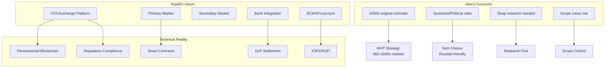

# 📋 Project Alignment & Synthesis: Cifra RWA/CFA Platform

## 🎯 TL;DR Executive Summary

### 🔴 Critical Reality Check
- **Original estimate**: 6000 hours from outsource company
- **Realistic timeline**: 1000-1500h over 6-9 months (NOT 400h in 3 months)
- **Current rate**: $40/hour (down from $50) with 100% prepayment requirement
- **MVP focus**: Primary market only, secondary market deferred to v1.1

### ✅ What Previous Agents Delivered
1. **cc-171f**: Comprehensive analysis, C4 architecture, domain model, roadmap
2. **cc-e4ee**: Project manifest, organizational improvements, documentation structure
3. **co-76ca**: 20 competitors analyzed, client materials (SOW, glossary, roadmap), realistic timeline

### 🚨 Critical Pending Decisions
1. **Ledger technology**: Hyperledger Fabric vs Besu vs immudb
2. **Bank partner**: For DvP settlement and nominal accounts
3. **УКЭП vendor**: For digital signatures (63-ФЗ compliance)

---

## 💡 Strategic Insights Synthesis

### Agent Contributions Map

| Agent | Key Deliverables | Status | Critical Insights |
|-------|------------------|--------|-------------------|
| **cc-171f** | - Comprehensive analysis<br>- C4 architecture<br>- Domain model<br>- Research plan | ✅ Complete | - Yury's psychological profile<br>- 560h MVP estimate<br>- Microservices architecture |
| **cc-e4ee** | - Project manifest<br>- Folder structure<br>- AGENTS.md rules | ✅ Complete | - Multi-agent collaboration framework<br>- Version control strategy |
| **co-76ca** | - 20 competitors research<br>- Client materials<br>- Realistic timeline<br>- Glossary | ✅ Complete | - Market landscape clarity<br>- 1000-1500h realistic estimate<br>- DvP unknown for most platforms |

### Key Requirements Convergence



---

## 🏗️ Unified Technical Architecture

### Technology Stack Consensus

| Layer | Technology | Rationale | Risk Level |
|-------|------------|-----------|------------|
| **Blockchain** | Hyperledger Fabric/Besu | Enterprise-grade, permissioned | Medium |
| **Smart Contracts** | Solidity/Chaincode | Standard, well-documented | Low |
| **Backend** | Node.js/NestJS | Team expertise | Low |
| **Database** | PostgreSQL + Event Store | CQRS pattern | Low |
| **Key Management** | HSM/MPC | Security requirement | High |
| **Infrastructure** | Kubernetes | Scalability | Medium |

### Core Services Priority Matrix

| Service | MVP Priority | Complexity | Dependencies |
|---------|--------------|------------|--------------|
| **identity-service** | ⭐⭐⭐ Critical | Medium | ЕСИА, КЭП |
| **tokenization-service** | ⭐⭐⭐ Critical | High | Blockchain, Smart Contracts |
| **ledger-service** | ⭐⭐⭐ Critical | High | Blockchain nodes |
| **payment-service** | ⭐⭐⭐ Critical | High | Bank partners |
| **settlement-service** | ⭐⭐ Important | High | DvP mechanism |
| **trading-service** | ⭐ Deferred | Medium | Order matching |
| **compliance-service** | ⭐⭐ Important | Medium | AML/CFT |

---

## 🎯 Reconciled Project Roadmap

### Phase 0: Foundation (Week 1-2, 80h)
**Status**: 🟡 In Progress

- [x] Multi-agent analysis complete
- [x] Competitor research (20 platforms)
- [ ] **Technology decision** ← BLOCKER
- [ ] **Bank partner selection** ← BLOCKER
- [ ] **УКЭП vendor selection** ← BLOCKER

### Phase 1: MVP Core (Week 3-8, 240h)
**Prerequisites**: Technology decisions finalized

```
Week 3-4: Infrastructure & Identity
├── Kubernetes setup
├── Basic KYC/KYB service
└── ЕСИА integration (mock)

Week 5-6: Tokenization
├── Smart contract factory
├── Basic CFA issuance
└── 3-node blockchain setup

Week 7-8: Settlement
├── Nominal accounts integration
├── Basic DvP mechanism
└── Transaction recording
```

### Phase 2: Integration (Week 9-12, 160h)
- Bank API integration
- УКЭП/КЭП implementation
- Compliance checks
- Basic reporting

### Phase 3: Testing & Launch (Week 13-14, 80h)
- Security audit
- Load testing
- Documentation
- Production deployment

---

## 🚨 Critical Actions Matrix

### Immediate (This Week)

| Action | Owner | Deadline | Impact | Blocker? |
|--------|-------|----------|--------|----------|
| **Decide ledger technology** | Юрий + Alex | Nov 3 | High | ✅ YES |
| **Select bank partner** | Юрий | Nov 3 | High | ✅ YES |
| **Choose УКЭП vendor** | Юрий | Nov 3 | Medium | ✅ YES |
| **Approve realistic timeline** | Юрий | Nov 2 | High | ❌ No |
| **First payment (40h)** | Юрий | Nov 2 | Critical | ✅ YES |

### Next Sprint (Week 2)

1. **Technical POC**
   - Deploy chosen blockchain (3 nodes)
   - Test smart contract deployment
   - Verify bank API connectivity

2. **Legal/Compliance**
   - Finalize regulatory requirements
   - Document compliance checklist
   - Prepare license applications

3. **Architecture**
   - Finalize C4 diagrams
   - API specifications (OpenAPI 3.0)
   - Security threat model

---

## 💰 Financial Alignment

### Budget Reality Check

| Scenario | Hours | Rate | Total | Feasibility |
|----------|-------|------|-------|-------------|
| **Юрий's expectation** | 400h | $40/h | $16,000 | ❌ Impossible |
| **MVP minimum** | 560h | $40/h | $22,400 | ⚠️ Very tight |
| **Realistic MVP** | 1000h | $40/h | $40,000 | ✅ Achievable |
| **Full platform** | 1500h | $40/h | $60,000 | ✅ Comfortable |

### Payment Structure
- **Blocks**: 40 hours prepaid
- **Notification**: Alert at 30h consumed
- **Stop work**: At 50h until next payment
- **Current credit**: $707.68 from previous project

---

## 📊 Risk Assessment Consolidation

### Top 5 Risks (Unified View)

1. **Scope Creep** (90% probability)
   - Mitigation: Written scope freeze, change control process

2. **Payment Delays** (70% probability)
   - Mitigation: 100% prepayment, automatic work stoppage

3. **Technology Decision Paralysis** (60% probability)
   - Mitigation: Time-boxed POCs, decision matrix

4. **Regulatory Changes** (50% probability)
   - Mitigation: Modular architecture, abstraction layers

5. **Unrealistic Timeline Pressure** (80% probability)
   - Mitigation: Written timeline agreement, phased delivery

---

## 🎬 Next Actions Summary

### For Юрий (Client)
1. ⚡ **Approve realistic timeline** (1000h over 6 months)
2. ⚡ **Make technology decisions** (Fabric vs Besu)
3. ⚡ **Select bank partner** for DvP
4. ⚡ **Choose УКЭП vendor**
5. ⚡ **Send first payment** (40h block)

### For Alex (Operator)
1. ✅ Prepare technology comparison matrix
2. ✅ Set up time tracking system
3. ✅ Create shared documentation space
4. ✅ Schedule weekly sync calls
5. ✅ Begin technical POCs once decisions made

### For Next Agent (cc-04-*)
1. 📝 Monitor technology decision outcomes
2. 📝 Begin implementation once blockers resolved
3. 📝 Track scope changes rigorously
4. 📝 Maintain financial burn-down chart
5. 📝 Update this alignment document weekly

---

## 📈 Success Metrics

### MVP Success Criteria
- [ ] 3 types of participants can register
- [ ] Simple CFA can be issued
- [ ] Transactions recorded on blockchain
- [ ] One bank integration working
- [ ] Admin panel operational

### Project Health Indicators
- [ ] Payment blocks maintained
- [ ] Scope changes < 10%
- [ ] Weekly demos delivered
- [ ] Documentation current
- [ ] No unpaid overtime

---

## 🔄 Document Maintenance

- **Next review**: Nov 7, 2025
- **Update frequency**: Weekly
- **Contributors**: All agents (cc-*, co-*, ge-*)
- **Version control**: Semantic versioning
- **SSOT principle**: This document supersedes conflicting information

---

*Generated by cc-03-0f8f | Project alignment synthesis | Multi-agent collaboration*