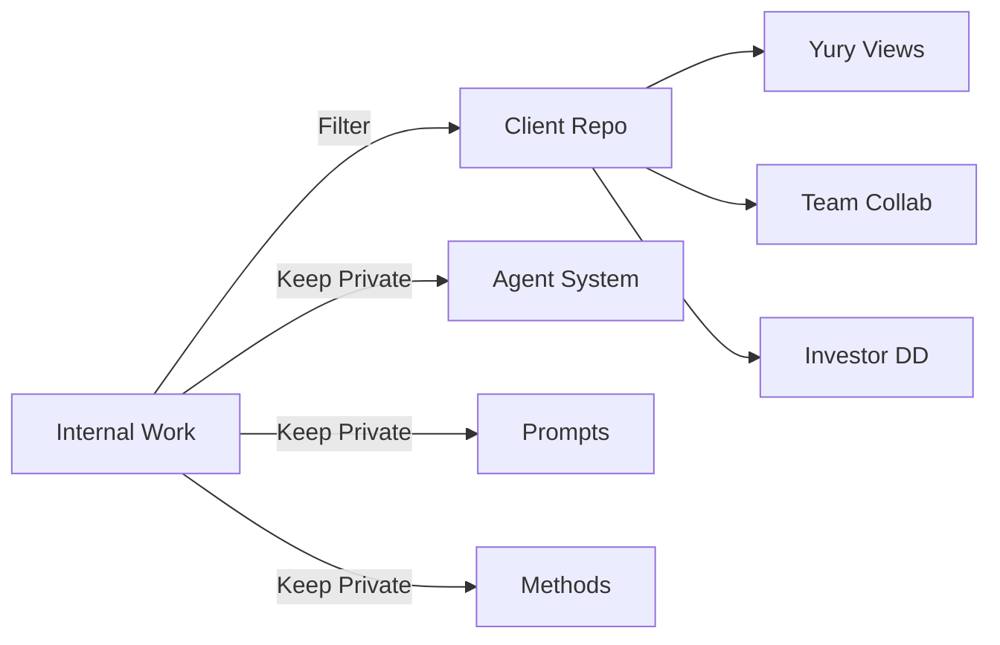

# 🔍 GitHub Transparency Strategy

## 🎯 Objective
Demonstrate **integrity, transparency, and professionalism** while maintaining competitive advantage.

---

## 📂 Two-Repository Architecture

### 1. Private Internal Repository
**Purpose**: Full framework and proprietary methods
```
github.com/alex-private/cifra-rwa-internal/
├── AGENTS.md                 # Multi-agent orchestration (PROPRIETARY)
├── memory-bank/              # Full knowledge base
├── prompts/                  # Optimized prompts (UNFAIR ADVANTAGE)
├── .claude/                  # Agent configurations
└── scripts/                  # Automation tools
```

**Access**: Only Alex and AI agents
**Why Private**: Maintains unfair advantage in multi-agent orchestration

### 2. Client Transparency Repository
**Purpose**: Demonstrate progress and enable collaboration
```
github.com/cifra-rwa/platform-development/
├── architecture/            # C4 diagrams, decisions
├── requirements/           # User stories, acceptance criteria
├── research/              # Competitor analysis, findings
├── api-specs/            # OpenAPI specifications
├── reports/              # Weekly progress reports
├── docs/                 # Technical documentation
└── .github/
    └── project/         # GitHub Projects for task tracking
```

**Access**: Yury, potential team members, investors (read-only)
**Why Public**: Shows spec-driven development and professional approach

---

## 🔄 Information Flow



---

## ✅ What to Share

### Share with Client
- ✅ Architecture decisions and diagrams
- ✅ Requirements and user stories
- ✅ Research findings and analysis
- ✅ API specifications
- ✅ Progress reports and timelines
- ✅ Test results and quality metrics
- ✅ Meeting notes and decisions

### Keep Private
- ❌ Multi-agent orchestration system
- ❌ Optimized prompt engineering
- ❌ Internal time tracking (real hours)
- ❌ Agent conversation logs
- ❌ Proprietary analysis methods
- ❌ Personal productivity hacks

---

## 📊 Benefits for Yury

### 1. **Transparency**
- See real-time progress
- Track all decisions
- Review any document

### 2. **Collaboration**
- Other developers can contribute
- Investors can do due diligence
- Easy handover if needed

### 3. **Professional Image**
- Modern development practices
- Version control everything
- Audit trail for compliance

### 4. **Reusability**
- Can show to other stakeholders
- Template for future projects
- Knowledge base for team

---

## 🚀 Implementation Plan

### Week 1: Setup
```bash
# Create client repository
gh repo create cifra-rwa/platform-development --public

# Initial structure
mkdir -p {architecture,requirements,research,api-specs,reports,docs}

# Add README with professional description
echo "# ЦФА Platform Development" > README.md

# Setup GitHub Projects
gh project create "MVP Development" --repo cifra-rwa/platform-development
```

### Week 2: Populate
1. Upload sanitized research
2. Add architecture diagrams
3. Create first progress report
4. Setup automated workflows

### Ongoing: Maintain
- Daily commits (shows activity)
- Weekly report uploads
- Architecture decision records
- Meeting summaries

---

## 📈 Metrics to Show

### Activity Metrics
```yaml
commits_per_week: 20-30
documents_created: 50+
decisions_documented: 15+
requirements_tracked: 100+
```

### Progress Metrics
- Burn-up chart in GitHub Projects
- Milestone completion percentages
- Test coverage trends
- Documentation completeness

---

## 💬 Messaging to Yury

### Initial Pitch
> "Юрий, предлагаю использовать GitHub для полной прозрачности разработки. Вы сможете в real-time видеть прогресс, все документы, архитектурные решения. Это также позволит другим разработчикам подключиться и инвесторам провести due diligence."

### Key Benefits to Emphasize
1. **"Spec-driven development"** - современный подход
2. **"Full transparency"** - видите каждый шаг
3. **"Collaboration ready"** - легко масштабировать команду
4. **"Investor friendly"** - профессиональный уровень

### Address Concerns
- **If "too technical"**: "Есть простой dashboard с прогрессом"
- **If "prefer Jira"**: "GitHub ближе к коду и modern AI development"
- **If "security concerns"**: "Sensitive data в приватном репо"

---

## 🎯 Success Metrics

### For Alex
- ✅ Maintains unfair advantage
- ✅ Shows professionalism
- ✅ Enables async communication
- ✅ Reduces status meetings

### For Yury
- ✅ Real-time visibility
- ✅ Professional documentation
- ✅ Easy to share with stakeholders
- ✅ No vendor lock-in

---

## ⚠️ Risks and Mitigations

| Risk | Mitigation |
|------|------------|
| Exposing proprietary methods | Two-repo strategy |
| Information overload | Clear folder structure |
| Time overhead | Automate with scripts |
| Security concerns | Private repo for sensitive |

---

*This strategy balances transparency with competitive advantage, demonstrating professionalism while protecting intellectual property.*