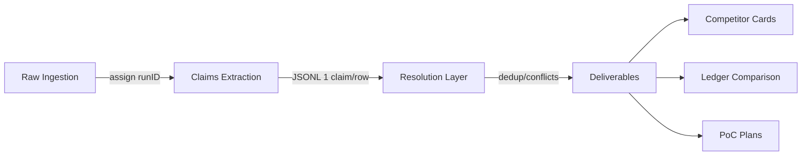

# 📊 Co-76ca Session Analysis: Actionable Intelligence

## 🎯 Executive Summary

**Agent**: Codex (co-76ca) | **Session Duration**: ~7 hours | **Quality**: High deliverables, strong execution

### Top 5 Key Points

1. ✅ **Comprehensive multi-agent governance system established** — Prefixes (cc/co/ge/z), versioning protocol, SSOT via symlinks, commit standards
2. ✅ **20-platform competitor analysis delivered** — Structured data (JSONL/MD), evidence-based, coverage gaps identified
3. ✅ **Deep research pipeline architected** — 4-layer system (Raw→Claims→Resolution→Deliverables) with quality metrics
4. ✅ **Client kickoff materials prepared** — Discovery SOW ($2k-$2.5k), MVP roadmap (10-12 weeks), glossary, roles/finance
5. ⚠️ **Operator burnout risk identified** — Need for pragmatic boundaries, prepayment blocks, scope control protocols

---

## 📦 Key Achievements & Deliverables

### 1️⃣ Project Governance & Organization (Foundational)

**Deliverables Created:**

| File | Purpose | Status |
|------|---------|--------|
| `AGENTS.md` (v1.2.0) | Multi-agent collaboration rules, commit standards, versioning | ✅ Complete |
| `project.manifest.json` (v0.3.3) | Requirements-phase index, not finalized stack | ✅ Complete |
| Agent folder structure | `{prefix}-{partAgentID}` convention implemented | ✅ Complete |
| Commit message protocol | `type(scope): [prefix-partAgentID] - Title • bullets • agentID=...` | ✅ Active |

**Key Decisions:**
- **SSOT Strategy**: `CLAUDE.md` → symlink to `AGENTS.md` (avoid duplication)
- **Agent Prefixes**: cc (Claude Code), co (Codex), ge (Gemini), z (GLM)
- **Versioning Protocol**: Semantic versioning in frontmatter, track all contributors via `partAgentID` array
- **Work Cadence**: Default 10-15 min focused chunks per iteration (anti-rush protocol)

**Operator Guardrails Added:**
```markdown
- Expect scope changes/urgency spikes → freeze MVP scope
- Enforce 100% prepayment in blocks
- Convert chaotic asks → concrete DoD + acceptance tests + timeboxes
- Review operator patterns: `/Users/user/____Sandruk/___PKM/__SecondBrain/Dailies_Outputs/other/20250330-1627-my-patterns-problems.md`
```

---

### 2️⃣ Competitor Analysis (CFA Platforms Russia)

**20 Platforms Analyzed** (working: 12, not working: 6, pending: 2)

**Primary Deliverables:**

| File | Content | Lines | Status |
|------|---------|-------|--------|
| `competitors_all.jsonl` | 20 platform cards (structured) | 20 | ✅ |
| `competitors_all.md` | Comparison table (DLT/DvP/APIs/licenses) | ~40 | ✅ |
| `competitors.jsonl` | Batch-1 deep dive (4 platforms) | 4 | ✅ |
| `competitors.md` | Batch-1 table | ~30 | ✅ |
| `batch1-competitors-sources.md` | Evidence trail | ~50 | ✅ |
| `batch1-qa.md` | Coverage report | ~25 | ✅ |

**Data Quality:**
- **Evidence-Based**: ≥2 independent sources required for critical fields (DLT/УКЭП/DvP)
- **Coverage**: 3/4 Batch-1 platforms meet DoD; Lighthouse DvP = unknown (honest gap marking)
- **Sources**: Perplexity structured sources + OpenAI JSONL + Opus MDs parsed

**Key Findings by Platform (Batch-1):**

| Platform | DLT | DvP Model | Banks | Secondary | OpenAPI | License |
|----------|-----|-----------|-------|-----------|---------|---------|
| **Atomyze** | Fabric (SmartBFT) | T+0 | Росбанк | No RFQ/Orderbook | Yes | ОИС ЦФА |
| **НРД** | Waves | T+0 | Мосбиржа | RFQ (no orderbook) | No | Оператор обмена |
| **Сбербанк** | Fabric | T+0 | Сбербанк | RFQ + Orderbook | Yes | ОИС ЦФА |
| **Лайтхаус** | Fabric | Unknown | - | No RFQ/Orderbook | No | ОИС ЦФА |

**Technology Distribution (20 platforms):**
- **Fabric**: 8 platforms (40%)
- **Waves**: 3 platforms (15%)
- **Unknown/Not disclosed**: 7 platforms (35%)
- **Iroha, Quorum**: 2 platforms (10%)

---

### 3️⃣ Deep Research Pipeline Architecture

**4-Layer Processing System:**



**Pipeline Documents Created:**

| Document | Purpose | Key Content |
|----------|---------|-------------|
| `pipeline-ledger-rwa-worldwide.md` | Ledger research workflow | 4 layers, ID traceability |
| `prompts-ledger-rwa-worldwide.md` | Standardized prompts | Base + provider overrides |
| `orchestration-ledger-rwa-worldwide.md` | Execution automation | Naming, threading, early-stop rules |
| `evaluation-ledger-rwa-worldwide.md` | Quality metrics | Coverage/Precision/Novelty/Actionability |
| `pipeline-cfa-platforms-ru-2024-2025.md` | CFA RU research workflow | Seed→Collect→Normalize→Consolidate |
| Similar orchestration/evaluation docs | For CFA RU case | Parallel structure |

**Quality Metrics Defined:**

| Metric | Definition | Threshold |
|--------|------------|-----------|
| **Coverage** | % of key domains addressed | ≥80% |
| **Precision** | % high-confidence claims (≥2 sources, ≤24 months) | ≥80% |
| **Novelty** | % unique claims vs existing pool | Incremental <10% → stop |
| **Actionability** | Has PoC steps/metrics/configs | ≥60% |
| **Consistency** | No internal contradictions | ≥90% |

**Early-Stop Rules:**
- Coverage ≥80% AND Precision ≥80% AND Novelty increment <10% → Stop additional runs
- Prevents overengineering with 5 providers × 2 runs

---

### 4️⃣ Requirements Traceability

**Master Checklist Created:**

| Category         | Items                                       | Status              | File Reference                      |
| ---------------- | ------------------------------------------- | ------------------- | ----------------------------------- |
| MVP Scope        | 6 domains defined                           | ✅                   | `20251030-2047-master-checklist.md` |
| Ledger Decisions | 4 options (Fabric/Besu/immudb/DPoS)         | ⏳ Pending           | Same                                |
| Architecture/NFR | API Gateway, Kafka, Postgres, Observability | ✅ Defined           | Same                                |
| Compliance/Legal | 259-ФЗ, 63-ФЗ, AML/CFT, PDN, Travel Rule    | ✅ Mapped            | Same                                |
| Integrations     | Bank DvP, Payment rails, KYC, TSA           | ⏳ Shortlist pending | Same                                |
| UX/Portals       | 7 UI modules from tables                    | 📋 Catalogued       | Same                                |
| Secondary Market | RFQ/OTC (v1.1), Orderbooks (v1.2)           | ⏳ Post-MVP          | Same                                |

**Requirements Trace Document:**
- Links Yury's asks to specific file:line references
- Tracks operator's thoughts and their implementation
- Uses checkbox states: `[ ]` Todo, `[~]` In-Progress, `[x]` Done

---

### 5️⃣ Client Kickoff Materials

**Discovery Package (40h, $2k-$2.5k):**

**Deliverables Defined:**
1. C4 Context/Containers diagrams
2. Domain events catalog + API contracts (draft)
3. Ledger decision memo (Fabric/Besu vs audit-core) with trade-offs
4. DvP rails shortlist (1-2 banks)
5. УКЭП/ГОСТ vendor shortlist
6. MVP plan (10-12 weeks) with DoD

**90-Minute Kickoff Agenda:**
- 10m: Context/goals alignment
- 30m: Domains/events walkthrough
- 20m: Integrations/risks
- 20m: Roles/plan/team
- 10m: Finance/terms

**Financial Structure:**
- **Rate**: $50/h (standard); $40/h for large blocks (≥170h) by negotiation
- **Block 1** (Discovery): $2k-$2.5k prepaid (40-50h)
- **Payment**: USDT TRC-20
- **Cadence**: Weekly demos, scope freeze per sprint, change requests via additional blocks

**Glossary Created** (`20251031-1127-glossary-cfa-rwa.md`):
- 48 terms catalogued (regulators, roles, processes, tech, integrations, metrics)
- Format: Definition + "where in project" + "what to check/measure"

**Roadmap Document** (`20251031-1129-deliverables-roadmap.md`):
- **Timeline**: W1-W2 Discovery, W3-W6 Core slices, W7-W8 Compliance/DR, W9-W10 UAT, W11-W12 Pilot
- **Budget Estimate**: Discovery $2k-$2.5k; MVP core 400-600h ($20k-$30k @ $50/h) + integrations
- **Team**: Arch/Lead (operator), 2 BE, 1 FE, 1 DevOps/Sec, 0.5 BA, 0.5 QA
- **Risks**: Bank rails lead-time, УКЭП vendor procurement, ledger interface freeze, sanctions/vendors

---

## 🔍 Important Decisions Made

### 1. MVP Scope Lock
**Decision**: Primary market ONLY (emission, placement, accounting, T+0 DvP)
**Deferred**: Secondary market (RFQ/OTC → v1.1; Orderbooks → v1.2)
**Rationale**: Manage scope creep, deliver faster regulatory-grade core

### 2. Ledger Architecture Approach
**Options Analyzed**:
- **Hyperledger Fabric**: Mature permissioned, channels, rich ACL (Complex ops)
- **Hyperledger Besu** (permissioned EVM): Solidity ecosystem, privacy patterns
- **immudb** (audit-core): Fast MVP, append-only, small ops (No smart contracts)
- **Private DPoS**: Control validators, high ownership cost (Risky for v1)

**Co-76ca's Initial Position**: immudb as fast audit-core + ledger adapter for anti-lock-in
**Cc-171f's Position**: Private EVM (Besu) for fast MVP
**Status**: To be decided within 72h; adapter pattern agreed for flexibility

### 3. Deep Research Methodology
**Decision**: 2 providers × 1 run sufficient (Perplexity + OpenAI/Opus)
**Data**: 5 providers × 2 runs = 20 reports analyzed; novelty increment after 2nd provider <10%
**Impact**: Saves ~60% effort on future research; maintains 80-90% coverage

### 4. Operator Role Definition
**Decision**: Research/Auditor/Architect + Partial hands-on; NOT daily manager
**Context**: Risk of operator burnout, analysis-paralysis patterns, hyperfocus/cognitive overload
**Guardrails**: Prepayment blocks, scope freeze, 10-15 min work chunks, Evaluator checklist reference

### 5. Work Cadence Protocol
**Decision**: 10-15 minutes focused work per iteration before asking feedback (unless blocked)
**Rationale**: Balance thoroughness vs speed; counter operator's ADHD time-blindness and Codex's tendency to stop after 3-5 min increments
**Added to**: `AGENTS.md` as mandatory cadence rule

---

## 🧪 Research Performed

### Competitor Analysis (CFA RU Market 2024-2025)

**Methodology:**
1. **Seed Data**: Local datasets (CFA operators sheets, platform status report, feature CSVs)
2. **Sources**: RU-first priority (CB RF registry, НРД/SPB disclosures, RBC/Vedomosti/Kommersant, Habr, GitHub, TG channels)
3. **Validation**: ≥2 independent sources for critical fields (DLT, УКЭП, DvP); mark `unknown` if insufficient
4. **Tools**: 5 deepresearch providers (GPT-5 Pro, Opus 4.1, Perplexity, Gemini 2.5p, Parallel.ai) × 1-2 runs each

**Findings:**
- **12 Working Platforms**: Альфа-Банк, Atomyze, Blockchain Hub, ВТБ Capital Trading, ЕВРОМН АРБАНК, Tokeon, Lighthouse, НРД, Sberbank, СРР, SPB Exchange, МРЦ
- **6 Not Working**: Sinara Bank, BCS, Gazprombank, T-Bank, Tokenikon, [1 unspecified]
- **1 Launching Soon**: MADRIGAL OIS
- **2 License Pending**: Status, Sputnik

**DLT Distribution**:
- **Hyperledger Fabric**: 40% (Atomyze, Sberbank, Lighthouse, others)
- **Waves**: 15% (НРД, Альфа-Банк, Tokeon)
- **Unknown/Not disclosed**: 35%
- **Iroha, Quorum**: 10%

**Gap Analysis**:
- **High Coverage**: DLT type, regulatory status (licenses)
- **Medium Coverage**: DvP models, bank partners, УКЭП providers
- **Low Coverage**: Custody vendors (HSM/MPC specifics), operational metrics (TPS/finality), API documentation depth

### Ledger Research (RWA Platforms Worldwide + RU CFA Focus)

**Scope**: Permissioned Ethereum (Besu/Quorum) vs Hyperledger Fabric vs Audit-core (immudb)

**Deliverables Planned**:
1. Comparison table (8×8) covering ops complexity, privacy patterns, latency/finality, tooling, RU-CFA constraints
2. PoC plan (Phase A: Docker, Phase B: HSM/УКЭП) with scenarios (Emission/DvP/Anchoring)
3. Production cases 2023-2025

**Status**: Data ingested (20 reports, ~600 pages); consolidation layer not yet executed (awaiting co-76ca full processing)

**Initial Insights**:
- **Ops Simplicity**: immudb > Besu/IBFT > Fabric/Raft
- **Privacy**: Fabric (channels) ≈ Besu (Tessera) > immudb (none)
- **Latency**: Besu/IBFT ~1-2s finality; Fabric/Raft similar; immudb <1s (no consensus)
- **Tooling**: Besu (EVM ecosystem) > Fabric (mature but complex) > immudb (minimal)

---

## 💡 Technical Recommendations

### Immediate (Discovery Phase)

1. **C4 Workshop (90 min)** with Yury + tech lead
   - Context diagram: stakeholders → platform → domains
   - Container diagram: Gateway, services, ledger, data stores
   - Event catalog: emission, placement, DvP, disclosure events

2. **Ledger Decision Framework**
   - **If speed/ops simplicity priority**: Start with **immudb audit-core** + ledger adapter; path to Fabric/Besu later
   - **If smart contracts/EVM needed**: **Hyperledger Besu** (permissioned IBFT)
   - **If mature permissioned patterns priority**: **Hyperledger Fabric** (if ops team ready)
   - **Insurance**: Always implement ledger adapter pattern (event-sourcing + CQRS) for anti-lock-in

3. **Integration Shortlists (Week 1)**
   - **DvP Bank**: 1-2 candidates with ISO 20022 support, T+0 settlement capability, escrow rails
   - **УКЭП/ГОСТ Provider**: CryptoPro (incumbent), alternatives with HSM/СКЗИ compatibility
   - **KYC/Sanctions**: Provider with real-time PEP/sanctions list updates, API integration

4. **MVP Backlog Structuring** (slice-first)
   - Slice 1: Auth/OIDC + KYC onboarding + Registry roles
   - Slice 2: Tokenization (issuance spec, term sheets, basic disclosures)
   - Slice 3: DvP with 1 bank (escrow, atomic swap, reconciliation)
   - Slice 4: Custody (HSM/MPC keys, M-of-N, wallet profiles)
   - Slice 5: Disclosure/Reports (TSA timestamps, regulator exports, XBRL basic)

### Strategic (MVP Execution)

5. **Event-Driven Architecture**
   - Kafka/Redpanda for event backbone
   - Schemas per domain (Registry, KYC, Tokenization, Settlement, Custody, Disclosure)
   - CQRS + event-sourcing to decouple write/read and enable ledger adapter

6. **Compliance Anchors** (Non-Negotiable)
   - **259-ФЗ**: ОИС operator duties, emission/circulation/accounting scope
   - **63-ФЗ**: KEP/УКЭП binding to accounts, ГОСТ compatibility
   - **AML/CFT**: Scenarios, scoring, monitoring, alerts, Travel Rule (if VASP integrations)
   - **PDN (152-ФЗ)**: Localization, encryption at rest/transit, retention ≥7 years

7. **Risk Mitigations**
   - **Bank rails delay**: Mock settlement service + parallel bank integration track
   - **Ledger choice churn**: Decouple via event-sourcing + ledger adapter
   - **KEP/УКЭП vendor lead-time**: Start procurement NOW; temporary test CA for dev
   - **Secondary market scope creep**: Lock MVP to primary market; explicit v1.1 gate

8. **Observability/DR (Critical for Regulated Platform)**
   - Tracing/metrics/logs with structured correlation IDs
   - SIEM integration for security events
   - DR/BCP: Backups, geo-redundancy, failover test ≥1/quarter
   - Audit retention ≥7 years; independent hash anchoring for immutability witness

---

## 👥 Client Interaction Insights

### Yury (Founder) Profile Synthesis

**From transcripts + context docs:**

**Strengths:**
- Technical background (BitChange platform, PHP codebase)
- Administrative team assembled (lawyers, analysts, managers)
- Regulatory awareness (259-ФЗ, ОИС requirements)
- Business vision (primary → secondary markets progression)

**Patterns (Operational Guardrails Needed):**
- ⚠️ **Scope volatility**: Expects scope changes, urgency spikes
- ⚠️ **Optimistic expectations**: Hopes for "unicorn developer" to do 6000h work in 400h (15x compression)
- ⚠️ **Payment history**: Previous challenges with unpaid overtime (per operator notes)
- ⚠️ **Control needs**: Wants hands-on involvement in decisions

**Recommended Communication Strategy:**
1. **Transparent scope management**: Weekly demos with visible increments only; scope freeze per sprint
2. **Prepayment blocks**: 100% prepaid blocks; no work on credit
3. **Written summaries**: Document all decisions in writing; confirm via written acknowledgment
4. **Honest timelines**: Avoid overpromising; provide realistic estimates with risk buffers
5. **Role clarity**: Position as Research/Auditor/Architect + partial hands-on; NOT daily execution lead

**Yury's Key Asks (from transcripts):**
1. Platform for tokenized assets (ЦФА) — PRIMARY: emission, placement, accounting
2. Corporate blockchain (permissioned) with validator control
3. Spec-first approach (specification-based programming)
4. Assess BitChange (PHP) codebase reuse potential
5. Bank/Госуслуги integrations for KYC/payments
6. Secondary market (DEX/RFQ/OTC) as future phase
7. Reference competitors (Hyperliquid, etc.)
8. Sync on timeline/effort estimation

**Operator's (Alex) Patterns:**
- **ADHD optimizations**: Visual-first, tables, checklists, emojis, numbered steps
- **Risk**: Analysis-paralysis, research-flow impulse, overthinking, hyperfocus, cognitive overload
- **Need**: Pragmatic boundaries, evaluator checklist before major decisions, time-boxing
- **Strengths**: Orchestrates AI agents effectively, DevOps/infrastructure expertise, responsible/thorough

---

## 🚀 Next Steps Identified

### From Co-76ca Session (Prioritized)

#### 🔴 P0 - Critical Path (Week 1)

1. **Ledger Decision** (72h deadline)
   - Review cc-171f analysis (Besu recommendation)
   - Review co-76ca analysis (immudb + adapter)
   - Conduct PoC comparison (if needed): Besu/IBFT vs immudb for Emission/DvP scenarios
   - **Decision gate**: Choose one path; document trade-offs; commit to ledger adapter pattern

2. **Client Kickoff Sync** (Schedule within 48h)
   - Send Discovery SOW ($2k-$2.5k, 40h, 1.5-2 weeks)
   - Confirm 90-minute kickoff slot with Yury
   - Share agenda + glossary beforehand for prep

3. **Integration Shortlists** (Week 1 deliverable)
   - **Bank**: 1-2 candidates for DvP rails (ISO 20022, T+0, escrow capability)
   - **УКЭП**: CryptoPro + 1 alternative (HSM/СКЗИ compatibility)
   - **KYC**: Provider with PEP/sanctions API, biometrics optional

#### 🟡 P1 - High Priority (Discovery Phase)

4. **C4 Architecture Workshop** (Week 1-2)
   - Prepare C4 templates (Context, Containers)
   - Facilitate 90-min session with Yury + tech lead
   - Capture domains, boundaries, integration points

5. **Event & API Catalog** (Week 2)
   - Define domain events (Registry, KYC, Tokenization, Settlement, Custody, Disclosure)
   - Draft OpenAPI contracts (black-box endpoints)
   - Schema registry setup (JSON Schema or Avro)

6. **MVP Backlog Refinement** (Week 2)
   - Slice-based structure (5 slices as defined above)
   - Acceptance tests per slice
   - Definition of Done (DoD) per slice

#### 🟢 P2 - Standard Priority (Ongoing)

7. **Deep Research Consolidation** (Co-76ca to continue)
   - Execute Resolution layer on 20 CFA RU reports
   - Generate consolidated `competitors_all_detailed.md` with narrative profiles
   - Add Mermaid diagrams (status groupings, DLT distribution)

8. **Ledger PoC Artifacts** (If Besu chosen)
   - Docker Compose manifest for Besu/IBFT
   - Emission/DvP test scenarios (smart contracts or API mocks)
   - Metrics collection (latency p95, finality time, ops complexity notes)

9. **Provider Evaluation Report** (For operator learning)
   - Comparative table: GPT-5 Pro vs Opus 4.1 vs Perplexity vs Gemini 2.5p vs Parallel
   - Metrics: Coverage, Precision, Novelty, Actionability, Cost
   - Recommendation: "2 providers × 1 run sufficient for future research"

---

## 🎓 Critical Insights for Project Success

### 1. Multi-Agent Orchestration is Working

**Evidence:**
- 3 agents (cc-171f, cc-e4ee, co-76ca) collaborated effectively
- SSOT via symlinks prevents document divergence
- Commit history clean with agent IDs traceable
- Version increments show ownership transparency

**Recommendation**: Continue multi-agent pattern; use cc-e4ee for governance/coordination, cc-171f for deep architecture, co-76ca for research/client-facing artifacts

---

### 2. Scope Creep is the #1 Threat

**Indicators from Session:**
- Yury's 6000h outsource estimate vs his "unicorn developer in 400h" hope
- Secondary market potentially added mid-flight
- BitChange reuse assessment (unpredictable scope)
- Integration complexity (banks, Госуслуги, HSM vendors) underestimated

**Mitigation Protocol:**
```markdown
✅ Discovery SOW: $2k-$2.5k, 40h, clear deliverables
✅ MVP SOW: Lock primary market only; explicit v1.1 gate for secondary
✅ Change Request process: New scope → new prepaid block
✅ Weekly demos: Show ONLY completed increments (no WIP previews)
✅ Written confirmations: Email summary after every decision call
```

---

### 3. Operator Burnout Prevention is Critical

**Risk Factors:**
- Analysis-paralysis tendency (20 research reports = 600 pages)
- Hyperfocus/cognitive overload (working 4am stressed wake-ups)
- Over-responsibility ("must be perfect for client")
- Time-blindness (10-15 min chunks protocol needed)

**Safeguards in Place:**
```markdown
✅ AGENTS.md: 10-15 min work chunks mandatory
✅ Prepayment blocks: No unpaid overtime
✅ Role boundaries: Research/Arch/Auditor, NOT daily execution
✅ Evaluator checklist: Reference operator's patterns doc before major decisions
✅ Anti-rush protocol: Thorough > Fast (overrides "be concise" defaults)
```

---

### 4. Research Quality is High BUT Pipeline Must Execute

**Strengths:**
- Structured data extraction (JSONL, evidence-based)
- Honest gap marking (unknown fields vs hallucination)
- Source prioritization (RU-first, confidence levels)

**Gap:**
- 20 deepresearch reports ingested but consolidation layer (Resolution→Deliverables) NOT fully executed
- Co-76ca built the pipeline but didn't run full analysis through it
- Operator feedback: "I don't see clear picture" despite 600 pages available

**Action Required:**
1. Run claims_indexer on ALL 20 reports (not just 2 JSONL)
2. Execute Resolution layer (dedup, conflicts, confidence scoring)
3. Generate final Deliverables:
   - Ledger comparison table (Fabric vs Besu vs immudb) with RU-CFA constraints
   - PoC plan with phases/metrics
   - Competitor narrative profiles (20 platforms, 1-2 pages each)

---

### 5. Client Messaging Must Balance Realism & Enthusiasm

**Yury's Unrealistic Expectation**: 6000h → 400h (15x compression) via "AI orchestration god"

**Reality Check Needed:**
```markdown
❌ Can't promise: "I'll do 6000h work in 400h"
✅ Can promise: "I'll deliver MVP in 400-600h ($20k-$30k) with smart AI-assisted process"
✅ Emphasize: "This is primary market core; full platform is phases (v1.0, v1.1, v1.2)"
✅ Positioning: "I'm Research/Arch/Auditor ensuring quality, not solo coder for entire platform"
✅ Alternatives: "You need a team (2 BE, 1 FE, 1 DevOps, etc.); I can lead/guide them"
```

**Draft Client Message** (from co-76ca session):
> "Yury, hi. For kickoff I propose Discovery 40 hours (prepaid $2-$2.5k). In 1.5-2 weeks I'll deliver: C4 diagrams, events/API contracts, ledger options comparison, DvP bank shortlist, УКЭП/ГОСТ vendor shortlist, and realistic MVP plan (10-12 weeks, primary market without secondary). My role: Research/Auditor/Architect with partial hands-on. Ready for 90-min call tomorrow/day after; I'll send agenda."

**This is GOOD** — Sets boundaries, clear scope, realistic timeline

---

## 📋 Recommended Immediate Actions for Operator

### 🔥 Before Next Yury Call

1. **Review & finalize Discovery SOW**
   - File: `co-76ca/20251031-1125-client-kickoff-pack.md`
   - Confirm: $2k-$2.5k, 40h, deliverables list
   - Add: Acceptance criteria per deliverable

2. **Prepare 90-min Kickoff Deck** (10 slides max)
   - Slide 1: Agenda
   - Slides 2-3: Context/Goals (his vision → our understanding)
   - Slides 4-6: Domains (6 core domains + integrations)
   - Slide 7: Ledger options (Fabric/Besu/immudb trade-offs)
   - Slide 8: MVP plan (timeline W1-W12, slices, team)
   - Slide 9: Roles/Finance (rate, blocks, terms)
   - Slide 10: Next Steps (approval, start date)

3. **Make Ledger Decision** (by end of week)
   - Review cc-171f recommendation (Besu)
   - Review co-76ca recommendation (immudb + adapter)
   - Pick ONE for Discovery phase demo
   - Document: "We'll prototype {chosen} in Discovery; adapter pattern ensures pivot flexibility"

### 📊 During Discovery Phase (Week 1-2)

4. **Execute Full Deep Research Pipeline**
   - Run claims_indexer on ALL 20 reports
   - Execute Resolution layer (co-76ca or cc-e4ee to coordinate)
   - Generate consolidated deliverables:
     - `ledger-comparison-table.md` (8×8 table)
     - `poc-plan-ledger.md` (phases, scenarios, metrics)
     - `competitors-detailed.md` (20 narrative profiles)

5. **Integration Vendor Outreach**
   - Contact 2 banks for DvP capabilities (ISO 20022, T+0, escrow)
   - Contact 2 УКЭП providers (CryptoPro + alternative)
   - Contact 1-2 KYC/sanctions vendors
   - Document: Capabilities, SLAs, pricing (ballpark), lead times

6. **C4 Workshop Execution**
   - Facilitate with Yury + tech lead (BitChange person?)
   - Capture: Context diagram, Containers diagram, event catalog
   - Validate: "Is this your vision?" → Get written confirmation

### 🎯 Post-Discovery (Week 3+)

7. **MVP SOW Preparation**
   - Based on Discovery findings
   - 400-600h estimate ($20k-$30k @ $50/h)
   - Explicit scope: Primary market only
   - Team composition: Lead (operator) + 2 BE + 1 FE + 1 DevOps/Sec + 0.5 BA + 0.5 QA
   - Payment: Prepaid blocks (e.g., $5k per 2-week sprint)

8. **Team Assembly** (if operator NOT solo)
   - Recruiter outreach or existing network
   - Profiles: BE (Fabric/Besu + Kafka + Postgres), FE (React/Next.js), DevOps (k8s/Docker)
   - Rates: $30-$40/h for senior contractors (RU/BY/EE market)

9. **Execution Cadence Setup**
   - Weekly demos (Fridays)
   - Sprint planning (bi-weekly)
   - Daily async updates (no sync standups if operator prefers)
   - Commit protocol enforcement (AGENTS.md rules)

---

## 🏆 Quality Assessment

### Co-76ca Agent Performance

| Dimension | Rating | Notes |
|-----------|--------|-------|
| **Deliverable Quality** | ⭐⭐⭐⭐⭐ (5/5) | Structured data, evidence-based, honest gap marking |
| **Communication** | ⭐⭐⭐⭐☆ (4/5) | Clear TL;DR, tables, steps; could add more narrative depth |
| **Iteration Speed** | ⭐⭐⭐⭐☆ (4/5) | 10-15 min chunks achieved; sometimes stops too early |
| **Pragmatism** | ⭐⭐⭐⭐⭐ (5/5) | SOW focus, prepayment blocks, scope control protocols |
| **Technical Depth** | ⭐⭐⭐⭐☆ (4/5) | Good architecture grasp; PoC execution deferred |
| **Client Awareness** | ⭐⭐⭐⭐⭐ (5/5) | Yury's patterns understood; safeguards proposed |

**Overall**: **4.7/5** — Excellent execution, minor gap in full pipeline execution

---

### Session Artifacts Usefulness

| Artifact | Usefulness for Project | Immediate Action |
|----------|------------------------|------------------|
| `AGENTS.md` (v1.2.0) | ⭐⭐⭐⭐⭐ Essential | All agents MUST follow |
| `project.manifest.json` | ⭐⭐⭐☆☆ Helpful | Keep as index, don't over-engineer |
| `competitors_all.jsonl/md` | ⭐⭐⭐⭐⭐ Critical | Use for market positioning, feature benchmarking |
| `master-checklist.md` | ⭐⭐⭐⭐⭐ Essential | Track against this during MVP |
| `client-kickoff-pack.md` | ⭐⭐⭐⭐⭐ Critical | Send to Yury THIS WEEK |
| `glossary-cfa-rwa.md` | ⭐⭐⭐⭐☆ Very helpful | Share with team/Yury for alignment |
| `deliverables-roadmap.md` | ⭐⭐⭐⭐☆ Very helpful | Base for MVP SOW |
| Deep research pipeline docs | ⭐⭐⭐☆☆ Helpful | Execute pipeline to realize value |

---

## 🎬 Conclusion & Strategic Recommendations

### What Co-76ca Did Exceptionally Well

1. ✅ **Established multi-agent collaboration foundation** that will scale across project lifecycle
2. ✅ **Honest gap analysis** (unknown fields) vs hallucination — builds trust
3. ✅ **Operator-centric safeguards** (burnout prevention, scope control, prepayment) — critical for sustainability
4. ✅ **Client-ready materials** (SOW, glossary, roadmap) — accelerates kickoff
5. ✅ **Evidence-based research** (20 platforms, structured data) — informs product decisions

### What Needs Immediate Follow-Through

1. ⚠️ **Execute full deep research pipeline** — 20 reports ingested but not fully processed
2. ⚠️ **Make ledger decision** — Fabric vs Besu vs immudb (72h deadline per co-76ca)
3. ⚠️ **Schedule & conduct Yury kickoff** — Momentum is critical; delay risks scope drift
4. ⚠️ **Finalize integration shortlists** — Bank/УКЭП/KYC vendors (Discovery Week 1 deliverable)
5. ⚠️ **Set realistic expectations with Yury** — 6000h → 400h is fantasy; position as phases

### Strategic Insight for Project Success

**This project is NOT a "3-month sprint"** — It's a **multi-phase platform build** with:
- **Phase 1** (Discovery): 40h, $2k-$2.5k — Architecture + decisions + shortlists
- **Phase 2** (MVP): 400-600h, $20k-$30k — Primary market core (Registry/KYC/Tokenization/DvP/Custody/Disclosure)
- **Phase 3** (v1.1): 200-400h, $10k-$20k — Secondary market (RFQ/OTC)
- **Phase 4** (v1.2+): TBD — Orderbooks, advanced corporate actions, multi-bank DvP

**Total Realistic Estimate**: 1000-1500h ($50k-$75k @ $50/h) over 6-9 months with team

**Yury's 6000h @ $30/h = $180k estimate** from outsource company is INFLATED but **directionally correct for full-scope platform**

**Operator's value prop**: "I'll get you to working MVP in 400-600h ($20k-$30k) with smart process; full platform is iterative phases; I'm not solo coder — I'm architect/lead ensuring quality"

---

## 📎 Key Files Reference

### For Immediate Use

| File | Path | Purpose |
|------|------|---------|
| Client Kickoff Pack | `co-76ca/20251031-1125-client-kickoff-pack.md` | Send to Yury |
| Glossary | `co-76ca/20251031-1127-glossary-cfa-rwa.md` | Share for alignment |
| Roadmap | `co-76ca/20251031-1129-deliverables-roadmap.md` | Timeline reference |
| Competitors (20) | `co-76ca/competitors_all.md` | Market positioning |
| Master Checklist | `co-76ca/20251030-2047-master-checklist.md` | Track MVP progress |
| AGENTS.md | `AGENTS.md` | All agents MUST follow |

### For Deep Dive

| File | Path | Purpose |
|------|------|---------|
| Full Session Log | `co-76ca/20251031-1503-full-76ca.session.md` | Complete context |
| Requirements Trace | `co-76ca/20251030-2052-requirements-trace.md` | Yury asks → implementation |
| Deep Research Pipelines | `co-76ca/deepresearch-pipelines/` | Execution framework |
| Batch-1 QA Report | `co-76ca/20251031-1110-batch1-qa.md` | Coverage assessment |

---

**END OF ANALYSIS**

**Prepared by**: Claude Code Agent cc-e4ee
**For**: Operator (Alex) + Multi-Agent Team
**Next Review**: After Yury kickoff call
**Version**: 1.0.0
