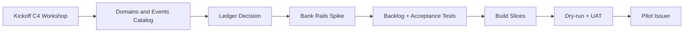

TL;DR
- Reading pass complete on core docs; MVP plan drafted; open questions tracked.
- Checklist below reflects status; mark items to drive next sync.
- Mermaid shows delivery flow for MVP discovery → build.

Checklist — Inputs to Learn
- [x] previous-context Yury analysis — 20251030-1850-gem2.5p-Yury-Mishinskiy-info-analysis.md
- [x] intro call — 20251022-1930-yury-founder-intro-call.md
- [~] telegram main chat — 20251004-20251029-chat-telegram-main-YuryMyshinskiy-1016927916.md (skimmed)
- [x] my thoughts — 20251030-1800-thoughts-jump-start-project-cifra-rwa-capital.md
- [x] estimation — 20251004-estimation-from-outsource-company.md
- [x] diagrams — 20251030-1925-gpt5h-..., 20251030-1926-son4.5-...
- [x] 20251022 artefacts — platform_functionality README/all_tables; finance status report

Key Decisions Needed
- [ ] Ledger path for MVP: Fabric vs Besu vs immudb (audit-core)
- [ ] Bank partner shortlist for DvP rails
- [ ] HSM/MPC vendor shortlist; KEP/УКЭП provider
- [ ] MVP scope lock: only primary market, no books in v1
- [ ] Discovery Sprint SOW approval (40h) and cadence

Open Questions
- Regulatory: need explicit matrix for roles/ABAC vs regulator expectations?
- Identity: which KYC/KYB providers and sanctions lists will be used on day 1?
- Cash rails: SBP vs bank API; escrow structure and reconciliation cadence?
- Secondary: RFQ/OTC model target in v1.1 or leave for v1.2?

MVP Discovery Flow

Notes
- Comply with 259-ФЗ, 63-ФЗ; PDN localization; audit retention ≥7y.
- Event-first, CQRS, ledger adapter to avoid lock-in.
- Anchor hashes externally for independent witness.

Meta
- agentID=019a362f-76ca-7272-909e-362716cf233d partAgentID=76ca
