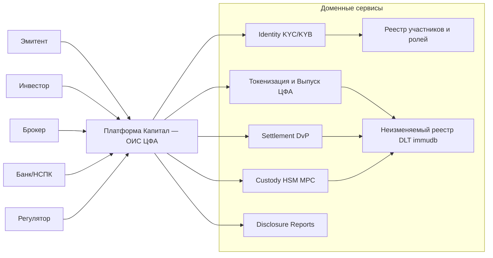

TL;DR
- Ship OIS MVP in 10–12 weeks: Registry/Identity-KYC, Tokenization, Custody/HSM, Settlement T+0 with 1 bank, Audit ledger + Disclosure.
- Start permissioned ledger (Hyperledger Fabric/Besu) or immudb audit-core for MVP; keep path to full DLT and later DEX/secondary market.
- Spec-first, event-driven (Kafka), strict compliance: 259-ФЗ, KEP/УКЭП, AML/KYC, audit/immutability.

Steps
1) Align scope: only primary market for MVP; secondary later (RFQ/OTC → books).
2) C4 Context/Containers workshop (90 min) with Yury + tech lead.
3) Decide ledger: Fabric vs Besu vs immudb (audit-core), pick 1 with rollout path.
4) Define domains/events: Registry, Identity-KYC, Tokenization, Settlement, Custody, Disclosure.
5) MVP backlog + test scenarios (emission, DvP, failures, rollback).
6) Integration spike with 1 bank (payments, escrow, DvP Rails), choose HSM/MPC.
7) Build by slices: Auth/KYC → Tokenization → Settlement → Audit/Reports.
8) Dry-run + UAT with synthetic data; pilot with 1 issuer.

Why → What → How → Result
- Why: Faster regulatory-grade MVP with minimal rework and BRICS-friendly stack.
- What: Permissioned OIS core with compliant issuance and atomic DvP; optional path to DEX.
- How: Spec-first (OpenAPI + event schemas), CQRS + Kafka, ledger anchoring; cloud/on-prem hardened.
- Result: Issuance live, 1 bank settlement, audit-ready logs, foundation for v1.1/v1.2.

Architecture Snapshot (MVP)
- Gateway: OAuth2/OIDC, mTLS, WAF/anti-DDoS.
- Domains: Registry, Identity-KYC, Tokenization, Settlement-DvP, Custody/HSM, Disclosure/Reporting.
- Ledger: Fabric/Besu or immudb for audit; hash anchors; retention ≥7 years.
- Data: Postgres per service, S3 docs, Kafka event-log, DW for reports.

Mermaid — Context to Domains


Ledger Options — Trade-offs

| Option | Pros | Cons | Fit (MVP) |
|---|---|---|---|
| Hyperledger Fabric | Mature permissioned, channels, rich ACL | Oper complexity, chaincode model | Strong if ops ready |
| Hyperledger Besu (permissioned) | EVM, Solidity, ecosystem tooling | Governance, privacy patterns | Good if Solidity talent |
| immudb (audit-core) | Simple, fast, append-only, small ops | Not smart contracts | Best for fast MVP audit |
| DPoS private net | Matches control needs, deterministic | Build/maintain L1, compliance doubts | Risky v1, consider later |

MVP Backlog (slice-first)
- Identity & KYC: onboarding, sanctions/PEP checks, KEP/УКЭП binding.
- Registry: roles/ABAC, participant statuses, audit trails.
- Tokenization: issuance spec, term-sheet, disclosures, corporate actions basic.
- Settlement DvP: escrow rails with 1 bank, atomic swap cash↔ЦФА.
- Custody: HSM/MPC keys, M-of-N policies, wallet profiles.
- Disclosure/Reports: TSA time-stamps, regulator exports, XBRL/ISO 20022 basic.

Compliance Anchors
- 259-ФЗ scope, operator duties; 63-ФЗ for KEP/УКЭП; AML/CFT; PDN localization.
- Audit retention 5–7y; independent hash anchoring; incident runbooks.

Risks → Mitigations
- Bank rails delay → mock settlement + parallel bank track.
- Ledger choice churn → decouple via event-sourcing + ledger adapter.
- KEP/УКЭП vendor lead-time → start procurement now; temporary test CA.
- Secondary market scope creep → lock MVP to primary; plan RFQ/OTC in v1.1.

Team & Cadence (lean)
- 1 Lead/Arch, 2 BE, 1 FE, 1 DevOps/Sec, 0.5 BA, 0.5 QA; weekly demos.
- Discovery Sprint: 40h paid; then bi-weekly milestones (M0-M3).

Next Actions
- Schedule C4 workshop (90m) and confirm MVP scope.
- Decide ledger path (Fabric/Besu vs immudb audit-core) within 72h.
- Lock bank partner and HSM/MPC vendor shortlist.
- Approve discovery sprint SOW; define acceptance tests.

Meta
- agentID=019a362f-76ca-7272-909e-362716cf233d partAgentID=76ca
````
