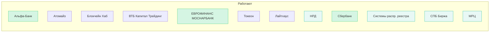

TL;DR
- Шаблон для deepresearch по платформам ЦФА РФ: по каждой — техстек, лицензии, операции, интеграции, проблемы, KPI.
- Источник списка: 06-20251030-1926-report-finance-cfa-platforms-status.md.
- По итогам — сводная таблица и mermaid‑кластер.

Per‑Platform Checklist
- [ ] Название, оргтип, статус (работает/не работает/ожидает)
- [ ] Регуляторика: лицензии, роль (ОИС/депозитарий/биржа)
- [ ] Техстек: DLT (Fabric/Besu/own/None), custody (HSM/MPC), KEP/УКЭП
- [ ] Домены: эмиссия, размещение, учёт, вторичка, корпоративные действия
- [ ] Интеграции: банки/НСПК/ISO 20022/регуляторные выгрузки
- [ ] Операции: TPS/latency, DvP модель, DR/availability
- [ ] Go‑to‑market: сегменты эмитентов/инвесторов
- [ ] Риски/инциденты/санкции
- [ ] Ссылки/источники

Platforms Table
| № | Платформа | Статус | Роль | DLT | Custody | DvP | Интеграции | Примечания |
|---|---|---|---|---|---|---|---|---|
| 1 | Альфа‑Банк | Работает | Банк/ОИС | TBD | TBD | TBD | TBD |  |
| 2 | Атомайз | Работает | Техкомпания | TBD | TBD | TBD | TBD |  |
| 3 | Блокчейн Хаб | Работает | Техкомпания | TBD | TBD | TBD | TBD |  |
| 4 | ВТБ Капитал Трейдинг | Работает | Инвесткомпания | TBD | TBD | TBD | TBD |  |
| 5 | ЕВРОФИНАНС МОСНАРБАНК | Работает | Банк | TBD | TBD | TBD | TBD |  |
| 6 | Токеон | Работает | Техкомпания | TBD | TBD | TBD | TBD |  |
| 7 | Лайтхаус | Работает | Техкомпания | TBD | TBD | TBD | TBD |  |
| 8 | НРД | Работает | Депозитарий | TBD | TBD | TBD | TBD |  |
| 9 | Сбербанк | Работает | Банк | TBD | TBD | TBD | TBD |  |
| 10 | Системы распр. реестра | Работает | Инфраструктура | TBD | TBD | TBD | TBD |  |
| 11 | СПБ Биржа | Работает | Биржа | TBD | TBD | TBD | TBD |  |
| 12 | МРЦ | Работает | Инфраструктура | TBD | TBD | TBD | TBD |  |
| 13 | Банк Синара | Не работает | Банк | TBD | TBD | TBD | TBD |  |
| 14 | Компания БКС | Не работает | Брокер | TBD | TBD | TBD | TBD |  |
| 15 | Газпромбанк | Не работает | Банк | TBD | TBD | TBD | TBD |  |
| 16 | ТБанк | Не работает | Банк | TBD | TBD | TBD | TBD |  |
| 17 | Токеник | Не работает | Техкомпания | TBD | TBD | TBD | TBD |  |
| 18 | МАДРИГАЛ ОИС | Скоро | Техкомпания | TBD | TBD | TBD | TBD |  |
| 19 | Статус | Лицензия | Техкомпания | TBD | TBD | TBD | TBD |  |
| 20 | Спутник | Лицензия | Техкомпания | TBD | TBD | TBD | TBD |  |

Mermaid Snapshot

